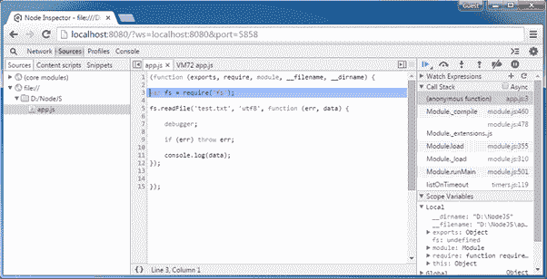
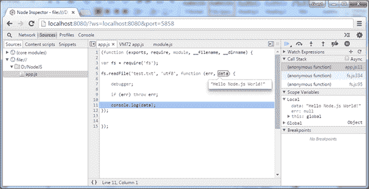

# 节点检查器

> 原文:[https://www.tutorialsteacher.com/nodejs/node-inspector](https://www.tutorialsteacher.com/nodejs/node-inspector)

在本节中，我们将使用节点检查器工具来调试 app.js 文件中包含的一个简单的 Node.js 应用程序。

app.js<button class="copy-btn pull-right" title="Copy example code">*Copy*</button> *```
var fs = require('fs');

fs.readFile('test.txt', 'utf8', function (err, data) {

    debugger;

    if (err) throw err;

    console.log(data);
}); 
```

节点检查器是基于图形用户界面的调试器。通过在终端窗口(在 Mac 或 Linux 中)或命令提示符(在 Windows 中)中编写以下命令，在全局模式下使用 NPM 安装节点检查器。

<samp>npm install -g node-inspector</samp>

安装完成后，使用如下所示的`node-inspector`命令运行。

<figure>[](../../Content/images/nodejs/node-inspector.png)

<figcaption>Run Node Inspector</figcaption>

</figure>

如上图所示，它将显示一个用于调试的网址。那么，把你的浏览器指向 http://127.0.0.1:8080/？ws=127.0.0.1:8080&port=5858 并开始调试。有时，端口 8080 可能在您的计算机上不可用。所以你会得到下面的错误。

*无法在 0.0.0.0:8080 启动服务器。错误:听 EACCES。*

在这种情况下，使用以下命令在不同的端口上启动节点检查器。

<samp>D:\>node-inspector --web-port=5500</samp>

现在，打开谷歌浏览器，输入网址。

<figure>[](../../Content/images/nodejs/node-debug-in-chrome.png)

<figcaption>Node Inspector</figcaption>

</figure>

现在，在 Windows 中打开另一个终端窗口或命令提示符，并使用以下命令开始调试。

<samp>> node --debug-brk app.js</samp>

刷新浏览器，您会看到它停在程序的第一行，如下所示。

<figure>[](../../Content/images/nodejs/node-debug-in-chrome2.png)

<figcaption>Node.js Debugging in Chrome using Node Inspector</figcaption>

</figure>

现在，在 Chrome 开发工具中将程序作为普通程序进行调试。此外，使用右窗格上的观察表达式或将光标悬停在变量上可以看到如下所示的值。

<figure>[](../../Content/images/nodejs/node-debug-in-chrome3.png)

<figcaption>Node Inspector</figcaption>

</figure>

这样，节点检查器就可以在 Windows 或 MAC OS 中进行调试。*