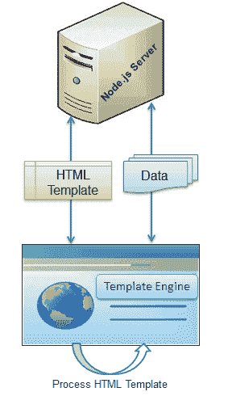

# 节点的模板引擎

> 原文:[https://www . tutorial stearn . com/nodejs/template-engines-for-nodejs](https://www.tutorialsteacher.com/nodejs/template-engines-for-nodejs)

模板引擎帮助我们用最少的代码创建一个 HTML 模板。另外，它可以在客户端将数据注入到 HTML 模板中，并生成最终的 HTML。

下图说明了模板引擎如何在 Node.js 中工作

<figure>

<figcaption>Template Engine</figcaption>

</figure>

如上图所示，客户端浏览器从服务器端加载 HTML 模板、JSON/XML 数据和模板引擎库。模板引擎使用客户端浏览器中的模板和数据生成最终的 HTML。然而，一些 HTML 模板也在服务器端处理数据并生成最终的 HTML 页面。

Node.js 有很多可用的模板引擎，每个模板引擎使用不同的语言来定义 HTML 模板并向其中注入数据。

以下是 Node.js 的重要(但不限于)模板引擎列表

*   [玉](https://github.com/jadejs/jade)
*   [瓦什](https://github.com/kirbysayshi/vash)

*   [小胡子](https://github.com/janl/mustache.js)T2】
*   [T2](https://github.com/linkedin/dustjs)
*   [努纳痒](https://github.com/mozilla/nunjucks)
*   [车把](https://github.com/wycats/handlebars.js)T2】
*   [atpl](https://github.com/soywiz/atpl.js)
*   [haml](https://github.com/tj/haml.js)

### 模板引擎在 Node.js 中的优势

1.  提高开发人员的工作效率。
2.  提高可读性和可维护性。
3.  更快的性能。
4.  最大化客户端处理。
5.  多页的单一模板。
6.  可以从内容交付网络访问模板。

在下一节中了解 Jade 模板引擎。