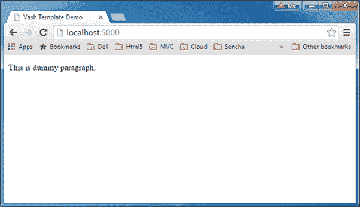
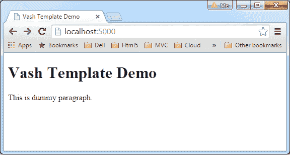

# Vash 模板引擎

> 原文:[https://www . tutorial stearn . com/nodejs/vash-template-engine](https://www.tutorialsteacher.com/nodejs/vash-template-engine)

在本节中，您将了解 Vash 模板引擎，以及如何使用 Express.js 在 Node.js 中使用它。

Vash 是一个模板视图引擎，使用 [Razor 语法](https://www.asp.net/web-pages/overview/getting-started/introducing-razor-syntax-(c))。因此，对于有 ASP.Net MVC 经验的人来说，这个模板引擎看起来很熟悉。

使用 NPM 安装瓦斯，如下所示。

<samp>npm install vash --save</samp>

现在，让我们看看如何使用 Express.js 呈现简单的 vash 模板

首先，在 views 文件夹下创建 index.vash 文件，并编写以下 HTML 内容。

Example: vash template<button class="copy-btn pull-right" title="Copy example code">*Copy*</button> *```
<!DOCTYPE html>

<html>
<head>
    <title>@model.title</title>
</head>
<body>
    <p>@model.content</p>
</body>
</html>
```

在上面的 vash 模板中，模型对象是@model，属性是 title 和 content。razor 语法中的@model 表示一个对象，该对象将在呈现此模板时由服务器提供。因此，上面的模板需要一个具有两个属性的对象:标题和内容。

现在，创建 server.js 并编写下面的 express.js 来呈现上面的 vash 模板。

server.js<button class="copy-btn pull-right" title="Copy example code">*Copy*</button> *```
var express = require('express');
var app = express();

app.set("view engine","vash")

app.get('/', function (req, res) {

    res.render('index', { title: 'Vash Template Demo', 
                          content:'This is dummy paragraph.'});

});

var server = app.listen(5000, function () {
    console.log('Node server is running..');
});
```

如您所见，在渲染 index.vash 时，我们已经在 res.render()方法中指定了一个具有标题和内容属性的对象。现在，使用`node server.js` 命令运行上述应用程序，并将浏览器指向 *http://localhost:5000* ，您将获得以下结果。

<figure>[](../../Content/images/nodejs/vash-example1.png)

<figcaption>Vash Template Engine</figcaption>

</figure>

## 布局页面

布局页面包括应用程序的静态部分，在整个应用程序中保持不变，例如页眉、页脚等。它提供了一种在添加静态内容的同时添加动态内容的机制。

vash 引擎允许您创建布局页面。下面是一个简单的布局。

layout.vash<button class="copy-btn pull-right" title="Copy example code">*Copy*</button> *```
<!DOCTYPE html>

<html>
<head>
    <title>@model.title</title>
</head>
<body>
    @html.block('body')
</body>
</html> 
```

在上面的布局页面中，@html.block('body ')定义了名为“body”的块。所以，任何 vash 模板现在都可以注射到这个身体块里。例如，下面的 index.vash 模板将一些 HTML 注入到上面 layout.vash 的主体块中。

index.vash<button class="copy-btn pull-right" title="Copy example code">*Copy*</button> *```
@html.extend('layout',function(model){

	@html.block('body',function(model){

            <h1>@model.title</h1>
            <p>@model.content</p>

    });

}); 
```

现在，使用如下所示的 Express.js 渲染上面的 vash 布局。

server.js<button class="copy-btn pull-right" title="Copy example code">*Copy*</button> *```
var express = require('express');
var app = express();

app.set("view engine","vash")

app.get('/', function (req, res) {

    res.render('index', { title: 'Vash Template Demo', 
                          content:'This is dummy paragraph.'});

});

var server = app.listen(5000, function () {
    console.log('Server is running..');
}); 
```

现在，使用`node server.js`命令运行上述应用程序，并将浏览器指向 *http://localhost:5000* ，您将获得以下结果。

<figure>[](../../Content/images/nodejs/vash-example2.png)

<figcaption>Vash Template Engine</figcaption>

</figure>

访问 [Github](https://github.com/kirbysayshi/vash) 详细学习 vash 模板语法。*****