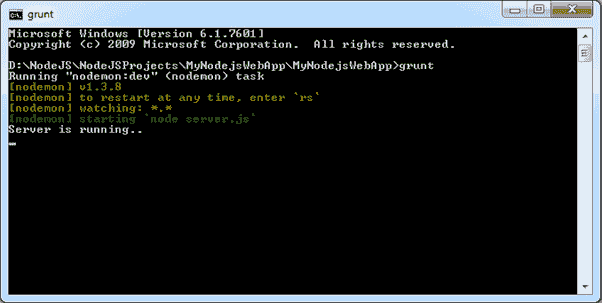
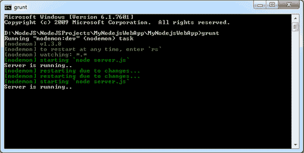

# -地面

> 哎哎哎:# t0]https://www . tutorial reacher . com/nodejs/grunt tjs

[grunjs](https://gruntjs.com/)是一个 JavaScript 任务运行器。它可以用最少的工作量自动完成应用程序的各种任务，从而提高开发人员的工作效率。

包括各种任务的插件。例如，每当应用程序中的任何 JavaScript 文件发生变化时，nodemon 插件都会自动重新启动节点服务器。因此，您不必在每次修改 JavaScript 时都手动停止并重新启动节点服务器。grunt-contrib-cssmin 插件可以用来压缩 CSS 文件。grunt-jsfmt 插件可以用来格式化、搜索或重写应用程序中的 JavaScript。

访问[gruntjs.com/plugins](https://gruntjs.com/plugins)列表，了解所有可用的插件。

## 安装

为了使用 GruntJS，首先需要使用以下 npm 命令全局安装 Grunt 的命令行界面(CLI)。

<samp>C:\> npm install -g grunt-cli</samp>

## 格朗蒂尔

gum file . js 或 Gruntfile.coffee 是主文件，您需要在其中配置应用程序的所有任务，您希望使用不同的插件来自动化这些任务。

让我们看看如何使用 [grunt-nodemon](https://www.npmjs.com/package/grunt-nodemon) 插件来运行 Node.js 服务器的节点监视器。

## Nodemon(节点名)

grunt-nodemon 是 Node.js 服务器的监视器。如果您的 Node.js 应用程序中的任何 JavaScript 文件发生变化，它会立即重新启动节点服务器。

首先，使用以下命令将 nodemon 插件安装到您的应用程序中。

<samp style="width:80%">C:\ProjectFolder> npm install grunt nodemon --save-dev</samp>

现在，在应用程序的根文件夹中创建一个咕噜文件，并编写下面的 JavaScript。

Gruntfile.js 

```
 module.exports = function (grunt) {
    grunt.initConfig({

        nodemon: {
            dev: {
                script: 'server.js'

            }
        }
    });

    grunt.loadNpmTasks('grunt-nodemon');
    grunt.registerTask('default', ['nodemon'])
}; 
```

在上面的例子中，我们已经在 grunt.initConfig()方法中指定了 nodemon 任务，用于在项目中任何 JavaScript 文件发生变化时重新启动 Node.js 服务器。最后，loadNpmTasks()方法加载指定的插件，在这种情况下是 grunt-nodemon。registerTask()方法注册默认任务，以便每当 gruntjs 启动时运行。

现在，打开命令提示符，导航到您的项目文件夹，并编写命令: **`grunt`** 。这将开始监控您的项目，如下所示。

[](../../Content/images/nodejs/install-gruntjs.png)

Run GruntJS


现在，每当您更改任何 JS 文件时，它都会重新启动 web 服务器，如下所示。

[](../../Content/images/nodejs/gruntjs-run.png)

Restarting Node Server


这就是如何为 Node.js 应用程序使用各种各样的咕噜咕噜的插件。

访问[入门](https://gruntjs.com/getting-started)指南，了解更多关于 gumanjs 和[配置任务](https://gruntjs.com/configuring-tasks)指南，了解如何配置不同的任务。*