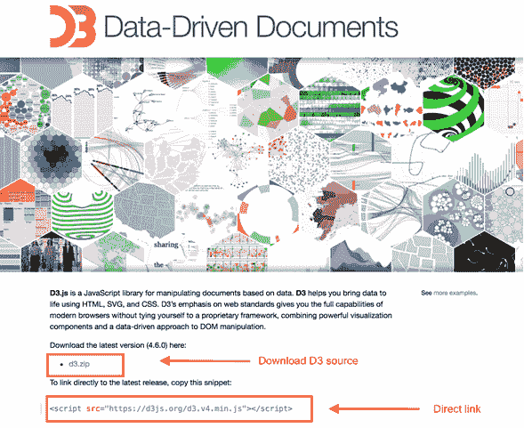

# 设置 D3.js 开发环境

> 原文：<https://www.tutorialsteacher.com/d3js/setup-d3js-development-environment>

在本章中，我们将学习如何设置 D3.js 开发环境。

在我们开始之前，您需要以下组件:

1.  D3 库
2.  Web 服务器
3.  编者ˌ编辑
4.  网络浏览器

## D3 库

您需要将 D3.js 库包含到您的 HTML 网页中，以便使用 D3 来创建数据可视化。有两种方法可以做到:

1.  包括项目文件夹中的 D3 库
2.  包括来自 CDN(内容交付网络)的 D3 库。

### 下载 D3 库

由于 D3 是一个开源库，源代码可以在 D3 网站 d3js.org 免费获得。

1.  访问 D3 网站:[https://d3js.org](https://d3js.org)T2】
2.  下载最新版本的 d3 (d3.zip)。(撰写本章时，最新版本为 4.6.0。)

    [](../../Content/images/d3js/d3js.png)

3.  下载完成后，解压缩 d3 文件夹并查找 d3.min.js 这是 d3 源代码的缩小版本。复制 d3.min.js 文件，并将其粘贴到项目的根文件夹或您想要保存所有库文件的任何其他文件夹中。如下所示，在您的 HTML 页面中包含 d3.min.js 文件。

Example: Use D3 Library from Local Machine/Server

```js
<!DOCTYPE html>
<html lang="en">
<head>
    <script src="../d3.min.js"></script>
</head>
<body>

<script>
    // write your d3 code here.. 
</script>
</body>
</html>
```

D3 是一个 JavaScript 代码，所以你可以在

### 包括来自 CDN 的 D3 库

您可以通过从内容交付网络(CDN)将其直接链接到您的 HTML 页面来使用 D3 库。CDN 是一个服务器网络，文件在其中托管，并根据用户的地理位置交付给用户。如果你使用 CDN，你不需要下载源代码。

包括 D3 库使用 CDN 网址 https://d3js.org/d3.v4.min.js 到您的页面，如下所示。

Example: Use D3 library from CDN

```js
<!DOCTYPE html>
<html lang="en">
<head>
    <script src="https://d3js.org/d3.v4.min.js"></script>
</head>
<body>

<script>
    // write your d3 code here.. 
</script>
</body>
</html>
```

## Web 服务器

大多数浏览器直接在你的网页浏览器中提供本地的 HTML 文件。但是，在加载外部数据文件时有一些限制。在本教程的后几章中，我们将从外部文件(如 CSV 和 JSON)加载数据。因此，如果您从一开始就设置 web 服务器，对您来说会更容易。

你可以使用任何你熟悉的 Web 服务器，例如 IIS，Apache 等。

## 编者ˌ编辑

最后，您将需要一个编辑器来开始编写代码。有一些很棒的集成开发环境支持 JavaScript，比如

*   Visual Studio 代码
*   web 图形
*   黯然失色
*   崇高的文字

这些 IDEs 提供智能代码完成，并支持一些现代的 JavaScript 框架。

如果你没有花哨的 IDEs，可以随时使用记事本！

## 网络浏览器

D3 适用于除 IE8 及更低版本以外的所有浏览器。出于本教程的目的，我们将使用谷歌 Chrome。

设置好开发环境之后，就该开始探索 D3 了。在下一节中，学习如何通过首先选择 DOM，然后使用 D3 进行操作来操作 DOM。