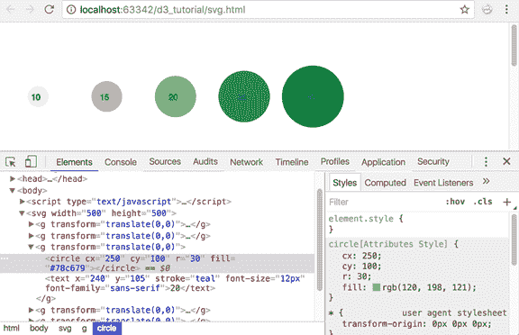

# 使用 D3 创建 SVG 图表

> 原文：<https://www.tutorialsteacher.com/d3js/create-svg-chart-in-d3js>

在前一章中，我们学习了在 D3 中创建 SVG 元素。在这里，我们将学习如何在 D3 中创建静态 SVG 图表。

让我们用 D3.js 在 SVG 中创建一个条形图。对于条形图，我们将使用`<rect>`元素表示条，使用`<text>`元素表示 T2，以显示我们对应于条的数据值。下面是一个简单的 SVG 条形图 HTML，我们将使用 D3 创建。

Example: SVG Bar Chart

```
<!doctype html>
<html>
<head>
    <script src="https://d3js.org/d3.v4.min.js"></script>
</head>
<style>
    svg rect {
        fill: orange;
    }

    svg text {
        fill:white;
        font: 10px sans-serif;
        text-anchor: end;
    }
</style>
<body>
    <svg class="chart" width="420" height="120">
        <g transform="translate(0,0)">
            <rect width="50" height="19"></rect>
            <text x="47" y="9.5" dy=".35em">5</text>
        </g>
        <g transform="translate(0,20)">
            <rect width="100" height="19"></rect>
            <text x="97" y="9.5" dy=".35em">10</text>
        </g>
        <g transform="translate(0,40)">
            <rect width="120" height="19"></rect>
            <text x="117" y="9.5" dy=".35em">12</text>
        </g>
    </svg>
</body>
</html>
```

浏览器中上述示例的输出:

[](../../Content/images/d3js/svg-chart1.png)

SVG Bar Chart


让我们把解释分成两部分:1)几何和 2)风格

## 几何学

你可能已经注意到了我们已经引入的用来固定小节的组元素`<g>` 。这里的每个组元素将相应的条及其文本保存在一起。

如果你看看这些`<g>`元素，你会注意到我们必须硬编码我们的元素位置。这是因为 SVG 需要相对于原点的绝对位置。原点总是从屏幕的左上角开始(0，0)。

注意变换属性:`transform="translate(0,20)"`

在我们的`<rect>`和`<text>`元素中，我们提供了宽度和高度属性。但是我们也需要提供这些元素在屏幕上的位置。为此，我们使用了一个名为 translate 的转换。它本质上提供了元素相对于原点的位置坐标。 其他变换定义有缩放、旋转、倾斜和倾斜。阅读更多来自[w3.org](https://www.w3.org/TR/SVG/coords.html#TransformAttribute)的变压器规格。

## 风格

谈到风格，我们使用类给我们的元素赋予风格。我们使用下面的类将我们的条`<rect>`元素涂成橙色。

```
svg rect {
        fill: orange;
    } 
```

另外，使用下面的 CSS 类将样式应用于我们的数据值。SVG 有一个`<text>`元素，可以用来显示文本输出。

```
 svg text {
        fill: white;
        font: 10px sans-serif;
        text-anchor: end;
    } 
```

如您所见，SVG 中使用的一些属性不同于 HTML 中使用的属性。例如，填充用于应用颜色。文本锚用于将我们的文本定位到小节的右端。我们将在未来的章节中了解更多关于 SVG 样式的信息。

现在，让我们用 D3 创建这个 SVG 条形图。

Example: SVG Bar Chart with D3

```
<html>
<head>
    <script src="https://d3js.org/d3.v4.min.js"></script>
    <style>
        svg rect {
            fill: orange;
        }

        svg text {
             fill:white;
            font: 10px sans-serif;
            text-anchor: end;
        }
    </style>
</head>
<body>
<script>
        var data = [5, 10, 12];
        var width = 200,
        scaleFactor = 10,
        barHeight = 20;

        var graph = d3.select("body")
                  .append("svg")
                  .attr("width", width)
                  .attr("height", barHeight * data.length);

        var bar = graph.selectAll("g")
                  .data(data)
                  .enter()
                  .append("g")
                  .attr("transform", function(d, i) {
                        return "translate(0," + i * barHeight + ")";
                  });

    bar.append("rect")
       .attr("width", function(d) {
                return d * scaleFactor;
       })
       .attr("height", barHeight - 1);

    bar.append("text")
       .attr("x", function(d) { return (d*scaleFactor); })
       .attr("y", barHeight / 2)
       .attr("dy", ".35em")
       .text(function(d) { return d; });

</script>
</body>
</html> 
```

以上示例将在浏览器中显示以下图表。

[](../../Content/images/d3js/svg-chart2.png) 

SVG Chart using D3


让我们一步一步地浏览代码:

`var data = [5, 10, 12];` 定义我们的数据数组。 T3】

```
var width = 200,
scaleFactor = 10,
barHeight = 20; 
```

上面的代码定义了三个变量，稍后在我们的程序中使用:

*   宽度:svg 的宽度
*   scalefactor:由于我们的数据值太小，需要将它们缩放到屏幕上可见的像素值。
*   横条高度:这是我们横条的静态高度。

```
var graph = d3.select("body")
              .append("svg")
              .attr("width", width)
              .attr("height", barHeight * data.length);

```

我们首先选择文档主体，创建一个新的 SVG 元素并追加它。我们将在这个 SVG 元素中构建我们的条形图。然后我们设置 SVG 的宽度和高度。高度计算为条形高度*数据值的数量。我们取 20 作为条高，数据数组长度为 3。所以 SVG 的高度是 60 像素。

```
var bar = graph.selectAll("g") 
               .data(data)
               .enter().append("g")
               .attr("transform", function(d, i) {
                   return "translate(0," + i * barHeight + ")";
               }); 
```

接下来，我们想要将我们的每个条放置在相应的`<g>`元素中。所以在这里，我们创建我们的组元素。我们也在这里应用翻译转换。 我们的每个组元素需要一个位于另一个的下方，因为我们想要构建一个水平条形图。所以我们的翻译公式是(当前元素索引*条高)。

```
bar.append("rect")
   .attr("width", function(d) {
        return d * scaleFactor;
   })
   .attr("height", barHeight - 1); 

```

现在我们已经准备好了组元素，我们将为每个小节添加`<rect>` 元素。我们给它的宽度是(数据值*比例因子)，高度是(条高-边距)。

```
bar.append("text")
   .attr("x", function(d) { return (d*scaleFactor); })
   .attr("y", barHeight / 2)
   .attr("dy", ".35em")
   .text(function(d) { return d; }); 
```

最后，我们希望将数据值显示为每个栏上的文本。宽度定义为(数据值*比例因子)文本元素不支持填充或边距。为此，我们需要给它一个“dy”偏移量。这用于垂直对齐文本。

因此，我们可以使用 D3 创建一个条形图。这只是最基本的。我们将在下一部分创建一个更高级的带有刻度和坐标轴的垂直条形图。

让我们看另一个例子，从数据中动态创建圆，并对它们进行样式化。

Example: SVG Circle Chart using D3

```
var width = 500;
var height = 500;

var data = [10, 15, 20, 25, 30];
var colors = ['#ffffcc','#c2e699','#78c679','#31a354','#006837'];

var svg = d3.select("body")
            .append("svg")
            .attr("width", width)
            .attr("height", height);

var g = svg.selectAll("g")
            .data(data)
            .enter()
            .append("g")
            .attr("transform", function(d, i) {
                return "translate(0,0)";
            })

    g.append("circle")
      .attr("cx", function(d, i) {
            return i*100 + 50;
      })
      .attr("cy", function(d, i) {
            return 100;
      })
      .attr("r", function(d) {
            return d*1.5;
      })
      .attr("fill", function(d, i){
            return colors[i];
      })

    g.append("text")
     .attr("x", function(d, i) {
            return i * 100 + 40;
     })
     .attr("y", 105)
     .attr("stroke", "teal")
     .attr("font-size", "12px")
     .attr("font-family", "sans-serif")
     .text(function(d) {
            return d;
     }); 
```

上面的示例将在浏览器中创建下面的图表。

[](../../Content/images/d3js/svg-chart4.png) 

SVG Circle Chart


让我们浏览一下代码:

```
var width = 500;
var height = 500; 
```

和以前一样，我们保持宽度和高度不变

`var data = [10, 15, 20, 25, 30];`用五个数字定义我们的数据数组。

`var colors = ['#ffffcc','#c2e699','#78c679','#31a354','#006837'];`定义颜色数组。我们将使用这个给我们的圆一个颜色渐变——每个圆一种颜色。

```
var svg = d3.select("body")
            .append("svg")
            .attr("width", width)
            .attr("height", height); 

```

接下来，我们选择我们的身体元素，并将 SVG 附加到身体上。我们还使用预定义的变量来指定 SVG 的宽度和高度；即宽度和高度。

`var g = svg.selectAll("g")`创建组元素来容纳圆。

`.data(data)`将我们的数据数组绑定到组元素。

`.enter()`为我们的组元素创建占位符。

`.append("g")`将组元素追加到我们的页面。

```
.attr("transform", function(d, i) {
        return "translate(0,0)";
 }) 
```

正如我们之前所学的，translate 用于相对于原点定位元素。在这种情况下，我们将其定位在原点。

`g.append("circle")`将我们的圆追加到组中。

```
.attr("cx", function(d, i) {
    return i*100 + 50;
 }) 
```

我们设置每个圆中心的 x 坐标。这里，我们将圆圈的索引乘以 100，并在圆圈之间添加一些填充。

```
.attr("cy", function(d, i) {
    return 100;
}) 
```

接下来，我们设置每个圆中心的 y 坐标。因为我们希望我们的圆水平定向在同一条线上，所以我们保持了圆上的 y 坐标一致。

```
.attr("r", function(d) {
    return d*1.5;
}) 
```

现在，我们设置每个圆的半径。我们希望圆的大小与数据值相对应。所以，数据价值越大，我们的圈子就越大。我们将数据值设置为每个圆的半径。但是由于我们的数据值非常小，它们不会对应于屏幕上清晰可见的像素值。为了解决这个问题，我们将数据值乘以常数“1.5”来增加圆的大小。

```
.attr("fill", function(d, i){
    return colors[i];
}) 
```

上面的代码用我们的颜色数组中的颜色填充每个圆。我们使用数据值的索引从颜色数组中获取相应的颜色。这会用不同的颜色画出每个圆。

```
g.append("text")
 .attr("x", function(d, i) {
     return i * 100 + 40;
 })
 .attr("y", 105)
 .attr("stroke", "teal")
 .attr("font-size", "12px")
 .attr("font-family", "sans-serif")
 .text(function(d) {
     return d;
 }); 
```

上面的代码将数据作为文本值添加到创建的每个 SVG 元素中。

在下一章中，我们将学习 d3.scales 以及如何为我们的图形创建轴。