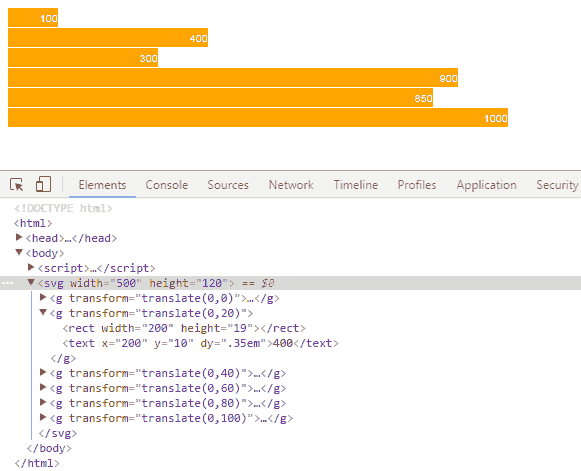

# D3 中的刻度

> 原文:[https://www.tutorialsteacher.com/d3js/scales-in-d3](https://www.tutorialsteacher.com/d3js/scales-in-d3)

在前几章中，我们学习了如何用 D3 创建一个简单的 SVG 图表。在本章中，我们将学习为图表创建刻度和坐标轴。

在我们到目前为止的示例中，当我们想要绘制由数据值驱动的形状时，我们在数据值中添加了一个比例因子。这是为了确保我们的形状在屏幕上可见。数据值可能不总是对应于屏幕上的像素值。一些数据值可能太大，而另一些太小，无法直接与像素值一起使用。

D3 秤为此提供了一个方便的解决方案。他们将我们的数据值映射到在可视化中更好表示的值。D3 为不同类型的图表提供了以下缩放方法。

| 刻度类型 | 方法 | 描述 |
| --- | --- | --- |
| 连续的 | d3.scaleLinear() | 构建连续的线性比例，其中输入数据(域)映射到指定的输出范围。 |
| d3.scaleIdentity() | 构建输入数据与输出数据相同的线性标尺。 |
| d3.scaleTime() | 构建线性标度，其中输入数据以日期为单位，输出数据以数字为单位。 |
| d3.scaleLog() | 构建对数标度。 |
| d3.scaleSqrt() | 构造平方根刻度。 |
| d3.scalePow() | 构建指数标度。 |
| 连续的 | d3.scaleSequential() | 构造顺序标度，其中输出范围由插值函数固定。 |
| 数字转换 | d3 .缩放量化() | 构建具有离散输出范围的量化音阶。 |
| 分位点 | d3.scaleQuantile() | 构造输入样本数据映射到离散输出范围的分位数。 |
| 阈值 | d3.scaleThreshold() | 构造任意输入数据映射到离散输出范围的比例。 |
| 带 | d3.scaleBand() | 除了输出范围是连续的和数字的之外，波段刻度类似于序数刻度。 |
| 要点 | d3.scalePoint() | 构造点刻度。 |
| 序数 | d 3 .scale 序数() | 构造序数标度，其中输入数据包括字母，并映射到离散的数字输出范围。 |

假设我们有以下数据，可以给你一家公司过去 6 年的股票价值:`[100, 400, 300, 900, 850, 1000]`。 在这种情况下，我们的数据值太大，无法在屏幕上显示为像素！为了解决这个问题，我们可以考虑将这些值乘以一个因子，例如 0.5 或 0.2，从而减少这些值。 相反，我们可以使用 d3.scaleLinear 函数来实现这一点。这将产生一个定量的线性标度。(d3.scaleLinear 是在 d3 的第 4 版中引入的。在早期版本中，它被表示为 D3 . scale . linear)

在使用 d3.scaleLinear 函数之前，我们首先需要了解两个术语:**域**和**范围**。

### 领域

域表示输入数据的最小值和最大值。在我们的数据`[100, 400, 300, 900, 850, 1000]`中，100 是最小值，1000 是最大值。

所以，我们的领域是[100，1000]

### 范围

范围是您希望输入值映射到的输出范围。

如果将数据值映射到像素，我们可能没有足够的空间来显示上述值的条形图。假设我们想在 500 像素宽度内显示一个 SVG 图表。因此，我们希望我们的输出范围在 50 到 500 之间，其中最小值将被映射到 50，最大值将被映射到 500，即[50，500]。这意味着，输入值 100 将映射到输出值 50。输入值 1000 将映射到输出值 500。这意味着比例因子为 0.5，数据将以像素表示为:数据值* 0.5。

100 -> 50

1000 -> 500

所以，现在如果我们的输入值是 300，输出值将是 150。

## 线性标尺

让我们现在使用 d3.scaleLinear 函数。我们将使用上一章中的水平条形图示例。因为数据值太小`var data = [5, 10, 12];`，我们使用了 10 的比例因子来增加像素条的宽度。

但是现在我们已经学会了如何使用比例，而不是将比例因子乘以数据值，我们将使用 d3.scaleLinear 函数。

让我们使用上面的数据集来创建我们的条形图:`var data = [100, 400, 300, 900, 850, 1000];`并使用 d3.scaleLinear 为我们进行缩放，如下所示。

```
var data = [100, 400, 300, 900, 850, 1000];

var scale = d3.scaleLinear()
            .domain([100, 1000])
            .range([50, 500]); 
```

上面，我们创建了一个线性比例变量，其域值为[100，1000]，其中 100 是最小值，1000 是数据数组中的最大值，输出范围为[50，500]。因此，我们将最小数据值映射到输出值 50，最大值 1000 到 500。100 到 1000 之间的值将使用上述比例函数自动计算。请注意，变量*标度*是一个转换函数，它将根据指定的域和范围返回输出值。我们可以将 100 到 1000 之间的任何值传递给 scale 函数，它将返回输出值。 例如，scale(200)将返回 100 或者 scale(350)将返回 175。

在上面的例子中，我们可以使用内置的 d3.min()和 d3.max()函数分别从我们的数据数组中返回最小值和最大值，而不是手动为我们的域提供最小值和最大值。

```
 var data = [100, 400, 300, 900, 850, 1000];

var scale = d3.scaleLinear()
            .domain([d3.min(data), d3.max(data)])
            .range([50, 500]); 
```

现在，让我们使用下面的 d3.scaleLinear()函数为大数据值创建一个条形图。

Example: Bar Chart with Scale

```
<body>
<script>
    var data = [100, 400, 300, 900, 850, 1000]

    var width = 500,
        barHeight = 20,
        margin = 1;

    var scale = d3.scaleLinear()
                 .domain([d3.min(data), d3.max(data)])
                 .range([50, 500]);

    var svg = d3.select("body")
                  .append("svg")
                  .attr("width", width)
                  .attr("height", barHeight * data.length);

    var g = svg.selectAll("g")
                  .data(data)
                  .enter()
                  .append("g")
                  .attr("transform", function (d, i) {
                      return "translate(0," + i * barHeight + ")";
                  });

    g.append("rect")
       .attr("width", function (d) {
           return scale(d);
       })
       .attr("height", barHeight - margin)

    g.append("text")
       .attr("x", function (d) { return (scale(d)); })
       .attr("y", barHeight / 2)
       .attr("dy", ".35em")
       .text(function (d) { return d; }); 
```

以上示例将在浏览器中显示以下结果。

<figure>[](../../Content/images/d3js/bar-chart-with-scaleLinear.png)

<figcaption>Horizontal Bar Chart</figcaption>

</figure>

在上面的示例中，下面的代码片段定义了图表的比例。

```
var data = [100, 400, 300, 900, 850, 1000];

var scale = d3.scaleLinear()
            .domain([d3.min(data), d3.max(data)])
            .range([50, 500]); 
```

然后我们使用这个缩放函数来设置矩形条的宽度，如下所示。`scale(d)`函数调用将为数组中的每个值返回一个输出值。

```
 g.append("rect")
    .attr("width", function (d) {
        return scale(d);
    })
    .attr("height", barHeight - margin) 
```

访问 [D3 量表](https://github.com/d3/d3-scale "D3.js Scales")了解更多信息。

在下一章学习如何创建轴。