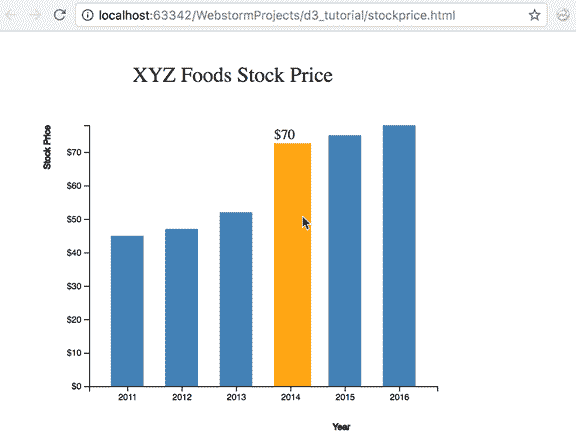

# 带 D3 的动画条形图

> 原文:[https://www.tutorialsteacher.com/d3js/animated-bar-chart-d3](https://www.tutorialsteacher.com/d3js/animated-bar-chart-d3)

我们可以在鼠标事件上添加过渡。让我们在单个条的悬停上添加一些事件处理，并在前一章的条形图可视化中显示值。

Example: Animated Bar Chart

```
<!doctype html>
<html>
<head>
    <style>
        .bar {
            fill: steelblue;
        }

        .highlight {
            fill: orange;
        }
</style>
    <script src="https://d3js.org/d3.v4.min.js"></script>
</head>
<body>
<svg width="600" height="500"></svg>
<script>

    var svg = d3.select("svg"),
        margin = 200,
        width = svg.attr("width") - margin,
        height = svg.attr("height") - margin;

    svg.append("text")
       .attr("transform", "translate(100,0)")
       .attr("x", 50)
       .attr("y", 50)
       .attr("font-size", "24px")
       .text("XYZ Foods Stock Price")

    var x = d3.scaleBand().range([0, width]).padding(0.4),
        y = d3.scaleLinear().range([height, 0]);

    var g = svg.append("g")
            .attr("transform", "translate(" + 100 + "," + 100 + ")");

    d3.csv("xyz.csv", function(error, data) {
        if (error) {
            throw error;
        }

        x.domain(data.map(function(d) { return d.year; }));
        y.domain([0, d3.max(data, function(d) { return d.value; })]);

        g.append("g")
         .attr("transform", "translate(0," + height + ")")
         .call(d3.axisBottom(x))
         .append("text")
         .attr("y", height - 250)
         .attr("x", width - 100)
         .attr("text-anchor", "end")
         .attr("stroke", "black")
         .text("Year");

        g.append("g")
         .call(d3.axisLeft(y).tickFormat(function(d){
             return "$" + d;
         }).ticks(10))
         .append("text")
         .attr("transform", "rotate(-90)")
         .attr("y", 6)
         .attr("dy", "-5.1em")
         .attr("text-anchor", "end")
         .attr("stroke", "black")
         .text("Stock Price");

        g.selectAll(".bar")
         .data(data)
         .enter().append("rect")
         .attr("class", "bar")
         .on("mouseover", onMouseOver) //Add listener for the mouseover event
         .on("mouseout", onMouseOut)   //Add listener for the mouseout event
         .attr("x", function(d) { return x(d.year); })
         .attr("y", function(d) { return y(d.value); })
         .attr("width", x.bandwidth())
         .transition()
         .ease(d3.easeLinear)
         .duration(400)
         .delay(function (d, i) {
             return i * 50;
         })
         .attr("height", function(d) { return height - y(d.value); });
    });

    //mouseover event handler function
    function onMouseOver(d, i) {
        d3.select(this).attr('class', 'highlight');
        d3.select(this)
          .transition()     // adds animation
          .duration(400)
          .attr('width', x.bandwidth() + 5)
          .attr("y", function(d) { return y(d.value) - 10; })
          .attr("height", function(d) { return height - y(d.value) + 10; });

        g.append("text")
         .attr('class', 'val') 
         .attr('x', function() {
             return x(d.year);
         })
         .attr('y', function() {
             return y(d.value) - 15;
         })
         .text(function() {
             return [ '$' +d.value];  // Value of the text
         });
    }

    //mouseout event handler function
    function onMouseOut(d, i) {
        // use the text label class to remove label on mouseout
        d3.select(this).attr('class', 'bar');
        d3.select(this)
          .transition()     // adds animation
          .duration(400)
          .attr('width', x.bandwidth())
          .attr("y", function(d) { return y(d.value); })
          .attr("height", function(d) { return height - y(d.value); });

        d3.selectAll('.val')
          .remove()
    }

</script>
</body>
</html> 
```

让我们浏览一下添加到代码中的两个鼠标事件处理程序:

```
g.selectAll(".bar")
.data(data)
.enter().append("rect")
.attr("class", "bar")
**.on("mouseover", onMouseOver)
.on("mouseout", onMouseOut)**
.attr("x", function(d) { return x(d.year); })
.attr("y", function(d) { return y(d.value); })
.attr("width", x.bandwidth())
.transition()
.ease(d3.easeLinear)
.duration(400)
.delay(function (d, i) {
    return i * 50;
})
.attr("height", function(d) { return height - y(d.value); }); 
```

在选择 bar 元素时，我们添加了两个新的事件处理程序，即。我们调用各自的函数来处理鼠标事件。这样做是为了在鼠标悬停在特定条上并离开时应用动画。

```
function onMouseOver(d, i) {

    d3.select(this).attr('class', 'highlight');
    d3.select(this)
      **.transition()
      .duration(400)
      .attr('width', x.bandwidth() + 5)
      .attr("y", function(d) { return y(d.value) - 10; })
      .attr("height", function(d) { return height - y(d.value) + 10; });** 
    g.append("text")
     .attr('class', 'val') // add class to text label
     .attr('x', function() {
         return x(d.year);
     })
     .attr('y', function() {
         return y(d.value) - 15;
     })
     .text(function() {
         return [ '$' +d.value];  // Value of the text
     });
} 
```

在 mouseover 事件中，我们希望增加条的宽度和高度，并将所选条的条颜色(由“this”对象给出)设为橙色。对于颜色，我们添加了一个类“高光”，它将所选条的颜色更改为橙色。然后，我们在 400 毫秒的持续时间内给这个条添加了一个转换函数。所以现在，当我们将条的宽度增加 5px，高度增加 10px 时，从条的先前宽度和高度到新宽度和高度的过渡将持续 400 毫秒。请注意，我们还为条形提供了一个新的“y”值，这样条形就不会因新的高度值而变形。

除了通过更改宽度和高度来突出显示所选内容之外，我们还希望将栏值显示为文本。为此，我们在 group 元素后添加了一个文本元素，并指定了文本元素的 x 和 y 位置。文本由[ '$' +d.value]给出。

```
function onMouseOut(d, i) {
        d3.select(this).attr('class', 'bar');
        d3.select(this)
          **.transition()
          .duration(400)
          .attr('width', x.bandwidth())
          .attr("y", function(d) { return y(d.value); })
          .attr("height", function(d) { return height - y(d.value); });** 
        d3.selectAll('.val')
          .remove()
    } 
```

在 mouseout 事件中，我们希望移除在 mouseover 事件中应用的选择功能。因此，我们将小节类恢复为原始的“小节”类，并恢复所选小节的原始宽度和高度。我们还将 y 值恢复到了原始值。d3 .选择所有('。val’)。remove()删除我们在选择栏时添加的文本值。

结果:

[](../../Content/images/d3js/bar-chart-animation.png)

Animation with Bar Chart

