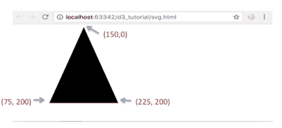
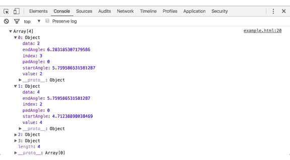
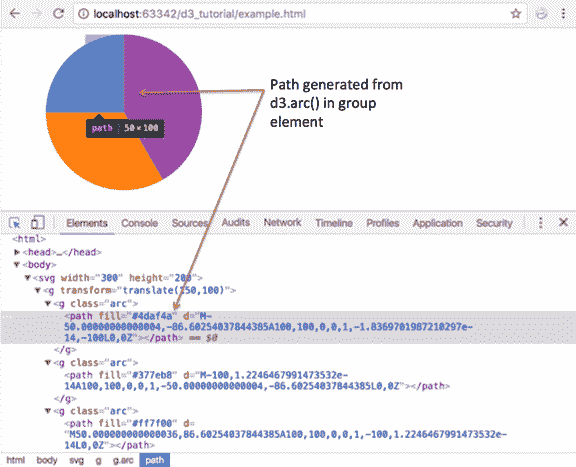
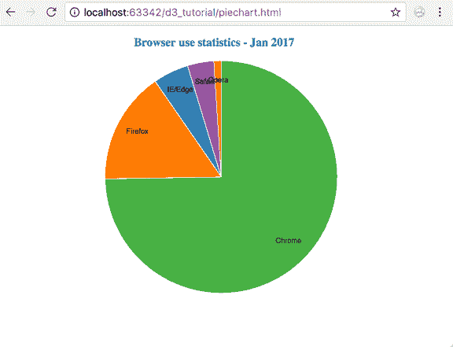
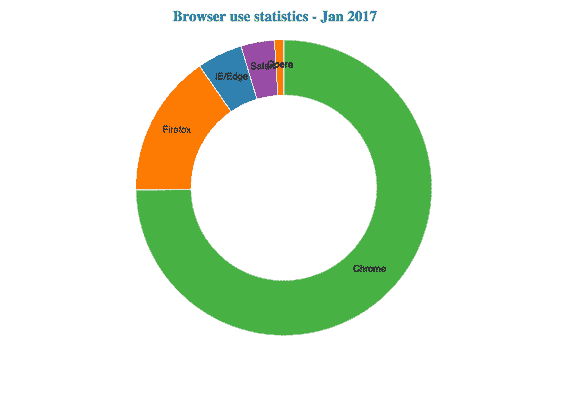

# 使用 D3 创建饼图

> 原文：<https://www.tutorialsteacher.com/d3js/create-pie-chart-using-d3js>

在本章中，我们将学习如何使用 D3 创建饼图。

为了创建饼图可视化，我们将使用以下 D3 方法。

| D3 方法 | 描述 |
| --- | --- |
| SVG 路径 | 根据定义的命令在 SVG 中创建路径。 |
| d 3 .scale 序数() | 创建序数刻度 |
| d3.pie() | 创建饼图生成器 |
| d3.arc() | 创建电弧发生器 |

## SVG 路径

路径元素用于在 SVG 上创建路径。SVG 路径采用命令在 SVG 中绘制路径。

Example: SVG Path

```js
<body>
    <svg height="210" width="400">
        <path d="M150 0 L75 200 L225 200 Z" />
    </svg>
</body>
```

上面的代码定义了从点(150，0)开始的以下路径，创建了从(150，0)到(75，200)的一行，从(75，200)到(225，200)的另一行，最后创建了到(150，0)的结束路径。

[](../../Content/images/d3js/pie-chart1.png)

在这里了解更多 SVG 路径[。](https://developer.mozilla.org/en/docs/Web/SVG/Tutorial/Paths "SVG Path")

## d 3 .scale 序数()

我们已经了解了 D3 中的[刻度。d3.scaleOrdinal()用一个空域和指定的范围构造一个新的序数刻度。在序数尺度中，顺序是最重要的，而不是差别。](/d3js/scales-in-d3)

Example:

```js
<body>
<script>
    var color = d3.scaleOrdinal(['#4daf4a','#377eb8','#ff7f00','#984ea3','#e41a1c']);
    console.log(color(0))
    console.log(color(1))
    console.log(color(2))
    console.log(color(3))
    console.log(color(4))
    console.log(color(5))
</script>
</body>
```

在上面的例子中，颜色变量将作为一个缩放函数，为指定的索引返回指定的颜色。例如，颜色(0)将返回#4daf4a，颜色(1)将返回#377eb8，颜色(2)将返回#ff7f00，以此类推。如果指定索引处的值不在指定范围内，则它将从 0 重新开始。即范围不包含第 5 个索引处的元素(索引从 0 开始)，因此它将从 0 开始，并将返回#4daf4a。

你可以在这里阅读更多关于序数音阶[的内容。](https://github.com/d3/d3-scale/blob/master/README.md#scaleOrdinal)

## d3.pie()

d3.pie()函数接收一个数据集，并为我们在 SVG 中生成饼图创建方便的数据。它计算饼图中每个楔形的开始角度和结束角度。这些开始和结束角度可用于为 SVG 中的楔形创建实际路径。

考虑下面的例子。

Example: d3.Pie()

```js
<script>

    var data = [2, 4, 8, 10];
    var pie = d3.pie()
    console.log(pie(data))

</script> 
```

[](../../Content/images/d3js/pie-data.png)

在上面的例子中，我们定义了一个 d3.pie()对象，并将我们的数据提供给 pie 函数。该函数计算饼图的某些字段，如开始角度和结束角度，以及数据值。

## d3.arc()

d3.arc()生成一个弧。这些路径将创造我们的馅饼的楔形。圆弧需要内半径和外半径。如果内半径为 0，结果将是一个饼图，否则结果将是一个圆环图。我们需要将这些生成的弧提供给我们的 SVG 路径元素。

下面的示例演示了一个简单的饼图。

Example: Pie Chart

```js
<body>
<svg width="300" height="200"> </svg>
<script>
    var data = [2, 4, 8, 10];

    var svg = d3.select("svg"),
        width = svg.attr("width"),
        height = svg.attr("height"),
        radius = Math.min(width, height) / 2,
        g = svg.append("g").attr("transform", "translate(" + width / 2 + "," + height / 2 + ")");

    var color = d3.scaleOrdinal(['#4daf4a','#377eb8','#ff7f00','#984ea3','#e41a1c']);

    // Generate the pie
    var pie = d3.pie();

    // Generate the arcs
    var arc = d3.arc()
                .innerRadius(0)
                .outerRadius(radius);

    //Generate groups
    var arcs = g.selectAll("arc")
                .data(pie(data))
                .enter()
                .append("g")
                .attr("class", "arc")

    //Draw arc paths
    arcs.append("path")
        .attr("fill", function(d, i) {
            return color(i);
        })
        .attr("d", arc);
</script>
</body> 
```

这将产生以下饼图:

[](../../Content/images/d3js/pie-chart.png)

Pie Chart with D3.js


让我们浏览一下代码:

```js
var svg = d3.select("svg"),
            width = svg.attr("width"),
            height = svg.attr("height"),
            radius = Math.min(width, height) / 2, 
```

我们首先定义所有的变量，比如 svg 的宽度和高度。我们将半径计算为数学最小值(宽度，高度)/ 2，以确保我们生成的饼图适合 SVG 的边界。为此，我们选择宽度和高度中的最小值。

`g = svg.append("g").attr("transform", "translate(" + width / 2 + "," + height / 2 + ")");`

上面的代码在我们的 SVG 中添加了一个 group 元素，将所有的饼图元素组合在一起。

var color = D3 . scaleOrdinal([' # 4daf4a '，' #377eb8 '，' #ff7f00 '，' #984ea3 '，' # e41a1c '])；

接下来，我们将色阶定义为序数色阶。当我们将数据数组中某个值的索引传递给色阶时，它会返回相应的颜色值。

`var pie = d3.pie();`

这将生成我们的饼图值，如前面的例子中所示的 startAngle 和 endAngle。

```js
var arc = d3.arc()
            .innerRadius(0)
            .outerRadius(radius); 
```

接下来，我们定义内半径为 0，外半径为前面计算的半径的圆弧。这将被用来给我们的饼图提供路径。

```js
var arcs = g.selectAll("arc")
            .data(pie(data))
            .enter()
            .append("g")
            .attr("class", "arc") 
```

现在，我们为每个数据值创建组元素。这个组元素将保存我们单独的路径或楔形。

```js
arcs.append("path")
            .attr("fill", function(d, i) {
                return color(i);
            })
            .attr("d", arc); 
```

最后，我们为每个楔子添加一个路径元素。我们提供前面生成的弧，并用色标中的颜色填充它。

现在让我们取一个真实的数据集，从一个外部 csv 文件中读取它，并根据这些数据创建一个饼图。

对于本例，我们将采用存储在“browseruse.csv”文件中的以下数据集。该数据集显示了虚拟网站的浏览器统计数据。

browseruse.csv

```js
browser,percent
Chrome,73.70
IE/Edge,4.90
Firefox,15.40
Safari,3.60
Opera,1.00
```

让我们为上面的数据集创建饼图可视化。

Example: Pie Chart with D3

```js
<!DOCTYPE html>
<html>
<head>
    <style>
        .arc text {
            font: 10px sans-serif;
            text-anchor: middle;
        }

        .arc path {
            stroke: #fff;
        }

        .title {
            fill: teal;
            font-weight: bold;
        }
    </style>
    <script src="https://d3js.org/d3.v4.min.js"></script>
</head>
<body>
    <svg width="500" height="400"></svg>
    <script>

        var svg = d3.select("svg"),
            width = svg.attr("width"),
            height = svg.attr("height"),
            radius = Math.min(width, height) / 2;

        var g = svg.append("g")
                   .attr("transform", "translate(" + width / 2 + "," + height / 2 + ")");

        var color = d3.scaleOrdinal(['#4daf4a','#377eb8','#ff7f00','#984ea3','#e41a1c']);

        var pie = d3.pie().value(function(d) { 
                return d.percent; 
            });

        var path = d3.arc()
                     .outerRadius(radius - 10)
                     .innerRadius(0);

        var label = d3.arc()
                      .outerRadius(radius)
                      .innerRadius(radius - 80);

        d3.csv("browseruse.csv", function(error, data) {
            if (error) {
                throw error;
            }
            var arc = g.selectAll(".arc")
                       .data(pie(data))
                       .enter().append("g")
                       .attr("class", "arc");

            arc.append("path")
               .attr("d", path)
               .attr("fill", function(d) { return color(d.data.browser); });

            console.log(arc)

            arc.append("text")
               .attr("transform", function(d) { 
                        return "translate(" + label.centroid(d) + ")"; 
                })
               .text(function(d) { return d.data.browser; });
            });

            svg.append("g")
               .attr("transform", "translate(" + (width / 2 - 120) + "," + 20 + ")")
               .append("text")
               .text("Browser use statistics - Jan 2017")
               .attr("class", "title")
    </script>
</body>
</html> 
```

上面的代码将显示下面的饼图。

[](../../Content/images/d3js/pie-chart2.png)

Piecharts with D3


让我们浏览一下代码:

我们像以前一样定义变量:

```js
var svg = d3.select("svg"),
            width = svg.attr("width"),
            height = svg.attr("height"),
            radius = Math.min(width, height) / 2,
            g = svg.append("g").attr("transform", "translate(" + width / 2 + "," + height / 2 + ")");

    var color = d3.scaleOrdinal(['#4daf4a','#377eb8','#ff7f00','#984ea3','#e41a1c']); 
```

接下来，我们生成馅饼。因为我们想要绘制百分比值，所以我们使用了一个匿名函数来返回 d.percent，并将其设置为饼图值。

```js
var pie = d3.pie()
        .value(function(d) { return d.percent; }); 
```

接下来，我们为每个饼图扇区定义弧。该弧将被设置为路径元素。我们将计算出的半径提供给外半径，内半径设置为 0。

```js
var arc = d3.arc()
            .outerRadius(radius)
            .innerRadius(0); 
```

除了楔形，我们还显示了不同浏览器的标签。我们在数据集中的“浏览器”属性中有这些数据。

标签也被定义为 d3.arc()。我们可以通过提供半径来决定将标签添加到楔形区的什么位置。您可以调整这些值，以查看您的标签在可视化效果中的最佳位置。所以标签看起来像:

```js
var label = d3.arc()
            .outerRadius(radius)
            .innerRadius(radius - 80); 
```

现在我们已经定义了弧，让我们读取数据集并开始构建饼图。

我们从“browseruse.csv”中加载数据，并进行标准的错误处理。

```js
 d3.csv("browseruse.csv", function(error, data) {
    if (error) {
    //throw an error if there is a problem reading the data file
        throw error;
    }

  var arcs = g.selectAll(".arc")
            .data(pie(data))
            .enter().append("g")
            .attr("class", "arc"); 
```

我们希望为数据集中的每个数据值创建组元素。我们也给我们的小组分配了一个班级“arc”。

```js
 arcs.append("path")
    .attr("d", arc)
    .attr("fill", function(d) { return color(d.data.browser); }); 
```

在添加组之后，我们现在想要添加我们生成的弧来为每个饼图扇区创建路径。我们将一个路径元素附加到组中，并将前面定义的弧提供给路径的“d”属性。我们还希望使用我们之前定义的色标对楔形进行着色。因此，我们提供样式属性“填充”，并从颜色范围中分配我们的颜色。

```js
arcs.append("text")
    .attr("transform", function(d) { 
            return "translate(" + label.centroid(d) + ")"; 
    })
    .text(function(d) { return d.data.browser; }); 
```

最后，我们将浏览器标签附加到每个组元素上。我们使用 SVG 文本元素作为标签。我们之前使用 d3.arc()创建的标签弧返回了一个质心点，便于定位标签。所以我们用它来提供文本标签的翻译点。然后我们使用 d.data.browser 提供数据。

```js
svg.append("g")
   .attr("transform", "translate(" + (width / 2 - 120) + "," + 20 + ")")
   .append("text")
   .text("Browser use statistics - Jan 2017")
   .attr("class", "title") 
```

我们还想给我们的可视化添加一个标题。我们添加另一个组元素来保存文本。我们申请翻译。attr("transform "，" translate "(+(width/2-120)+"，"+ 20 +")将我们的文本放在饼图的正上方。接下来，我们附加文本元素文本(“浏览器使用统计-2017 年 1 月”)。最后，我们应用一个类“标题”来给文本着色并使其加粗。

```js
.title {
    fill: teal;
    font-weight: bold;
} 
```

因此，我们根据从 csv 文件中读取的数据集创建了一个饼图。

## 圆环图

使用相同的代码，只需稍加修改，就可以创建一个圆环图，而不是饼图。更改圆弧的内半径以使用大于零的值:

```js
var arc = d3.arc()
            .outerRadius(radius)
            .innerRadius(100); 
```

[](../../Content/images/d3js/donut-chart.png) 

Donut Chart with D3


内半径> 0 会给你一个圆环图。