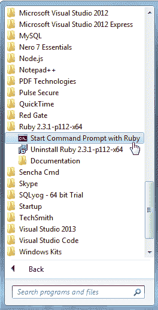

# 设置开发环境

> 原文:[https://www . tutorial stearner . com/sass/setup-sass-development-environment](https://www.tutorialsteacher.com/sass/setup-sass-development-environment)

在前一章中，您了解了 Sass 及其 transpiler。在这里，您将学习为 Sass 设置开发环境。

Sass transpiler 使用 Ruby，默认情况下在 Windows 中不会安装 Ruby，所以这是我们需要做的第一件事。

## 安装 Ruby

要安装 Ruby，请从[rubyinstaller.org](https://rubyinstaller.org)下载并运行最新稳定版本的 Windows Ruby 安装程序。 作为安装的一部分，安装程序将在您的开始菜单中添加“使用 Ruby 启动命令提示符”快捷方式。(您会在 Ruby 文件夹中找到它。)

[](../../Content/images/sass/start-ruby-command-prompt.png)

Start Ruby Command Prompt in Windows


使用上面的命令提示符和 ruby 来运行 sass 的所有命令。

## 安装 Sass

要安装 Sass transpiler，请打开一个命令窗口。在 Windows 上，使用“用 Ruby 启动命令提示符”快捷方式。在苹果电脑上，使用终端程序。(您可以在“实用程序”文件夹中找到它。)

命令窗口打开后，执行以下命令:

`gem install sass`

在 Windows 上，您可能会看到一个确认对话框。就答应吧。

在任一系统上，根据您的安全设置，您可能会收到一条错误消息。如果发生这种情况，请尝试以下命令:

`sudo gem install sass`

## 测试 Sass

让我们尝试一些事情来确保一切正常。首先，执行以下命令:

`sass -v`

过一会儿，您应该会看到安装在系统上的 Sass 版本(这就是-v 开关的意思)。

现在让我们尝试一些实际的 Sass 代码。启动编辑器，创建一个名为 test.scss (The。scss 扩展名是用于 Sass 文件的两种文件扩展名之一。我们将在下一章更详细地讨论这个问题。)

输入以下代码，并保存文件。

```
 $primary : #434433;

html {
  text-color: $primary;
} 
```

现在返回命令窗口，确保您在创建文件的文件夹中，并执行以下命令:

`sass test.scss test.css`

Sass transpiler 将创建 test.css 文件。如果您在编辑器中打开它(或者只是在命令窗口中键入它)，它应该如下所示:

```
html {
  text-color: #434433; 
} 
```

恭喜你！您刚刚编写了第一段 Sass 代码，并将其转换为 CSS。

## 观看萨斯文件和文件夹

您总是可以使用我们刚才尝试的命令语法来传输单个 Sass 文件:

Syntax:

```
sass <input-file> <output-file>

```

但这很快就会变得乏味。无论你使用什么样的代码编辑器，都有可能为你处理转换过程，无论是本地的还是通过编辑器扩展。大多数流行的编辑器都有扩展，包括 Visual Studio 代码和 Atom。值得一查，因为集成的 transpilation 使得整个过程无缝衔接。

如果您使用任何工作流自动化工具，如[咕噜声](https://gruntjs.com/)或[吞咽声](http://gulpjs.com)，您可以在任务文件中包含翻译过程。同样，它使过程变得无缝，在编码时需要考虑的事情越少越好，对吗？

这些技术中的任何一种都适用于本教程中的示例和练习，但是为了简单起见，我们将使用最基本的:命令行。根据您使用的是 Windows 还是 Mac，安装过程略有不同，但是一旦安装了 Sass，无论您使用的是什么编辑器或操作系统，一切都将保持不变。

如果您没有使用任何自动化工具，那么您也可以告诉 transpiler 使用- watch 标志来监视单个文件或整个文件夹:

`sass --watch input:output`

注意，这个语法有点不同:输入和输出值用冒号而不是空格分隔。例如，要告诉 transpiler 在每次 test.scss 更改时重新创建 test.css，您应该执行以下命令:

`sass --watch test.scss:test.css`

当然，您的项目中通常会有多个文件。在这种情况下，让 Sass 监视整个文件夹会更有效。因为您不需要部署 Sass 文件，所以最好将 CSS 文件放在不同的文件夹中，所以在大多数情况下，您会告诉 transpiler 监视整个文件夹，使用如下语法:

`sass --watch project/sass:project/stylesheets`

项目/sass 当然是在开发过程中放置 sass 文件的地方，而项目/样式表是在部署时放置 CSS 文件的地方。

大多数情况下，您需要 Sass 做的只是传输一个文件或一个文件夹，但它确实有一些其他的开关。您可以通过在命令行中键入`sass --help`来检查它们。