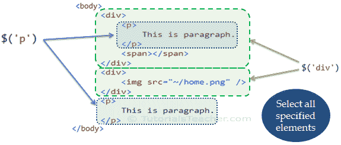
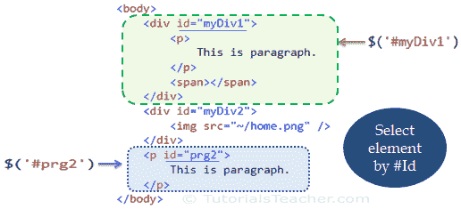
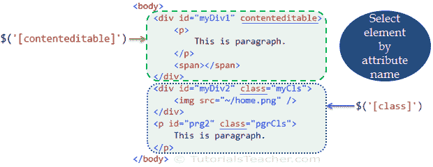
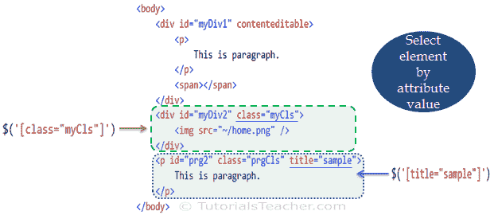

# jQuery 选择器

> 原文:[https://www.tutorialsteacher.com/jquery/jquery-selectors](https://www.tutorialsteacher.com/jquery/jquery-selectors)

在本节中，您将了解 jQuery 选择器以及如何使用选择器查找 DOM 元素。

jQuery 选择器使您能够在网页中找到 DOM 元素。大多数情况下，您将从 jQuery 中的选择器函数$()开始。

Syntax:

```
$(*selector expression*, *context*)

jQuery(*selector expression*, *context*)

```

选择器表达式参数指定匹配元素的模式。jQuery 使用 [CSS 选择器模式](https://www.w3.org/TR/CSS21/selector.html)以及它自己的模式来匹配元素。

上下文参数是可选的。它指定了 DOM 层次结构中的元素，jQuery 从这些元素开始搜索匹配的元素。

让我们看看 jQuery 中常用的选择器。

## 按名称选择元素

最常见的选择器模式是元素名称。将元素名称指定为字符串，例如`$('p')`将返回网页中所有< p >元素的数组。

下图显示了将从$('p ')和$'(div ')返回哪些 DOM 元素。

[](../../Content/images/jquery/jq-element-selector.png) 

jQuery Selectors Demo


如上图所示，$('div ')将返回所有

元素，包括其子元素。Example: Select Elements by Name

```
$('p').append('This is paragraph.'); // appends text to all p elements 

$('div').append('This is div.); // appends text to all div elements 

<div>
    <p></p>
    <p></p>
</div>

<p></p>

<div></div>
```

## 按标识选择元素

  jQuery [append()](/jquery/jquery-dom-manipulation "DOM manipulation methods") method inserts text at the end in the element.

您可以通过使用 id 选择器模式来获取特定的元素。指定要获取其引用的元素的 id，从# 符号开始。

下图显示了将从$(“# mydiv 1”)& $ '(# PRG 2’)返回哪些 DOM 元素。

[](../../Content/images/jquery/jq-id-selector.png) 

jQuery Id Selector Demo


Example: Select Element by #Id

```
$('#impPrg').append('This element\'s id is "impPrg"');

$('#myDiv2').append('This element\'s id is "myDiv2"');

<div id="myDiv1">
    <p></p>
</div>

<p id="impPrg"></p>

<div id="myDiv2">
</div>
```

## 按属性选择元素

jQuery 还允许您根据元素上设置的属性来查找元素。在$函数的方括号中指定属性名称(例如$(“[类]”)将返回所有具有类属性的元素，而不考虑值。

在下面的示例中，jQuery 返回所有具有类或内容可编辑属性的元素，而不考虑任何值。

[](../../Content/images/jquery/jq-attribute-selector.png) 

jQuery Attribute Selector


Example: Select Elements by Attribute

```
$('[class]').append('This element has class attribute');

<div id="myDiv1">
    <p></p>
</div>

<p id="impPrg" class="boldPrg"></p>

<div id="myDiv2" class="yellowDiv">
</div>
```

您也可以在属性选择器中指定属性的特定值。例如，$('[class="myCls"]')将返回所有具有以 myCls 作为值的类属性的元素。

[](../../Content/images/jquery/jq-attribute-value-selector.png) 

jQuery Selector by Attribute Value


Example: Select Element by Attribute Value

```
$('[class="yellowDiv"]').append('This element includes class="yellowDiv" attribute');

<div id="myDiv1">
    <p></p>
</div>

<p id="impPrg" class="boldPrg">This is paragraph.</p>

<div id="myDiv2" class="yellowDiv">
</div>
```

## jQuery 选择器模式

jQuery 提供了许多选择特定 DOM 元素的方法。下表列出了最重要的选择器模式。

| 种类 | 选择器 | 描述 |
| --- | --- | --- |
| 查找单元 | [【div】](/codeeditor?cid=jquery-21) | 查找所有元素 |
|  | 美元(‘p，div，code’) | 找到、和`元素` |
| 查找后代元素 | [【div p】](/codeeditor?cid=jquery-153) | 找到所有的后代

元素

 |
|  | 【div>p】T3】 | 找到的孩子 |
|  | [$(*)](/codeeditor?cid=jquery-155) | 查找所有元素 |
| 按标识查找 |  | 查找 id 为*my div*T2 的元素 |
|  | [$【div # mydvd】](/codeeditor?cid=jquery-157) | 找到 Id 为*my div*T3 的元素 |
|  |  | 用逗号分隔的 id 查找多个元素。 |
| 按 CSS 类查找 | [美元(')。mysscclass '](/codeeditor?cid=jquery-159) | 用 *class=myCSSClass* 查找所有元素。 |
|  | [$(. . mycss class 1 . . mycss class 2)](/codeeditor?cid=jquery-160) | 查找类属性设置为 *myCSSClass1* 或*mycss class 2*T4 的所有元素 |
|  | [【div . mysscclass】](/codeeditor?cid=jquery-161) | 查找所有*类= MyCSScale*T3 的元素 |
| 查找子元素 | [$('p:第一个孩子')](/codeeditor?cid=jquery-162) | 查找所有元素，这是其父元素的第一个子元素。(父元素可以是任何东西) |
|  | [$(【p:最后一个孩子】)](/codeeditor?cid=jquery-163) | 选择其父元素的最后一个子元素的所有元素。(父元素可以是任何东西) |
|  | [$(“p:第 n 子(5)”)](/codeeditor?cid=jquery-164) | 选择所有元素，这是其父元素的第五个子元素。(父元素可以是任何东西) |
|  | [$(“p:n 次子(2)”)](/codeeditor?cid=jquery-165) | 选择所有元素，这是其父元素的倒数第二个子元素。(父元素可以是任何东西) |
|  | [$(【p:独生子女】)](/codeeditor?cid=jquery-166) | 选择所有元素，这些元素是其父元素的唯一子元素。(父元素可以是任何东西) |
| 按属性查找 | [$('[class]')](/codeeditor?cid=jquery-194) | 找到所有具有*类*属性的元素(无论值是多少)。 |
|  | [$('div[class]')](/codeeditor?cid=jquery-167) | 找到所有具有*类*属性的元素(无论其值如何)。 |
| 通过包含属性值来查找 | [$(' div[class = myCls]')](/codeeditor?cid=jquery-168) | 找到类属性等于 *myCls* 的所有元素。 |
|  | [$(' div[class &#124; = myCls]')](/codeeditor?cid=jquery-193) | 查找类属性等于 *myCls* 或以 *myCls* 字符串后跟连字符(-)开始的所有元素。 |
|  | [$(' div[class * = " myCls "]')](/codeeditor?cid=jquery-169) | 选择类属性包含 *myCls* 的元素。 |
|  | [$(' div[class ~ = myCls]')](/codeeditor?cid=jquery-170) | 选择其类属性包含由空格分隔的 *myCls* 的 div 元素。 |
|  | [$(【div【class $ = ' myCls ' 】)](/codeeditor?cid=jquery-171)T2】 | 选择类属性值以*结束的元素。该比较区分大小写。* |
|  | [$(【div【类！= ' myCls '])](/codeeditor?cid=jquery-172)T2】 | 选择不具有*类*属性或值不等于 myCls 的元素。 |
|  | [$(【班^=的‘mycls’】)](/codeeditor?cid=jquery-173)T2】 | 选择其*类*属性值以 myCls 开头的元素。 |
|  | [$(“div:contains(' tutorialsterm ')”](/codeeditor?cid=jquery-174)T2】 | 选择所有包含文本*“教师”* 的元素 |
| 按输入类型查找 | [$(“:输入”)](/codeeditor?cid=jquery-175) | 选择所有输入元素。 |
| :按钮 | [$(“:按钮”)](/codeeditor?cid=jquery-176) | 选择所有输入元素。 |
| :收音机 | [$(":radio")](/codeeditor?cid=jquery-177) | 选择所有输入类型，其中 type="radio " |
| :文本 | [$(":text")](/codeeditor?cid=jquery-178) | 选择所有输入元素，其中 type="text "。 |
| ":复选框" | [$(":复选框")](/codeeditor?cid=jquery-179) | 选择所有复选框元素。 |
| :提交 | [$(“:submit”)](/codeeditor?cid=jquery-180) | 选择 type="submit "处的所有输入元素。 |
| :密码 | [$(“:密码”)](/codeeditor?cid=jquery-181) | 选择所有输入元素，其中 type="password "。 |
| :重置 | [【重置】](/codeeditor?cid=jquery-182) | 选择 type="reset "处的所有输入元素。 |
| :图像 | [$(':image')](/codeeditor?cid=jquery-183) | 选择所有输入元素，其中 type="image "。 |
| :文件 | [$(':file')](/codeeditor?cid=jquery-184) | 选择类型为“文件”的所有输入元素。 |
| :已启用 | [$(':已启用')](/codeeditor?cid=jquery-185) | 选择所有启用的输入元素。 |
| :禁用 | [$(':禁用')](/codeeditor?cid=jquery-186) | 选择所有禁用的输入元素。 |
| :已选择 | [$(':选中')](/codeeditor?cid=jquery-187) | 选择所有选定的输入元素。 |
| :选中 | [$(':选中')](/codeeditor?cid=jquery-188) | 选择所有选中的输入元素。 |
| :隐藏 | [$(':隐藏')](/codeeditor?cid=jquery-189) | 选择所有隐藏元素。 |
| :可见 | [$(':可见')](/codeeditor?cid=jquery-190) | 选择所有可见元素。 |
| :奇怪 | [$（'tr：奇数'）](/codeeditor?cid=jquery-191) | 选择所有奇数行。(1,3,5,7..) |
| :偶数 | [$('tr:even')](/codeeditor?cid=jquery-192) | 选择所有偶数行。(0,2,4,6..) |

访问[选择器参考](/jquery/jquery-selector-reference)了解更多选择器模式。