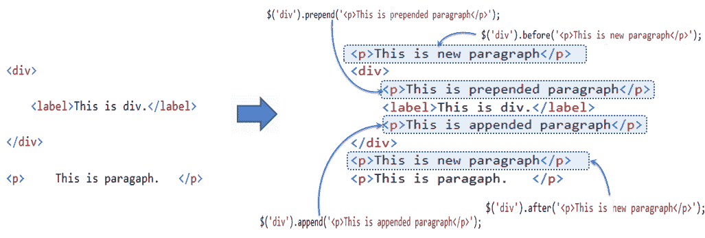

# jQuery 中的 DOM 操作方法

> 哎哎哎:# t0]https://www . tutorial connector . com/jquery/jquery-DOM-manipulation

jQuery 提供了各种方法来添加、编辑或删除 HTML 页面中的 DOM 元素。

下表列出了一些添加/删除新 DOM 元素的重要方法。

| 方法 | 描述 |
| --- | --- |
| 追加() | 将内容插入到由选择器指定的元素末尾。 |
| 之前() | 在由选择器指定的元素之前插入内容(新的或现有的 DOM 元素)。 |
| 之后() | 在选择器指定的元素后插入内容(新的或现有的 DOM 元素)。 |
| prepend() | 在选择器指定的元素的开头插入内容。 |
| 移除() | 从由选择器指定的 DOM 中移除元素。 |
| replaceAll() | 用指定的元素替换目标元素。 |
| 包装() | 在选择器指定的每个元素周围包装一个 HTML 结构。 |

下图显示了 DOM 操作方法如何添加新元素。

[](../../Content/images/jquery/manipulation-methods.png) 

DOM Manipulation Methods


让我们快速浏览一下重要的 DOM 操作方法。

## ()方法后的 jQuery

方法在选择器指定的目标元素后插入内容(新的或现有的 DOM 元素)。

Syntax:

```
$('selector expression').after('content');
```

首先，指定一个选择器来获取要添加内容的目标元素的引用，然后调用 after()方法。将内容字符串作为参数传递。内容字符串可以是任何有效的 HTML 元素。

Example: jQuery after() Method

```
$('#div1').after('<div style="background-color:yellow"> New div </div>');

<div id="div1">div 1
</div>

<div id="div2">div 2
</div>
```

Result:

```
<div id="div1">div 1
</div>

<div style="background-color:yellow"> New div </div>

<div id="div2">div 2
</div>
```

## 方法之前的 jQuery()

方法在选择器指定的目标元素之前插入内容(新的或现有的 DOM 元素)。

Syntax:

```
$('selector expression').before('content');

```

指定一个选择器以获取要在之前添加内容的目标元素的引用，然后调用 before()方法。将可以是任何有效 HTML 元素的内容字符串作为参数传递。

Example: jQuery before() Method

```
$('#div1').before('<div style="background-color:yellow"> New div </div>');

<div id="div1">div 1
</div>

<div id="div2">div 2
</div>
```

Result:

```
<div style="background-color:yellow"> New div </div>
<div id="div1">div 1
</div>

<div id="div2">div 2
</div>
```

## jQuery 追加()方法

jQuery append()方法将内容插入到由选择器指定的目标元素的末尾。

Syntax:

```
$('selector expression').append('content');
```

首先指定一个选择器表达式来获取要向其追加内容的元素的引用，然后调用 append()方法并将内容字符串作为参数传递。

Example: jQuery append() Method

```
$('p').append('World!');

<p>Hello </p>
```

Result:

```
<p>Hello World!</p>
```

## jQuery prepend()方法

jQuery prepend()方法在选择器指定的元素的开头插入内容。

Syntax:

```
$('selector expression').prepend('content');
```

首先指定一个选择器表达式来获取要为其添加内容的元素的引用，然后调用 prepend()方法并将内容字符串作为参数传递。

Example: jQuery prepend() Method

```
$('div').prepend('<p>This is prepended paragraph</p>');

<div>
    <label>This is div.</label>
</div>
```

Result:

```
<div>
    <p>This is prepended paragraph</p> 
    <label>This is div.</label>
</div>
```

## jQuery 移除()方法

jQuery remove()方法移除选择器指定的元素。

Syntax:

```
$('selector expression').remove();
```

首先指定一个选择器表达式来获取要从文档中移除的元素的引用，然后调用 remove()方法。

Example: jQuery remove() Method

```
$('label').remove();

<div>This is div.
    <label>This is label.</label>
</div>
```

Result:

```
<div>
    This is div.
</div>
```

## jQuery 替换所有()方法

jQuery replaceAll()方法用指定的元素替换所有目标元素。

Syntax:

```
$('content string').replaceAll('selector expression');
```

在这里，语法是不同的。首先将内容字符串指定为替换元素，然后使用选择器表达式调用 replaceAll()方法来指定目标元素。

Example: jQuery replaceAll() Method

```
$('<span>This is span</span>').replaceAll('p');

<div>
    <p>This is paragraph.</p>
</div>

<p>This is another paragraph.</p>
```

Result:

```
<div>
    <span>This is span</span>
</div>
<span>This is span</span>
```

## jQuery 包装()方法

jQuery wrap()方法用指定的内容元素包装每个目标元素。

Syntax:

```
$('selector expression').wrap('content string');
```

指定一个选择器来获取目标元素，然后调用 wrap 方法并传递内容字符串来包装目标元素。

Example: jQuery wrap() Method

```
$('span').wrap('<p></p>');

<div>
    <span>This is span.</span>
</div>
<span>This is span.</span>
```

Result:

```
<div>
    <p> <span>This is span.</span></p>
</div>
<p><span>This is span.</span></p>
```

访问[操纵方法参考](/jquery/jquery-dom-methods-reference)了解 jQuery 中所有的 DOM 操纵方法。