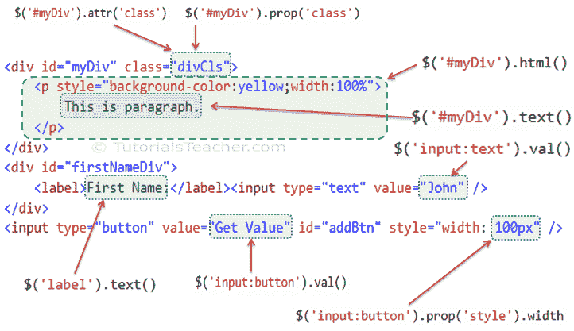

# 使用 jQuery 操作 HTML 属性

> 原文：<https://www.tutorialsteacher.com/jquery/jquery-manipulate-attributes-of-dom-elements>

下表列出了获取或设置属性值、属性值、文本值或 html 值的 jQuery 方法。

| jQuery 方法 | 描述 |
| --- | --- |
| attr() | 获取或设置目标元素的指定属性值。 |
| 道具() | 获取或设置目标元素的指定属性值。 |
| html() | 获取或设置指定目标元素的 html 内容。 |
| 文本() | 获取或设置指定目标元素的文本。 |
| val() | 获取或设置指定目标元素的 value 属性。 |

下图显示了访问 DOM 元素的属性、属性和值的各种 jQuery 方法。



jQuery Methods to Access Values


让我们快速浏览一下访问元素属性的重要方法。

## jQuery attr()方法

jQuery attr()方法用于获取或设置 DOM 元素指定属性的值。

Syntax:

```js
$('selector expression').attr('name','value');

```

首先，指定一个选择器来获取元素的引用，并用属性名参数调用 attr()方法。若要设置属性值，请将 value 参数与 name 参数一起传递。

Example: jQuery attr() Method

```js
$('p').attr('style'); // returns "font-size:16px;font-weight:bold" 
$('div').attr('class','yellowDiv');  // adds class='divCls' to each div element

<div>
    This is div.
</div>
<p style="font-size:16px;font-weight:bold">
    This is paragraph.
</p>
<div>
    This is div.
</div>
<p>
    This is paragraph.
</p>
```

在上例中，`$('p').attr('style')`获取 html 页面中第一个< p >元素的样式属性。它不返回所有< p >元素的样式属性。

## jQuery prop()方法

jQuery prop()方法获取或设置 DOM 元素的指定属性值。

Syntax:

```js
$('selector expression').prop('name','value');

```

首先，指定一个选择器来获取元素的引用，并调用 prop()方法。提供“name”参数以获取该属性的值。若要设置属性值，请指定一个值参数和名称参数。

Example: jQuery prop() Method

```js
var style = $('p').prop('style');
style.fontWeight; // returns "bold" 

$('div').prop('class','yellowDiv'); // add class="yellowDiv" to all div elements

<div>
    This is div.
</div>
<p style="font-size:16px;font-weight:bold">
    This is paragraph.
</p>
<div>
    This is div.
</div>
<p>
    This is paragraph.
</p>
```

在上例中，`$('p').prop('style')`返回一个对象。您可以通过使用 object.propertyName 约定获得不同的样式属性，例如 style.fontWeight。不要包含“-”作为属性名。

## jQuery html()方法

jQuery html()方法获取或设置 html 内容到指定的 DOM 元素。

Syntax:

```js
$('selector expression').html('content');
```

首先，指定一个选择器来获取元素的引用，并调用 html()方法，而不传递任何参数来获取内部 html 内容。若要设置 html 内容，请将 html 内容字符串指定为参数。

Example: jQuery html() Method

```js
$('#myDiv').html(); //returns innerHtml of #myDiv

//add <p>This is paragraph.</p> to #emptyDiv
$('#emptyDiv').html('<p>This is paragraph.</p>');

<div id="myDiv" class="yellowDiv">
    <p style="font-size:16px;font-weight:bold">
        This is paragraph.
    </p>
</div>
<div id="emptyDiv">
</div>
```

## jQuery 文本()方法

jQuery text()方法获取或设置指定 DOM 元素的文本内容。

Syntax:

```js
$('selector expression').text('content');
```

首先，指定一个选择器来获取元素的引用，并调用 text()方法来获取元素的文本内容。若要设置文本内容，请将内容字符串作为参数传递。

Example: jQuery text() Method

```js
$('#myDiv').text(); //returns "This is paragraph."
$('p').text(); //returns "This is paragraph."

//removes all the content from #emptyDiv and inserts "This is some text." to it
$('#emptyDiv').text('This is some text.');

<div id="myDiv" class="divCls">
    <p style="font-size:16px;font-weight:bold">
        This is paragraph.
    </p>
</div>
<div id="emptyDiv">
</div>
```

请注意，text()方法只返回元素内部的文本内容，而不返回内部 Html。

## jQuery val()方法

jQuery val()方法获取或设置指定 DOM 元素的 value 属性。

Syntax:

```js
$('selector expression').val('value');
```

首先，指定一个选择器来获取元素的引用，并调用 val()方法来获取 value 属性值。若要设置文本内容，请将内容字符串作为参数传递。

Example: jQuery val() Method

```js
$('input:Submit').val(); //returns "Save"

//set value of input text to "Steve"
$('input:text').val('Steve');

$('input:text').val(); //returns "Steve"

<div>
    <label>Name:</label><input type="text" />
</div>

<div>
    <input type="Submit" value="Save" />
</div>
```

在上例中，val()方法返回“value”属性的值。如果元素不支持 value 属性，则 val()方法返回 null。

访问[操纵方法参考](/jquery/jquery-dom-methods-reference)了解所有操纵属性的 jQuery 方法。

  Points to Remember :

1.  jQuery 属性方法允许您操作元素的属性和特性。
2.  使用选择器获取元素的引用，然后调用 jQuery 属性方法对其进行编辑。
3.  重要的 DOM 操作方法:attr()、prop()、html()、text()、val()等。