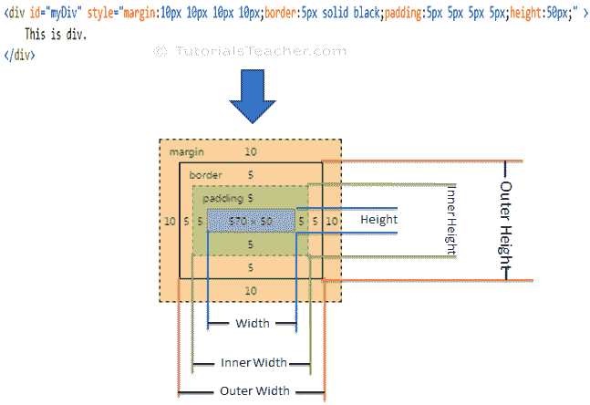

# 使用 jQuery 操作 DOM 元素的维度

> 原文：<https://www.tutorialsteacher.com/jquery/jquery-get-dimensions-of-dom-elements>

jQuery 库包括各种方法来操作 DOM 元素的尺寸，如高度、宽度、偏移量、位置等。

下表列出了获取或设置 DOM 元素维度的所有 jQuery 方法。

| jQuery 方法 | 描述 |
| --- | --- |
| [身高()](#height)T2】 | 获取或设置指定元素的高度。 |
| innerHeight() | 获取或设置指定元素的内部高度(填充+元素高度)。 |
| 外部高度() | 获取或设置指定元素的外部高度(边框+填充+元素高度)。 |
| [偏移()](#offset)T2】 | 获取或设置指定元素的左坐标和上坐标。 |
| 位置() | 获取指定元素的当前坐标。 |
| [宽度()](#width)T2】 | 获取或设置指定元素的宽度。 |
| 内宽（） | 获取或设置指定元素的内部宽度(填充+元素宽度)。 |
| 外宽（） | 获取或设置指定元素的外部宽度(边框+填充+元素宽度)。 |

下图显示了元素的各种尺寸。

[](../../Content/images/jquery/jquery-dom-dimension.png)

DOM Element's Dimensions


## jQuery 高度()方法

jQuery height()方法获取或设置指定 DOM 元素的高度。

Syntax:

```js
$('selector expression').height(value);
```

指定一个选择器来获取元素的引用，并调用 height()方法来获取以像素为单位的高度。若要设置指定元素的高度，请在 height()方法中将 height 指定为整数参数。

Example: jQuery height() Method

```js
$('#myDiv').height(); //returns height of #myDiv in pixels
$('p').height(); //returns height in pixel

//set height of all div elements
$('div').height(100);

<div id="myDiv" >
    This is div.
</div>

<p>
    This is paragraph.
</p>
```

## jQuery 宽度()方法

jQuery width()方法获取或设置指定 DOM 元素的宽度。

Syntax:

```js
$('selector expression').width(value);

```

指定选择器以获取元素的引用，并调用 width()方法以获取以像素为单位的宽度。将宽度指定为整数参数以设置宽度。

Example: jQuery width() Method

```js
$('#myDiv').width(); //returns width of #myDiv in pixels
$('p').width(); //returns width of p in pixel

//set width of all div elements
$('div').width(100);

<div id="myDiv" >
    This is div.
</div>

<p>
    This is paragraph.
</p>
```

## jQuery 偏移量()方法

jQuery offset()方法获取或设置指定元素的坐标。

Syntax:

```js
$('selector expression').offset(options);
```

指定一个选择器来获取元素的引用，并调用 offset()方法来获取具有 left 和 top 属性的 jQuery 对象。使用左侧和顶部属性指定 JSON 对象，并指定要将元素移动到的坐标。

Example: jQuery offset() Method

```js
var ofs = $('#myDiv').offset();
alert('left:' + ofs.left + ', top: ' + ofs.top);

$('p').offset({ left:100, top:200});

<div id="myDiv" >
    This is div.
</div>

<p>
    This is paragraph.
</p>
```

访问 [DOM 操作方法参考](/jquery/jquery-dom-methods-reference)了解所有操作维度的方法。

  Points to Remember :

1.  jQuery 维度方法允许您操作 DOM 元素的维度。
2.  使用选择器获取元素的引用，然后调用 jQuery 维度方法对其进行编辑。
3.  重要的 DOM 操作方法:高度()、宽度()、偏移量()、位置()等。