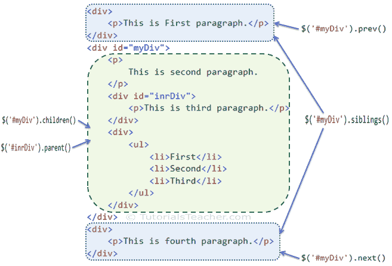

# 使用 jQuery 遍历 DOM 元素

> 原文:[https://www . tutorial stearn . com/jquery/jquery-遍历-dom-elements](https://www.tutorialsteacher.com/jquery/jquery-traversing-dom-elements)

jQuery 库包括在 DOM 层次结构中遍历 DOM 元素的各种方法。

下表列出了遍历 DOM 元素的 jQuery 方法。

| jQuery 方法 | 描述 |
| --- | --- |
| 儿童() | 获取指定元素的所有子元素 |
| 每个() | 迭代指定的元素，并为每个元素执行指定的回调函数。 |
| 查找() | 获取每个指定元素的所有指定子元素。 |
| 第一次() | 获取指定元素的第一个匹配项。 |
| 下一个() | 获取指定元素的紧接着的同级。 |
| 父项() | 获取指定元素的父元素。 |
| prev() | 获取指定元素的前一个同级。 |
| 兄弟姐妹() | 获取每个指定元素的同级 |

下图显示了 jQuery 遍历方法如何获取 DOM 元素。

[](../../Content/images/jquery/jq-traversing-methods.png)

Traversing DOM Elements


让我们看看一些重要的 jQuery 遍历方法。

## jQuery 每个()方法

jQuery each()方法迭代每个指定的元素(使用选择器指定)，并为每个元素执行回调函数。

Syntax:

```
$('selector expression').each(callback function);
```

首先，指定一个选择器来获取元素的引用，并用回调函数调用每个()方法，回调函数将为每个元素执行。

Example: jQuery each() method

```
$('p').each(function (index) {
        alert('index' + index + ', text: ' + $(this).text());
    });

<div>
    <p>This is First paragraph.</p>
</div>
<div id="myDiv">
    <p>
        This is second paragraph.
    </p>
    <div id="inrDiv">
        <p>This is third paragraph.</p>
    </div>
    <div>
        <ul>
            <li>First</li>
            <li>Second</li>
            <li>Third</li>
        </ul>
    </div>
</div>
<div>
    <p>This is fourth paragraph.</p>
</div>
```

Result:

```
Index:0, text: This is first paragraph.
Index:1, text: This is second paragraph.
Index:2, text: This is third paragraph.
Index:3, text: This is fourth paragraph.
```

## jQuery 子()方法

jQuery children()方法获取使用选择器表达式指定的每个元素的子元素。

Syntax:

```
$('selector expression').children();
```

 Elements returned from children() method can be iterated using each() method.

首先，指定一个选择器来获取元素的引用，并调用 children()方法来获取所有子元素。

Example: jQuery children() method

```
$('#myDiv').children().each(function (index) {
        alert('Index: ' + index + ', html: ' + $(this).html());
    });

<div>
    <p>This is First paragraph.</p>
</div>
<div id="myDiv">
    <p>
        This is second paragraph.
    </p>
    <div id="inrDiv">
        <p>This is third paragraph.</p>
    </div>
    <div>
        <ul>
            <li>First</li>
            <li>Second</li>
            <li>Third</li>
        </ul>
    </div>
</div>
<div>
    <p>This is fourth paragraph.</p>
</div>
```

Result:

```
Index:0, html: <p>
                    This is second paragraph.
                </p>
Index:1, html: <div id="inrDiv">
                    <p>This is third paragraph.</p>
                </div>
Index:2, html: <div>
                    <ul>
                        <li>First</li>
                        <li>Second</li>
                        <li>Third</li>
                    </ul>
                </div>

```

## jQuery 查找()方法

jQuery find()方法返回指定元素的所有匹配子元素。

Syntax:

```
$('selector expression').find('selector expression to find child elements');
```

指定选择器以获取要查找其子元素的元素的引用，然后使用选择器表达式调用 find()方法以获取所有匹配的子元素。您可以使用每个方法迭代子元素。

Example: jQuery find() method

```
$('#myDiv').find('p').each(function(index){
            alert('index' + index + ', text: ' + $(this).text());
    });

<div>
    <p>This is First paragraph.</p>
</div>
<div id="myDiv">
    <p>
        This is second paragraph.
    </p>
    <div id="inrDiv">
        <p>This is third paragraph.</p>
    </div>
    <div>
        <ul>
            <li>First</li>
            <li>Second</li>
            <li>Third</li>
        </ul>
    </div>
</div>
<div>
    <p>This is fourth paragraph.</p>
</div>
```

Result:

```
Index:0, text: This is second paragraph.
Index:1, text: This is third paragraph.

```

## jQuery next()方法

jQuery next()方法获取指定元素紧接着的同级。

Syntax:

```
$('selector expression').next();
```

指定一个选择器来获取要获取其下一个元素的元素的引用，然后调用 next()方法。

Example: jQuery next() method

```
alert('Next element to #myDiv: ' + $('#myDiv').next().html());

alert('Next element to #inrDiv: ' + $('#inrDiv').next().html());

<div>
    <p>This is First paragraph.</p>
</div>
<div id="myDiv">
    <p>
        This is second paragraph.
    </p>
    <div id="inrDiv">
        <p>This is third paragraph.</p>
    </div>
    <div>
        <ul>
            <li>First</li>
            <li>Second</li>
            <li>Third</li>
        </ul>
    </div>
</div>
<div>
    <p>This is fourth paragraph.</p>
</div>
```

Result:

```

```
Next element to #myDiv: <div>
                            <p>This is fourth paragraph.</p>
                        </div>        

Next element to #inrDiv: <ul>
                            <li>First</li>
                            <li>Second</li>
                            <li>Third</li>
                        </ul>

```

```

## jQuery 父()方法

jQuery parent()方法获取指定元素的直接父元素。

Syntax:

```
$('selector expression').parent();
```

指定一个选择器以获取要获取其父元素的元素的引用，然后调用 parent()方法。

Example: jQuery parent() method

```
alert('Parent element of #inrDiv: ' + $('#inrDiv').parent().html());

<div>
    <p>This is First paragraph.</p>
</div>
<div id="myDiv">
    <p>
        This is second paragraph.
    </p>
    <div id="inrDiv">
        <p>This is third paragraph.</p>
    </div>
    <div>
        <ul>
            <li>First</li>
            <li>Second</li>
            <li>Third</li>
        </ul>
    </div>
</div>
<div>
    <p>This is fourth paragraph.</p>
</div>
```

Result:

```
Parent element of #inrDiv: <p>
                                This is second paragraph.
                            </p>
                            <div id="inrDiv">
                                <p>This is third paragraph.</p>
                            </div>
                            <div>
                                <ul>
                                    <li>First</li>
                                    <li>Second</li>
                                    <li>Third</li>
                                </ul>
                            </div>

```

## jQuery 兄弟()方法

jQuery 兄弟()方法获取指定 DOM 元素的所有兄弟。

Syntax:

```
$('selector expression').siblings();
```

指定一个选择器以获取要获取其同级的元素的引用，并调用同级()方法。

提示:您可以使用每个()方法迭代同级元素。

Example: jQuery siblings() method

```
$('#myDiv').siblings().css({"color": "green", "border": "2px solid green"});

<div>
    <p>This is First paragraph.</p>
</div>
<div id="myDiv">
    <p>
        This is myDiv.
</div>
<div>
    <p>This is second paragraph.</p>
</div>
```

访问[遍历方法参考](/jquery/jquery-dom-traversing-methods-reference)了解所有的遍历 DOM 方法。

  Points to Remember :

1.  jQuery 遍历方法允许您迭代 DOM 层次结构中的 DOM 元素。
2.  使用选择器获取元素的引用，然后调用 jQuery 遍历方法来编辑它。
3.  重要的 DOM 操作方法:每个()、子()、find()、first()、parent()、next()、previous()、兄弟()等。