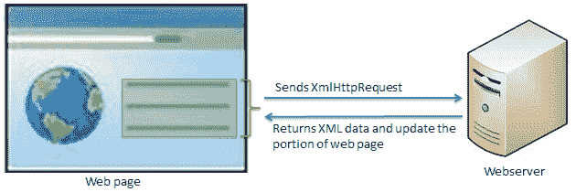

# jQuery AJAX 简介

AJAX 代表“异步 JavaScript 和 XML”。JavaScript 包含使用`XMLHttpRequest`对象发送异步 http 请求的特性。Ajax 是关于使用 JavaScript 的这种能力来发送异步 http 请求，并获取 xml 数据作为响应(也是其他格式)，以及更新网页的一部分(使用 JavaScript)，而无需重新加载或刷新整个网页。

下图说明了 Ajax 功能。

Ajax

jQuery 库包括各种发送 Ajax 请求的方法。这些方法在内部使用 JavaScript 的 XMLHttpRequest 对象。下表列出了 jQuery 的所有 Ajax 方法。

| jQuery Ajax 方法 | 描述 |
| --- | --- |
| ajax() | 向服务器发送异步 http 请求。 |
| get() | 发送 http GET 请求从服务器加载数据。 |
| 帖子() | 发送 http POST 请求将数据提交或加载到服务器。 |
| getJSON（） | 发送 http GET 请求从服务器加载 JSON 编码的数据。 |
| getScript（） | 发送 http GET 请求从服务器加载 JavaScript 文件，然后执行。 |
| 负载() | 发送 http 请求，从服务器加载 html 或文本内容，并将它们添加到 DOM 元素中。 |

jQuery 库还包括以下事件，这些事件将根据 Ajax 请求的状态触发。

| jQuery Ajax 事件 | 描述 |
| --- | --- |
| ajaxComplete() | 注册一个在 Ajax 请求完成时调用的处理函数。 |
| ajaxError() | 注册一个处理函数，当 Ajax 请求出错时调用。 |
| ajaxSend() | 在发送 Ajax 请求之前注册一个要调用的处理函数。 |
| ajaxStart() | 注册第一个 Ajax 请求开始时要调用的处理函数。 |
| ajaxStop() | 注册一个处理函数，当所有的 Ajax 请求完成时调用。 |
| ajaxSuccess() | 注册一个处理函数，以便在 Ajax 请求成功完成时调用。 |

## jQuery Ajax 的优势

1.  跨浏览器支持
2.  简单的使用方法
3.  能够发送获取和发布请求
4.  能够加载 JSON、XML、HTML 或脚本

在下一节中，让我们来看看重要的 jQuery Ajax 方法的概述。