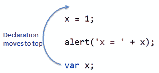

# JavaScript 提升

> 原文：<https://www.tutorialsteacher.com/javascript/javascript-hoisting>

提升是 JavaScript 中的一个概念，而不是一个特性。在其他脚本语言或服务器端语言中，变量或函数必须在使用前声明。

在 JavaScript 中，变量和函数名可以在声明之前使用。JavaScript 编译器将变量和函数的所有声明都移到顶部，这样就不会有任何错误。这叫提升。

Example: Hoisting

```js
x = 1;

alert('x = ' + x); // display x = 1

var x; 
```

下图说明了提升。

<figure>

<figcaption>JavaScript Hoisting</figcaption>

</figure>

同样，一个变量可以分配给另一个变量，如下所示。

Example: Hoisting

```js
x = 1;
y = x;

alert('x = ' + x);
alert('y = ' + y);

var x;
var y; 
```

只有在声明的情况下才可以进行提升，但不能进行初始化。JavaScript 不会移动在一行中声明和初始化的变量。

Example: Hoisting not applicable for initialized variables

```js
alert('x = ' + x); // display x = undefined

var x = 1; 
```

正如你在上面的例子中看到的，x 的值是未定义的，因为 var x = 1 没有被提升。

## 功能提升

JavaScript 编译器以与变量声明相同的方式将函数定义移动到顶部。

Example: Function Hoisting

```js
alert(Sum(5, 5)); // 10

function Sum(val1, val2)
{
    return val1 + val2;
} 
```

请注意，JavaScript 编译器不会移动函数表达式。

Example: Hoisting on function expression

```js
 Add(5, 5); // error

var Add = function Sum(val1, val2)
{
    return val1 + val2;
} 
```

## 变量前的提升函数

JavaScript 编译器在变量声明之前移动函数的定义。下面的例子证明了这一点。

Example: Function Hoisting Before Variables

```js
alert(UseMe);

var UseMe;

function UseMe()
{            
    alert("UseMe function called");
} 
```

根据上面的例子，它将显示 UseMe 函数定义。所以函数在变量之前移动。

  Points to Remember :

1.  JavaScript 编译器将变量和函数声明移动到顶部，这称为提升。
2.  只有变量声明移动到顶部，而不是初始化。
3.  函数定义首先移动到变量之前。