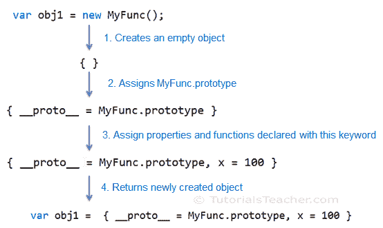

# JavaScript `new`关键字

> 原文：<https://www.tutorialsteacher.com/javascript/new-keyword-in-javascript>

我们在[对象](/javascript/javascript-object "JavaScript Object")部分看到，可以用新的关键字创建一个对象。在这里，您将了解它在创建对象时执行的步骤。

```js
function MyFunc() {
    this.x = 100;
}

var obj1 = new MyFunc();
obj1.x;
```

 The built-in primitive types in JavaScript are functions only e.g. Object, Boolean, String, Number is built-in JavaScript functions. If you write Object in browser's console window and press Enter then you will see the output "function Object()".

在上面的例子中，我们使用 new 关键字创建了一个 MyFunc 的对象。这个 MyFunc()被称为构造器。new 关键字构造并返回构造器的对象(实例)。

`new`关键字执行以下四项任务:

1.  它创建新的空对象，例如 obj = { }；
2.  它将新空对象的不可见“prototype”属性设置为构造器的可见且可访问的“prototype”属性。(每个函数都有可见的“原型”属性，而每个对象都有不可见的“原型”属性)
3.  它将使用该关键字声明的属性或函数绑定到新对象。
4.  它返回新创建的对象，除非构造器返回非原始值(自定义 JavaScript 对象)。如果构造器不包含 return 语句，编译器将插入“return this”隐式地放在函数的末尾。如果构造器返回一个基元值，那么它将被忽略。

让我们看看 new 关键字如何使用下面的例子创建一个对象。

Example: new keyword

```js
function MyFunc() {
    var myVar = 1;
    this.x = 100;
}

MyFunc.prototype.y = 200;

var obj1 = new MyFunc();
obj1.x; // 100
obj1.y; // 200 
```

让我们理解当您使用 new 关键字创建 MyFunc()的对象(实例)时会发生什么。

首先，new 关键字创建一个空对象- { }。

其次，它将这个空对象的不可见“prototype”属性(或属性)设置为 myFunc 的 prototype 属性。正如您在上面的例子中看到的，我们已经使用 MyFunc.prototype.y 分配了新的属性“y”。因此，新的空对象也将具有与包含 y 属性的 MyFunc 相同的原型属性。

在第三步中，它将使用该关键字声明的所有属性和函数绑定到新的空对象。这里，MyFunc 只包含一个用这个关键字声明的属性 x。所以新的空对象现在将包含 x 属性。MyFunc 还包括没有用这个关键字声明的 myVar 变量。所以 myVar 不会包含在新对象中。

在第四步，也是最后一步，它将返回这个新创建的对象。MyFunc 不包含 return 语句，但编译器会在末尾隐式插入“return this”。

因此，MyFunc 的对象将使用新的关键字返回。

下图说明了上述过程。

[](../../Content/images/oo-js/new-keyword.png)

Object creation process


new 关键字忽略返回基元值的 return 语句。

Example: new keyword

```js
function MyFunc() {
    this.x = 100;

    return 200;
}

var obj = new MyFunc();
alert(obj.x); // 100 
```

如果函数返回非原始值(自定义对象)，那么 new 关键字不执行上述 4 个任务。

Example: new keyword

```js
function MyFunc() {
    this.x = 100;

    return { a: 123 };
}

var obj1 = new MyFunc();

alert(obj1.x); // undefined 
```

因此，new 关键字在 JavaScript 中构建了一个函数对象。