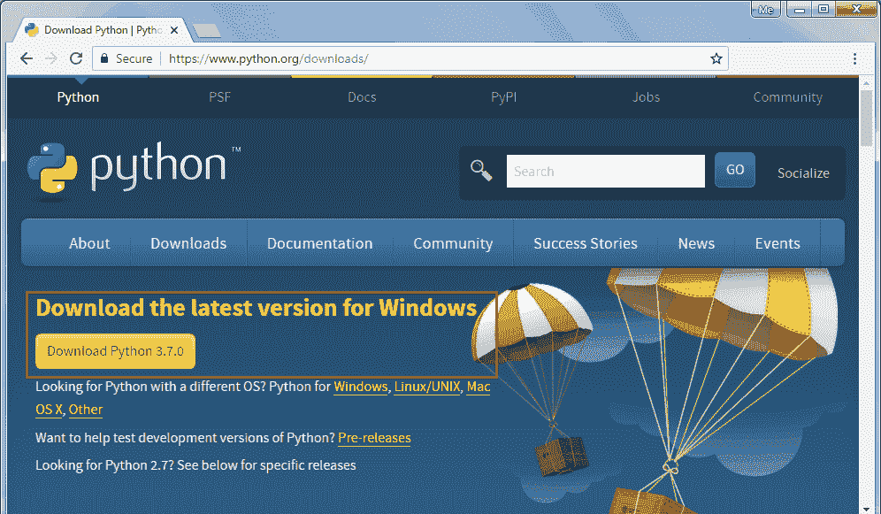
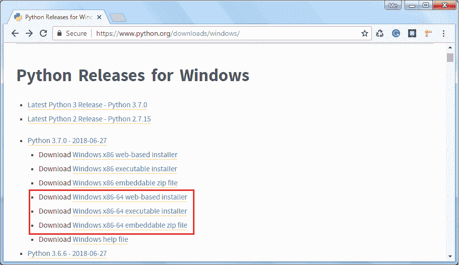
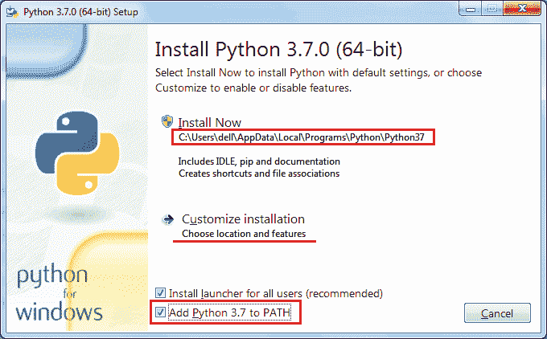
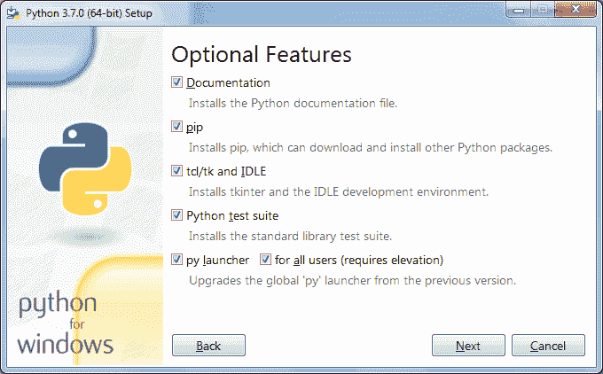
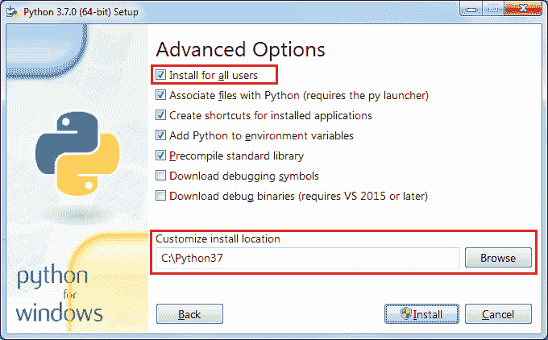
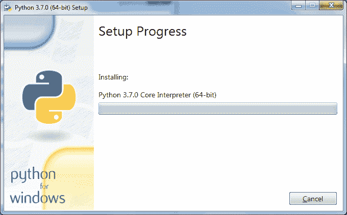

# 在 Windows、Mac 和 Linux 上安装 Python

> 原文：<https://www.tutorialsteacher.com/python/install-python>

Python 可以安装在 Windows、Linux、Mac OS 以及某些其他平台上，如 IBM AS/400、iOS、Solaris 等。

要在您的本地机器上安装 Python，请根据您的操作系统、硬件架构和本地机器的版本，从[https://www.python.org/downloads](https://www.python.org/downloads/)获取 Python 软件的标准发行版副本。

## 在 Windows 上安装 Python

要在 Windows 平台上安装 Python，需要下载安装程序。基于网络的安装程序、可执行安装程序和可嵌入的 zip 文件可用于在 Windows 上安装 Python。访问[https://www.python.org/downloads/windows](https://www.python.org/downloads/windows)，根据本地机器的硬件架构下载安装程序。

基于 web 的安装程序需要一个活动的互联网连接。因此，您也可以下载独立的可执行安装程序。访问[https://www.python.org/downloads](https://www.python.org/downloads)，点击**下载 Python 3.7.0** 按钮，如下图。(3.7.0 是截至本文撰写时的最新版本。)

[](../../Content/images/python/download-python-windows.png) 

Download Python Library


这将下载 32 位的 python-3.7.0.exe。64 位安装程序，进入[https://www.python.org/downloads/windows](https://www.python.org/downloads/windows)选择合适的 64 位安装程序，如下图。

[](../../Content/images/python/download-python-windows64.png) 

Download Python for Windows 64 bit


下载 Windows x86-64 可执行安装程序，双击它启动 python 安装向导，如下所示。

[](../../Content/images/python/install-wizard1.png) 

Python Installation Wizard


安装是一个基于向导的简单过程。如上图所示，对于 Python 3.7.0 64 位，默认安装文件夹将是 C:\ Users \ { UserName \ } \ AppData \ Local \ Programs \ Python \ Python 37。选中**将 Python 3.7 添加到路径**复选框，这样就可以从任何路径执行 Python 脚本。 您可以点击**定制安装**选择安装文件夹或功能。这将进入可选功能的下一步，如下所示。

[](../../Content/images/python/install-wizard2.png) 

Python Installation Wizard


单击“下一步”继续。

[](../../Content/images/python/install-wizard3.png) 

Python Installation Wizard


在高级选项中，选择**为所有用户安装**选项，这样本地机器的任何用户都可以执行 Python 脚本。 此外，选择安装文件夹，为 Python 可执行文件(类似于 C:\python37)创建一个较短的路径，将其余选项保留为默认值，最后单击“安装”按钮。

[](../../Content/images/python/install-wizard4.png) 

Python Installation Wizard


安装成功后，打开命令提示符，键入`python --version`或`python -V`并按回车键，即可检查 Python 安装。如果 Python 安装成功，它将显示安装的版本。

```
C:\>python --version
Python 3.7.0
```

## 在 Mac OS X 上安装 Python

可以从[https://www.python.org/downloads/mac-osx](https://www.python.org/downloads/mac-osx/)页面下载官方安装程序安装 Python。 在 Mac OS X 的 Python Releases 标题下下载最新版本的 Python。双击安装程序文件启动安装向导。

在安装向导上，点击`Continue`几次，直到要求您同意软件许可协议，点击`Agree`完成安装。

## 在 Linux 上安装 Python

大多数 Linux 发行版都已经安装了 Python。然而，Python 2.x 版本包含在其中的许多版本中。要检查 Python 3.x 是否可用，请在 Linux 终端中运行以下命令:

```
$ which python3
```

如果可用，它会将 Python3 可执行文件的路径返回为`/usr/local/bin/python3`。

要在 Ubuntu 18.04、Ubuntu 20.04 及更高版本上安装 Python，请执行以下命令:

```
$ sudo apt-get update
$ sudo apt-get install python3.7 python3-pip
```

安装完成后，可以运行 Python 3.8 和 pip3 命令。

对于其他 Linux 发行版，使用相应的包管理器，比如 YUM 代表红帽，intelligence 代表 debian，DNF 代表 Fedora，等等。

关于在其他平台上的安装以及从源代码安装，请参考 [Python 源代码版本](https://www.python.org/downloads/source/)页面上的官方文档。