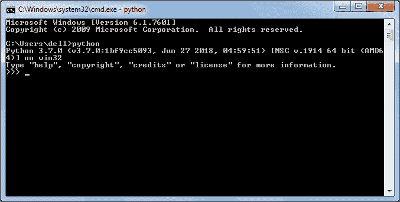
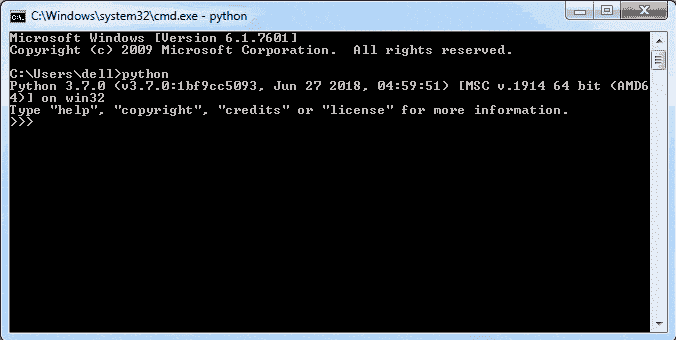

# Python 解释器:Shell/REPL

> 原文:[https://www . tutorial stearn . com/python/python-interactive-shell](https://www.tutorialsteacher.com/python/python-interective-shell)

Python 是一种解释器语言。这意味着它一行行地执行代码。Python 提供了一个 Python Shell，用于执行单个 Python 命令并显示结果。

它也称为 REPL(读取、评估、打印、循环)，在这里它读取命令、评估命令、打印结果，并循环返回以再次读取命令。

要运行 Python Shell，打开 Windows 上的命令提示符或电源 Shell，mac 上的终端窗口，写`python`并按**进入**。 出现一个 Python 提示符，包含三个大于符号`>>>`，如下所示。

<figure>[](../../Content/images/python/python-shell.png) 

<figcaption>Python Shell/REPL</figcaption>

</figure>

现在，您可以输入一条语句并获得结果。比如输入类似`3 + 2`这样的简单表达式，按回车键，会在下一行显示结果，如下图。

<figure>[](../../Content/images/python/python-shell2.gif) 

<figcaption>Execute Python Commands in Shell</figcaption>

</figure>

## 执行 Python 脚本

正如您在上面看到的，Python Shell 执行一条语句。要执行多条语句，创建一个扩展名为`.py`的 Python 文件，编写 Python 脚本(多条语句)。

例如，在文本编辑器(如记事本)中输入以下语句。

Example: myPythonScript.py<button class="copy-btn pull-right" title="Copy example code">*Copy*</button> 

```
print ("This is Python Script.")
print ("Welcome to Python Tutorial by TutorialsTeacher.com") 
```

另存为`myPythonScript.py`，将命令提示符导航到保存该文件的文件夹，执行`python myPythonScript.py`命令，如下图。 会显示结果。

<figure>[](../../Content/images/python/execute-python-script.png) </figure>

因此，您可以使用 Python REPL 执行 Python 表达式和命令，以快速执行 Python 代码。*