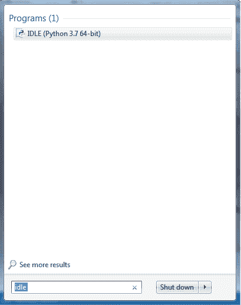
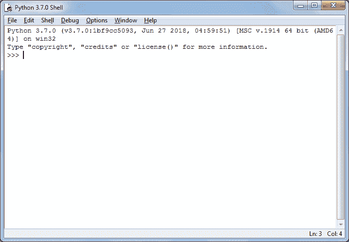
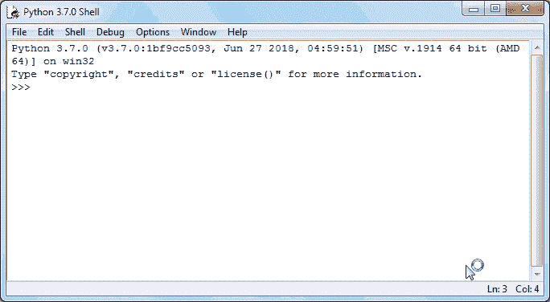
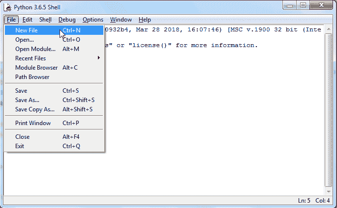
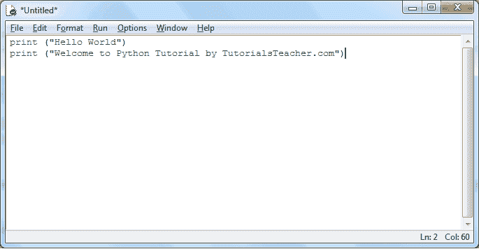
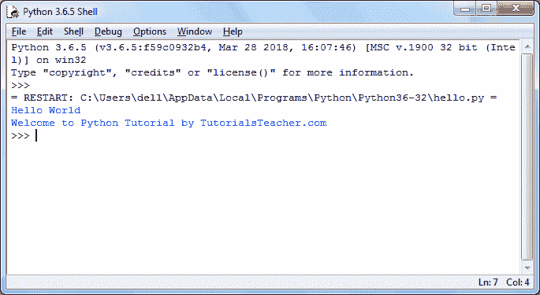

# python IDLE

> 原文：<https://www.tutorialsteacher.com/python/python-idle>

IDLE(集成开发和学习环境)是 Python 的集成开发环境(IDE)。默认情况下，窗口的 Python 安装程序包含空闲模块。

默认情况下，在 Linux 的 Python 发行版中，空闲是不可用的。它需要使用各自的包管理器来安装。执行以下命令在 Ubuntu 上安装 IDLE:

```py
$ sudo apt-get install idle
```

像 Python Shell 一样，IDLE 可以用来执行单个语句，也可以用来创建、修改和执行 Python 脚本。IDLE 提供了一个功能齐全的文本编辑器来创建 Python 脚本，该脚本包括语法突出显示、自动完成和智能缩进等功能。它还有一个带有步进和断点功能的调试器。

要启动一个 IDLE 交互式 Shell，在开始菜单中搜索 IDLE 图标并双击它。

 

Python IDLE


这将打开 IDLE，在这里您可以编写和执行 Python 脚本，如下所示。

 

Python IDLE


您可以执行与 [Python Shell](/python/python-interective-shell) 中相同的 Python 语句，如下所示。

 

Python IDLE


要执行 Python 脚本，请通过从菜单中选择文件->新建文件来创建新文件。

 

输入多条语句并以扩展名保存文件。使用文件->保存复制。例如，将以下代码保存为`hello.py`。

 

Python Script in IDLE


现在，按 F5 在编辑器窗口中运行脚本。空闲 Shell 将显示输出。

 

Python Script Execution Result in IDLE


因此，在 IDLE 中编写、测试和运行 Python 脚本很容易。

在下一章中了解不同的 Python 开源编辑器。