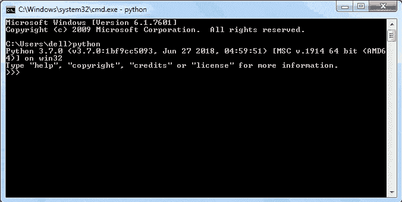

# Python 语法

> 原文：<https://www.tutorialsteacher.com/python/python-syntax>

在这里，您将学习 Python 3 的基本语法。

Python 语句以标记 NEWLINE 字符(回车)结束。这意味着 Python 脚本中的每一行都是一条语句。下面的 Python 脚本包含三行不同的三条语句。

Example: Python Statements 

```py
print('id: ', 1)
print('First Name: ', 'Steve')
print('Last Name: ', 'Jobs') 
```

使用反斜杠字符`\`连接跨越多行的语句，如下所示。

Example: Python Statements 

```py
if 100 > 99 and \
    200 <= 300 and \
    True != False:
        print('Hello World!') 
```

请注意，反斜杠字符跨越一个逻辑行中的单个语句和多个物理行，但不跨越一个逻辑行中的两个不同语句。

Example: Multiple Statements in Single Line 

```py
>>> print('Hello  \
     World!') # a multi-line statement
Hello World!
>>> print('Hello') \
    print(' World!') # two statement in one logical line
SyntaxError: invalid syntax 
```

使用分号`;`在一行中分隔多个语句。

Example: Multiple Statements in Single Line 

```py
print('id: ', 1);print('First Name: ', 'Steve');print('Last Name: ', 'Jobs') 
```

圆括号`()`、方括号`[ ]`或大括号`{ }`中的表达式可以分布在多行上，无需使用反斜杠。

Example: Multiple Statements in Single Line 

```py
list = [1, 2, 3, 4
        5, 6, 7, 8,
        9, 10, 11, 12] 
```

## Python 中的缩进

行首的前导空格或制表符被认为是行的缩进级别，用于确定语句组。具有相同缩进级别的语句被视为一个组或块。

例如，Python 中的函数、类或循环包含要执行的语句块。其他编程语言如 C# 或 Java 使用花括号`{ }`表示一段代码。 Python 使用缩进(空格或制表符)来表示语句块。

### 缩进规则

*   使用冒号 **:** 开始一个块，然后按回车键。
*   块中的所有行必须使用相同的缩进，要么是空格，要么是制表符。
*   Python 推荐**四个空格**作为缩进，让代码更易读。不要在同一个块中混合空格和制表符。
*   一个块可以有下一级缩进的内部块。

下面的例子演示了如果 elif 阻塞了[:](/python/python-if-elif)

Example: Python if Block 

```py
if 10 > 5:  # 1st block starts
    print("10 is greater than 5") # 1st block
    print("Now checking 20 > 10") # 1st block
    if 20 > 10: # 1st block
        print("20 is greater than 10") # inner block
elif: # 2nd block starts
    print("10 is less than 5") # 2nd block
    print("This will never print") # 2nd block 
```

下面的函数包含一个带有两个语句的块。

Example: Python Function Block 

```py
def SayHello(name):
    print("Hello ", name)
    print("Welcome to Python Tutorials") 
```

以下示例说明了缩进在 Python shell 中的使用:

[](../../Content/images/python/indentation3.png) 

Python Block in Shell


可以看到，在 Python shell 中，`SayHello()`功能块在`:`之后开始，按回车键。 然后显示...标记街区。使用四个空格(甚至一个空格也可以)或制表符来缩进，然后写一条语句。 要结束封锁，请按两次回车键。

同样的功能可以在 IDLE 或者其他任何基于 GUI 的 IDE 中编写，如下所示，使用 **Tab** 作为缩进。

[](../../Content/images/python/indentation2.png) 

Python Block in IDLE


## Python 中的注释

在 Python 脚本中，符号# 表示注释行的开始。它在编辑器中一直有效到行尾。

Example: Comments 

```py
# this is a comment
print("Hello World")
print("Welcome to Python Tutorial") #comment after a statement. 
```

在 Python 中，没有编写多行注释或块注释的规定。对于多行注释，每一行的开头都应该有`#`符号。

如果三重引用的多行字符串不是[函数](/python/python-user-defined-function)或[类](/python/python-class)的文档字符串，也将被视为注释。

Example: Multi-line Comments

```py
'''
comment1
comment2
comment3
''' 

```

更多信息请访问[Python 代码 PEP 8 风格指南](https://www.python.org/dev/peps/pep-0008/)。

## Python 命名约定

Python 程序可以包含变量、函数、类、模块、包等。标识符是给予这些编程元素的名称。标识符应该以字母(小写或大写)或下划线(_)开头。此后，可以使用一个以上的字母(a-z 或 A-Z)、数字(0-9)或下划线来形成标识符。不允许使用其他字符。

*   Python 中的标识符区分大小写，这意味着名为`age`和`Age`的变量是不同的。
*   类名应该使用 TitleCase 约定。它应该以大写字母开头，例如`MyClass`、`Employee`、`Person`。
*   函数名应该是小写的。多个单词应该用下划线隔开，例如`add(num)`、`calculate_tax(amount)`。
*   函数中的变量名应该是小写的，例如:`x`、`num`、`salary`。
*   模块和包名应该是小写的，例如`mymodule`、`tax_calculation`。使用下划线来提高可读性。
*   常量变量名应该大写，例如`RATE`、`TAX_RATE`。
*   命名类的实例属性时使用一个或两个下划线字符。
*   Python 本身使用了两个前导下划线和尾随下划线用于特殊目的，例如 __add__、__init__，等等。

更多信息，请访问 [PEP 8 -规范命名约定](https://www.python.org/dev/peps/pep-0008/#prescriptive-naming-conventions)。

## 显示输出

[print()](/python/print-function) 作为 Python 中的输出语句。 它呼应了 Python Shell 上任何 Python 表达式的价值。

[](../../Content/images/python/print1.gif) 

Display Output


单个`print()`功能可以显示多个值，用逗号分隔。 以下示例使用单个`print()`功能显示`name`和`age`变量的值。

```py
>>> name="Ram"                
>>> print(name) # display single variable
Ram
>>> age=21                          
>>> print(name, age)# display multiple variables
Ram 21
>>> print("Name:", name, ", Age:",age) # display formatted output
Name: Ram, Age: 21 
```

默认情况下，单个空格`' '`充当值之间的分隔符。但是，通过提供`sep`参数，可以使用任何其他字符。

## 获取用户输入

`input()`函数是标准 Python 发行版核心库的一部分。 它将键击作为字符串对象读取，该字符串对象可以由具有合适名称的变量引用。

[](../../Content/images/python/input.gif) 

Taking User's Input


请注意，闪烁的光标等待用户的输入。用户输入他的输入，然后点击输入。这将被捕获为字符串。

在上面的例子中，`input()`函数从下一行获取用户的输入，例如这里的‘史蒂夫’。 `input()`将捕获它并将其分配给一个`name`变量。 `name`变量将显示用户提供的任何输入。

`input()`函数有一个可选的字符串参数，作为用户的提示。

[](../../Content/images/python/input2.gif) 

Taking User's Input


`input()`函数始终将输入读取为字符串，即使包含数字。前面使用的 type()函数证实了这种行为。

Example: Multi-line Comments 

```py
>>> name=input("Enter your name: ")
Enter your name: Steve                      
>>> type(name)                     
<class 'str'>                         
>>> age=input("Enter your age: ")  
Enter your age: 21                          
>>> type(age)                      
<class 'str'> 
```

更多信息请访问[输入()功能](/python/input-function)。*********