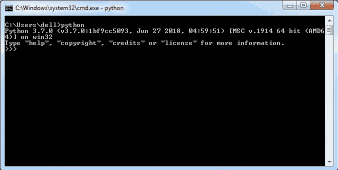
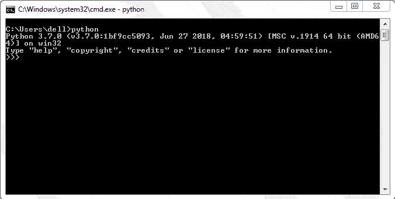

# Python 模块

> 原文：<https://www.tutorialsteacher.com/python/python-module>

任何包含 Python 代码的`.py`扩展名的文本文件基本上都是一个模块。函数、类、变量、常量等不同的 Python 对象。，可以通过使用`import`语句使解释器会话或另一个 Python 脚本可用。 内置模块中定义的功能需要导入后才能使用。类似地，自定义模块可能包含一个或多个用户定义的 Python 对象。这些对象可以在解释器会话或其他脚本中导入。

如果编程算法需要定义大量的函数和类，那么它们就被逻辑地组织在模块中。一个模块存储类、函数和其他类似相关的资源。代码的这种模块化结构使其易于理解、使用和维护。

## 创建模块

下图是包含`sum()`函数定义的 Python 脚本。保存为`calc.py`。

calc.py 

```py
def sum(x, y):
    return x + y 
```

## 导入模块

我们现在可以导入这个模块，并在 [Python shell](/python/python-interective-shell) 中执行`sum()`函数。

Example: Importing a Module 

```py
>>> import calc 
>>> calc.sum(5, 5) 
10 
```

同样，要在另一个 Python 脚本中使用上面的`calc`模块，请使用 import 语句。

每个模块，无论是内置的还是定制的，都是一个模块类的对象。使用内置的`type()`功能验证不同模块的类型，如下图所示。

Example: Module Type 

```py
>>> import math
>>> type(math)
<class 'module'>
>>> import calc
>>> type(calc)
<class 'module'> 
```

## 重命名导入的模块

使用`as`关键字重命名导入的模块，如下图所示。

Example: 

```py
>>> import math as cal
>>> cal.log(4)
1.3862943611198906 
```

## 从..导入语句

上面的 import 语句将加载当前工作环境中模块的所有资源(也称为名称空间)。使用以下语法可以从模块中导入特定对象。比如下面的模块`calc.py`里面有三个功能。

calc.py 

```py
def sum(x,y):
    return x + y
def average(x, y):
    return (x + y)/2
def power(x, y):
    return x**y 
```

现在，我们可以使用...导入语句。例如，下面的代码在 test.py 中只导入了两个函数。

Example: Importing Module's Functions 

```py
>>> from functions import sum, average
>>> sum(10, 20)
30
>>> average(10, 20)
15
>>> power(2, 4) 
```

以下示例仅导入一个函数 sum。

Example: Importing Module's Function 

```py
>>> from functions import sum
>>> sum(10, 20)
30
>>> average(10, 20) 
```

您也可以使用`from...import *`语法导入它的所有函数。

Example: Import Everythin from Module 

```py
>>> from functions import *
>>> sum(10, 20)
30
>>> average(10, 20)
15
>>> power(2, 2)
4 
```

## 模块搜索路径

当在交互会话或脚本中遇到 import 语句时:

*   首先，Python 解释器试图在当前工作目录中定位模块。
*   如果没有找到，将搜索 PYTHONPATH 环境变量中的目录。
*   如果仍未找到，它将搜索安装默认目录。

当 Python 解释器启动时，它将上述所有位置放在 sys.path 属性返回的列表中。

Example: Module Attributes 

```py
>>> import sys
>>> sys.path
['','C:\\python36\\Lib\\idlelib', 'C:\\python36\\python36.zip', 
'C:\\python36\\DLLs', 'C:\\python36\\lib', 'C:\\python36', 
'C:\\Users\\acer\\AppData\\Roaming\\Python\\Python36\\site-packages', 
'C:\\python36\\lib\\site-packages'] 
```

如果所需模块不存在于上述任何目录中，则会抛出消息`ModuleNotFoundError`。

```py
>>> import MyModule
Traceback (most recent call last): 
File "<stdin>", line 1, in <module>
    ModuleNotFoundError: No module named 'MyModule' 
```

## 重新加载模块

假设您已经导入并使用了一个模块。但是，模块所有者在您导入模块后添加或修改了一些功能。因此，您可以使用`imp`模块的`reload()`功能重新加载模块以获取最新的模块，如下所示。

Example: Reloading Module 

```py
>>> import imp
>>> imp.reload(calc)
<module 'calc' (built-in)> 
```

## 获取模块帮助

使用[帮助()](/python/help-method)功能了解模块的方法和属性。例如，调用`help("math")`了解`math`模块。 如果您已经导入了一个模块，请提供其名称，例如`help(math)`。

 

Getting Help on Module


如上所示，您可以看到方法名称和描述。它不会显示以- More -结尾的帮助页面。按回车键查看更多帮助。

也可以使用 [dir()](/python/dir-method) 函数知道模块的名称和属性。

 

Know Module Attributes and Methods


在下一章中了解模块属性。**********