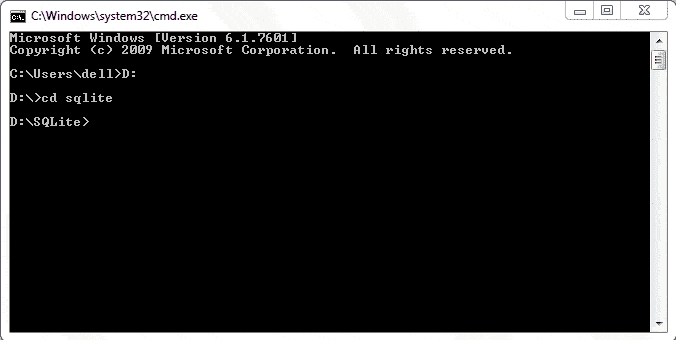

# Python 中的数据库 CRUD 操作

> 原文：<https://www.tutorialsteacher.com/python/database-crud-operation-in-python>

在本教程中，您将学习如何使用 SQLite 数据库在 Python 中执行 CRUD 操作。Python 以 sqlite3 模块的形式内置了对 SQLite 的支持。该模块包含用于在 SQLite 数据库上执行持久 CRUD 操作的函数。

## Sqlite 数据库

SQLite 是一个独立的事务关系数据库引擎，不需要服务器配置，就像 Oracle、MySQL 等的情况一样。它是由理查德·希普于 2000 年 8 月开发的一个开源的进程中的库。整个 SQLite 数据库包含在一个文件中，可以放在计算机文件系统的任何地方。

SQLite 被广泛用作移动设备、网络浏览器和其他独立应用中的嵌入式数据库。尽管体积很小，但它是一个完全符合 ANSI 标准的数据库。

SQLite 可从官方网站[https://www.sqlite.org/download.html](https://www.sqlite.org/download.html)免费下载。本页包含所有主要操作系统的预编译二进制文件。一组命令行工具包含命令行 shell 和其他实用程序来管理 SQLite 数据库文件。

我们将下载最新版本的 SQLite(3 . 25 . 1 版)以及命令行工具，并提取归档文件。

要创建新的 SQLite 数据库，请从命令提示符导航到解压缩归档文件的文件夹，并输入以下命令:

[](../../Content/images/python/python-sqlite3.gif) 

Sqlite3 Command


现在可以执行任何 SQL 查询。以下语句创建一个新表。(确保语句以分号结尾)

```py
sqlite> create table student(name text, age int, marks real);
```

在上表中添加一条记录。

```py
sqlite> insert into student values('Ramesh', 21, 55.50);
```

要检索记录，请使用如下`SELECT`查询:

```py
sqlite> select * from student;
Ramesh|21|55.5
```

## python db API

[Python 数据库 API](https://www.python.org/dev/peps/pep-0249/) 是一个特别兴趣小组推荐的一套数据库模块标准化的标准。提供与所有主要数据库产品的数据库接口功能的 Python 模块需要遵守该标准。另一个 [Python 增强提案](https://www.python.org/dev/peps/) (PEP-249)将数据库 API 标准进一步修改为数据库 API 2.0。

标准 Python 发行版内置了对 SQLite 数据库连接的支持。它包含遵循 DB-API 2.0 的 sqlite3 模块，由 Gerhard Haring 编写。其他关系数据库管理系统产品也有符合数据库 API 的模块:

*   MySQL: [PyMySql 模块](https://pypi.org/project/PyMySQL/)
*   Oracle: [Cx-Oracle 模块](https://oracle.github.io/python-cx_Oracle/)
*   SQL Server: [PyMsSql 模块](https://pypi.org/project/pymssql/)
*   PostGreSQL: [psycopg2 模块](https://pypi.org/project/psycopg2/)
*   ODBC: [pyodbc 模块](https://pypi.org/project/pyodbc/)

按照规定的标准，这个过程的第一步是获得到代表数据库的对象的连接。为了与 SQLite 数据库建立连接，需要导入 sqlite3 模块并执行`connect()`功能。

```py
>>> import sqlite3
>>> db=sqlite3.connect('test.db')
```

`connect()`函数返回一个引用现有数据库的连接对象，如果不存在，则返回一个新数据库。

连接类中定义了以下方法:

| 方法 | 描述 |
| --- | --- |
| 游标() | 返回使用此连接的游标对象。 |
| 犯罪 | 向数据库显式提交任何挂起的事务。如果基础数据库不支持事务，则该方法应为 no-op。 |
| 回滚() | 这个可选方法导致事务回滚到起点。它可能不会在所有地方实施。 |
| 关闭() | 永久关闭与数据库的连接。调用此方法后尝试使用连接将引发数据库 API 错误。 |

游标是一个 Python 对象，使您能够使用数据库。它充当给定 SQL 查询的句柄；它允许检索结果的一行或多行。因此，使用以下语句从连接中获取一个游标对象来执行 SQL 查询:

```py
>>> cur=db.cursor()
```

游标对象的下列方法很有用。

| 方法 | 描述 |
| --- | --- |
| 执行() | 在字符串参数中执行 SQL 查询 |
| executemany() | 使用元组列表中的一组参数执行 SQL 查询 |
| fetchone() | 从查询结果集中获取下一行。 |
| fetchall() | 从查询结果集中提取所有剩余的行。 |
| callproc() | 调用存储过程。 |
| 关闭() | 关闭游标对象。 |

连接类的`commit()`和`rollback()`方法保证了事务控制。 游标的`execute()`方法接收包含 SQL 查询的字符串。 有不正确 SQL 查询的字符串引发异常，应该正确处理。 这就是为什么`execute()`方法被放置在 try 块中，并且使用`commit()`方法持久保存 SQL 查询的效果。 但是，如果 SQL 查询失败，则由 except 块处理产生的异常，并使用`rollback()`方法撤消挂起的事务。

`execute()`方法的典型用法如下:

Example: 

```py
try:
    cur=db.cursor()
    cur.execute("Query")
    db.commit()
    print ("success message")
except:
    print ("error")
    db.rollback()
db.close() 

```

## 创建新表

包含 CREATE TABLE 查询的字符串作为参数传递给游标对象的`execute()`方法。 下面的代码在 test.db 数据库中创建学生表。

Example: Create a New Table in Sqlite 

```py
import sqlite3
db=sqlite3.connect('test.db')
try:        
    cur =db.cursor()
    cur.execute('''CREATE TABLE student (
    StudentID INTEGER PRIMARY KEY AUTOINCREMENT,
    name TEXT (20) NOT NULL,
    age INTEGER,
    marks REAL);''')
    print ('table created successfully')
except:
    print ('error in operation')
    db.rollback()
db.close() 
```

这可以使用 sqlite shell 中的`.tables`命令来验证。

```py
E:\SQLite>sqlite3 test.db
SQLite version 3.25.1 2018-09-18 20:20:44
Enter ".help" for usage hints.
sqlite> .tables
student
```

## 插入记录

游标对象的`execute()`方法应该用代表 INSERT 查询语法的字符串参数来调用。 我们创建了一个学生表，该表有三个字段:姓名、年龄和分数。保存插入查询的字符串定义为:

```py
qry="INSERT INTO student (name, age, marks) VALUES ('Rajeev',20,50);"
```

我们必须将其用作`execute()`方法的参数。为了说明可能的异常，如前所述，`execute()`语句被放在 try 块中。 插入操作的完整代码如下:

Example: Insert a Record in Sqlite 

```py
import sqlite3
db=sqlite3.connect('test.db')
qry="insert into student (name, age, marks) values('Rajeev', 20, 50);"
try:
    cur=db.cursor()
    cur.execute(qry)
    db.commit()
    print ("one record added successfully")
except:
    print ("error in operation")
    db.rollback()
db.close() 
```

您可以在 Sqlite shell 中使用 `SELECT`查询来检查结果。

```py
sqlite> select * from student;
1|Rajeev|20|50.0
```

### 在查询中使用参数

通常，Python 变量的值需要在 SQL 操作中使用。一种方法是使用 Python 的字符串`format()`函数将 Python 数据放入字符串中。 不过，这可能会导致 SQL 注入对你的程序进行攻击。相反，使用 Python DB-API 中推荐的参数替换。那个？字符在查询字符串中用作占位符，并在`execute()`方法中以元组的形式提供值。 以下示例使用参数替换方法插入记录:

Example: 

```py
import sqlite3
db=sqlite3.connect('test.db')
qry="insert into student (name, age, marks) values(?,?,?);"
try:
    cur=db.cursor()
    cur.execute(qry, ('Vijaya', 16,75))
    db.commit()
    print ("one record added successfully")
except:
    print("error in operation")
    db.rollback()
db.close() 
```

`executemany()`方法用于一次添加多条记录。要添加的数据应该在元组列表中给出，每个元组包含一条记录。 列表对象(包含元组)与查询字符串一起是`executemany()`方法的参数。

Example: 

```py
import sqlite3
db=sqlite3.connect('test.db')
qry="insert into student (name, age, marks) values(?,?,?);"
students=[('Amar', 18, 70), ('Deepak', 25, 87)]
try:
    cur=db.cursor()
    cur.executemany(qry, students)
    db.commit()
    print ("records added successfully")
except:
    print ("error in operation")
    db.rollback()
db.close() 
```

## 检索记录

当查询字符串包含 `SELECT`查询时，`execute()`方法形成一个包含返回记录的结果集对象。Python 数据库 API 定义了两种获取记录的方法:

1.  fetchone():从结果集中获取下一条可用记录。它是一个元组，由提取的记录的每一列的值组成。
2.  fetchall():以元组列表的形式获取所有剩余的记录。每个元组对应一条记录，并包含表中每一列的值。

使用`fetchone()`方法时，使用循环迭代结果集，如下所示:

Example: Fetch Records 

```py
import sqlite3
db=sqlite3.connect('test.db')
sql="SELECT * from student;"
cur=db.cursor()
cur.execute(sql)
while True:
    record=cur.fetchone()
    if record==None:
        break
    print (record)
db.close() 
```

执行时，Python shell 中会显示以下输出:

Result:

```py
(1, 'Rajeev', 20, 50.0)
(2, 'Vijaya', 16, 75.0)
(3, 'Amar', 18, 70.0)
(4, 'Deepak', 25, 87.0)

```

`fetchall()`方法返回一个元组列表，每个元组都是一条记录。

Example: 

```py
students=cur.fetchall()
for rec in students:
print (rec) 

```

## 更新记录

`execute()`方法中的查询字符串应该包含更新查询语法。要将“Amar”的“年龄”值更新为 17，请定义如下字符串:

```py
qry="update student set age=17 where name='Amar';"
```

还可以使用替换技术将参数传递给 UPDATE 查询。

Example: Update Record 

```py
import sqlite3
db=sqlite3.connect('test.db')
qry="update student set age=? where name=?;"
try:
    cur=db.cursor()
    cur.execute(qry, (19,'Deepak'))
    db.commit()
    print("record updated successfully")
except:
    print("error in operation")
    db.rollback()
db.close() 
```

## 删除记录

查询字符串应该包含 DELETE 查询语法。例如，下面的代码用于从学生表中删除“比尔”。

```py
qry="DELETE from student where name='Bill';"
```

你可以用？参数替换字符。

Example: Delete Record 

```py
import sqlite3
db=sqlite3.connect('test.db')
qry="DELETE from student where name=?;"
try:
    cur=db.cursor()
    cur.execute(qry, ('Bill',))
    db.commit()
    print("record deleted successfully")
except:
    print("error in operation")
    db.rollback()
db.close() 
```

