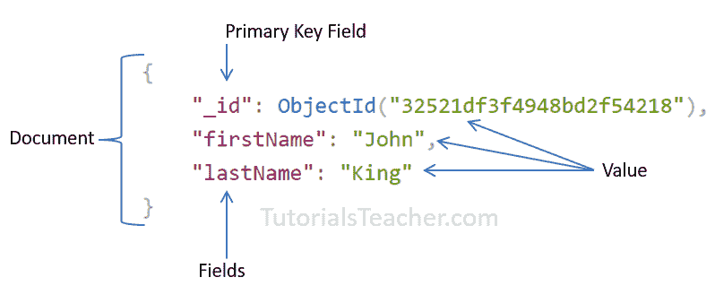

# 什么是 MongoDB？

> 原文:[https://www.tutorialsteacher.com/mongodb/what-is-mongodb](https://www.tutorialsteacher.com/mongodb/what-is-mongodb)

MongoDB 是一个开源的、跨平台的、基于分布式文档的数据库，旨在简化应用程序的开发和扩展。这是一个由蒙古数据库公司开发的 NoSQL 数据库。

MongoDB 的名字来源于单词“Humongous”，意思是巨大的，巨大的。MongoDB 数据库的构建是为了存储大量数据，并且执行速度也很快。

蒙古数据库不是关系数据库管理系统。它被称为“NoSQL”数据库。它与基于 SQL 的数据库相反，在基于 SQL 的数据库中，它不会规范化模式和表下的数据，因为每个表都有固定的结构。相反，它将集合中的数据存储为基于 JSON 的文档，并且不强制模式。它不像其他 SQL(关系数据库管理系统)数据库那样有表、行和列。

下表列出了 MongoDB 和 RDBMS 术语之间的关系。

| NoSQL 数据库 | 关系数据库管理系统(SQL Server、Oracle 等)。) |
| --- | --- |
| 数据库ˌ资料库 | 数据库ˌ资料库 |
| 募捐 | 桌子 |
| 文件 | 行(记录) |
| 田 | 圆柱 |

在关系数据库管理系统数据库中，一个表可以有多行多列。类似地，在 MongoDB 中，一个集合可以有多个相当于行的文档。每个文档都有多个相当于列的“字段”。单个集合中的文档可以有不同的字段。

下面是一个基于 JSON 的文档示例。

<figure> 

<figcaption>MongoDB Document</figcaption>

</figure>

## MongoDB 的优势

1.  MongoDB 将数据存储为基于 JSON 的文档，不强制模式。它允许我们在文档中存储分层数据。这使得以高效的方式存储和检索数据变得容易。
2.  因为它是基于文档的数据库，所以很容易根据需求进行扩展或缩小。MongoDB 还允许我们跨多台服务器拆分数据。
3.  MongoDB 提供了丰富的功能，如索引、聚合、文件存储等。
4.  MongoDB 在海量数据下执行速度很快。
5.  MongoDB 提供了驱动程序，用于存储和从不同技术开发的不同应用程序中获取数据，如 C#、Java、Python、Node.js 等。
6.  MongoDB 提供了管理 MongoDB 数据库的工具。