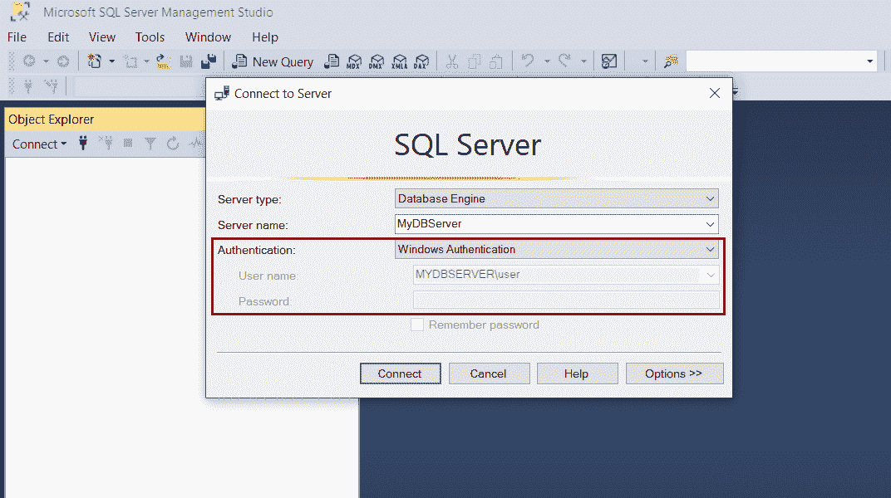
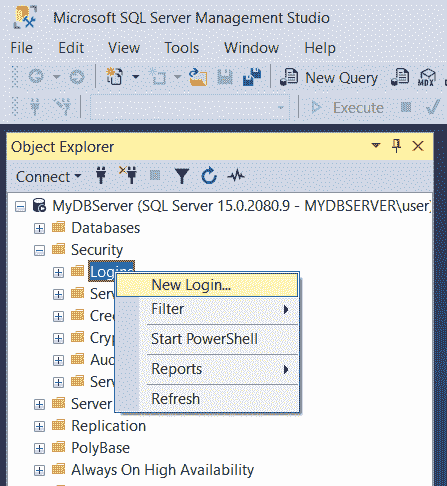
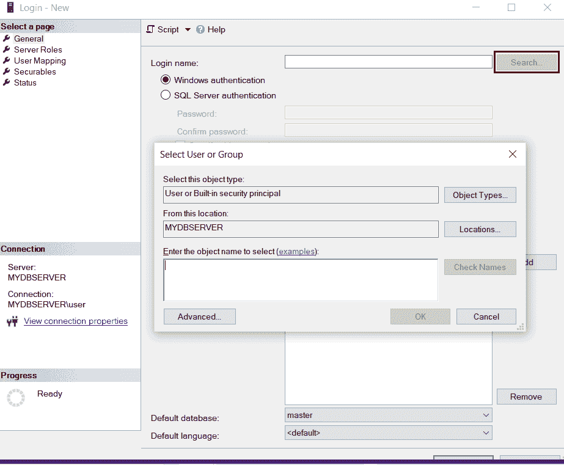
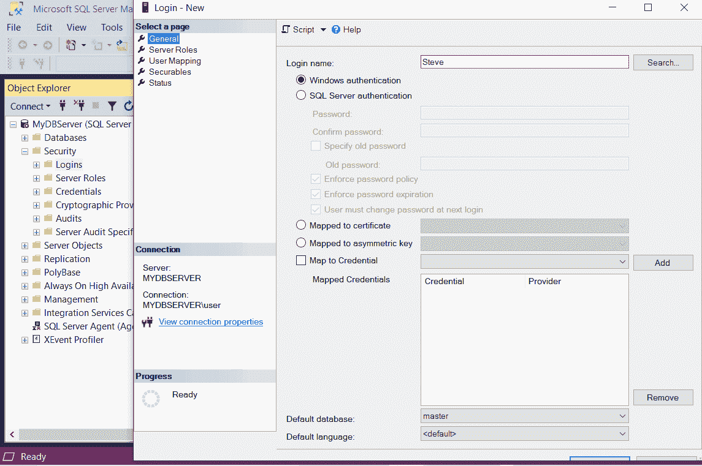
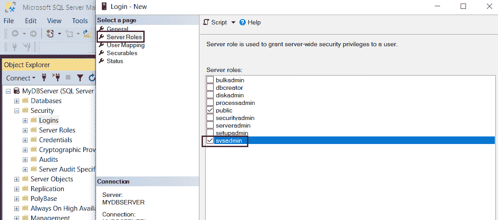
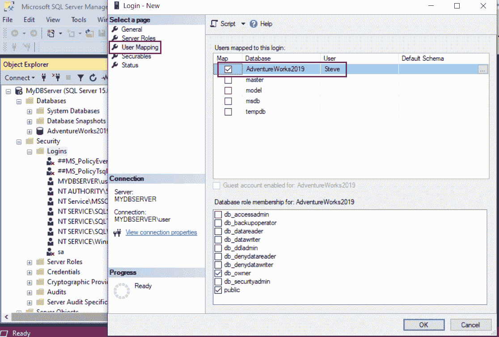
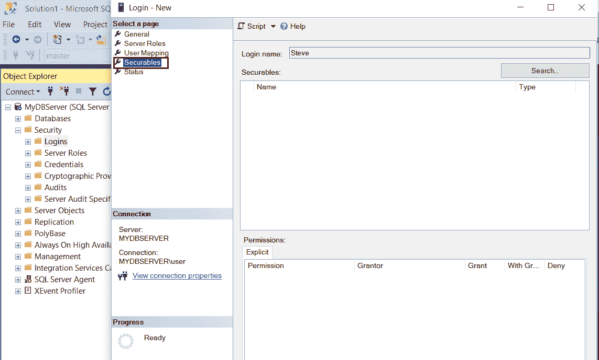
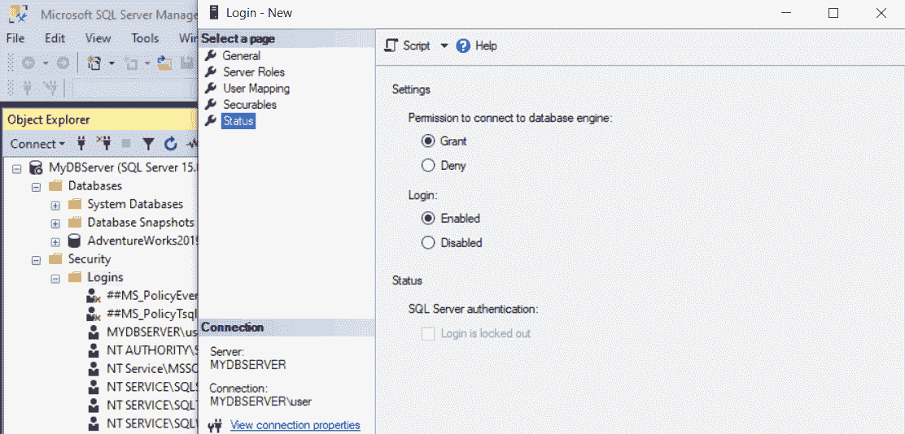

# SQL Server Windows 认证

> 原文：<https://www.tutorialsteacher.com/sqlserver/windows-authentication>

在这里，您将学习如何使用您的 Windows 用户帐户向 SQL Server 进行认证。

SQL Server 支持两层认证:登录和数据库用户。登录是访问和连接到 SQL Server 的第一层安全性。登录与数据库无关。相反，登录被映射到数据库中的用户，以读取或写入特定的数据库。

在 SQL Server 中有两种认证模式，您可以使用这两种模式登录并连接到 SQL Server。

*   Windows 认证
*   SQLServer 认证

## Windows 认证

Windows 认证模式使用 SQL Server 启用本地 Windows 认证，您可以使用本地 Windows 凭据登录。

例如，下面使用一个 Windows 凭据连接到 SQL Server，其中 MYDBSERVER\user 中的用户是 Windows 上的本地用户帐户，MYDBSERVER 是数据库服务器的名称。单击“确定”以此凭据登录并连接到 MYDBSERVER 数据库服务器。

SQL Server Authentication Modes

Windows 认证是默认认证模式，比 SQL Server 认证更安全。它也被称为集成安全性，与 Windows 紧密集成。已经通过 Windows 认证并且在连接到 SQL Server 时不需要提供任何附加凭据的用户。它也被称为可信连接。该用户帐户由 Windows 确认。

在 Windows 认证中，可以在 SQL Server 中为整个 Windows 组创建登录，这简化了帐户管理。

Windows 认证使用 Kerberos 安全协议，提供密码策略强制，并支持密码过期。

让我们看看如何创建一个新的登录，使用本地窗口的用户帐户来连接到 SQL Server。

## 使用 Windows 认证创建新登录

要创建新的登录，请打开 [SQL Server 管理工作室](/sqlserver/sql-server-management-studio)。

在对象浏览器中，展开**安全**文件夹，右键单击登录文件夹，然后单击**新登录..**，如下图。

Create New Login

在如下所示的登录-新建窗口中，输入一个 Windows 用户名。如果用户名不是 Windows 用户，那么它将引发一个错误。您可以点击“搜索”按钮来搜索窗口用户，如下所示。

Create New Login

输入登录名后，您必须选择 Windows 认证或 SQL Server 认证。选择窗口认证。请注意，对于 Windows 认证，密码字段和密码策略单选按钮将被禁用，因为我们将在此使用 Windows 凭据。

Create New Login

现在，要为新登录分配角色和权限，请转到服务器角色选项卡。在“服务器角色”页面上，您可以通过单击角色旁边的复选框将服务器级角色分配给新登录。默认情况下，公共角色被分配给新登录。此外，让我们通过单击 sysadmin 旁边的复选框来分配 sysadmin 角色。使用 sysadmin 服务器角色，用户可以在服务器上执行任何活动，并拥有完全控制权。

Server Roles

单击用户映射选项卡。在这里，我们将把我们的 Windows 登录映射到一个数据库用户。

它列出了服务器上的所有数据库。要映射您的新登录，只需选中要映射此登录以访问数据库的数据库旁边的复选框。

下图中`AdventureWorks2019`数据库被选中。新的登录信息现在列在 AdventureWorks2019 的“用户”列下。如果希望用户名与您的登录名不同，您可以更改用户名。只需单击该名称，然后为用户重新键入您想要的任何名称。如果您想让更多的数据库与您的登录相关联，那么只需单击数据库旁边的复选框，它就会与登录进行映射。

User Mapping

现在，单击“安全对象”选项卡。安全对象是您正在创建的登录名可以访问的 SQL server 资源。在“安全对象”选项卡上，单击“搜索”按钮。这将打开一个弹出窗口，如下所示。选择服务器“<your server="" name="">”，然后单击确定。这将列出服务器的所有显式权限。根据您的要求，选择授予、允许或拒绝。</your>

这是一个可选步骤。您可以在创建登录时跳过“安全对象”设置，稍后再进行设置。

SQL Server Authentication Modes

最后，单击状态选项卡，选择“授予”单选按钮获得连接到数据库引擎的权限，选择“启用”单选按钮获得登录权限，如下所示。

SQL Server Authentication Modes

单击“确定”创建新登录。这将在登录节点下添加新的登录。

因此，您可以添加本地 Windows 用户帐户，以便使用 Windows 认证登录数据库服务器。