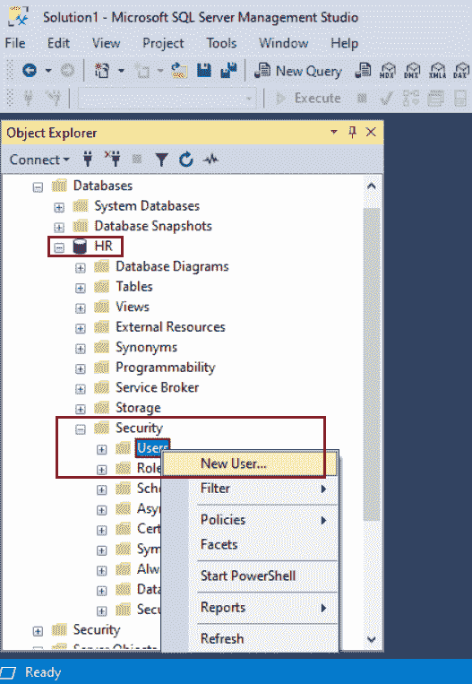
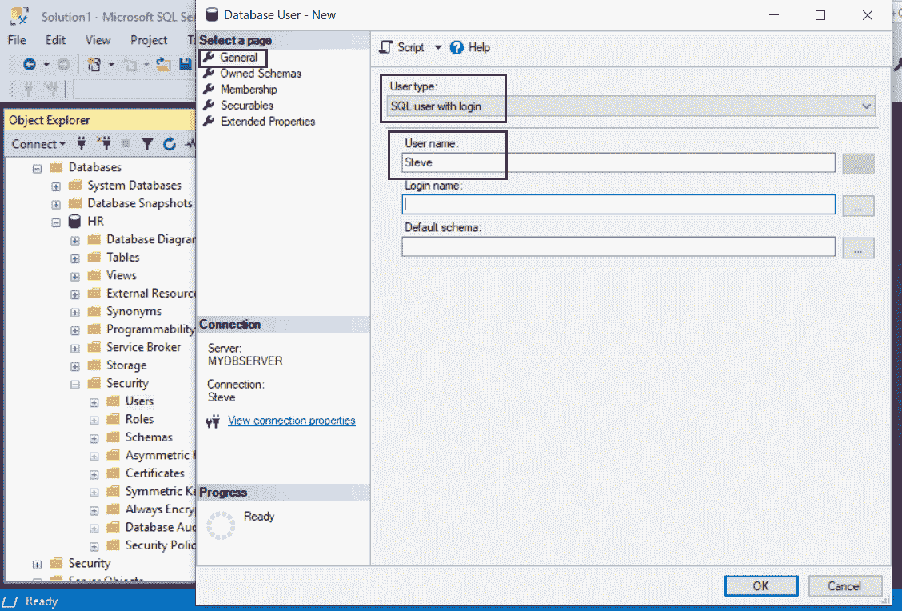
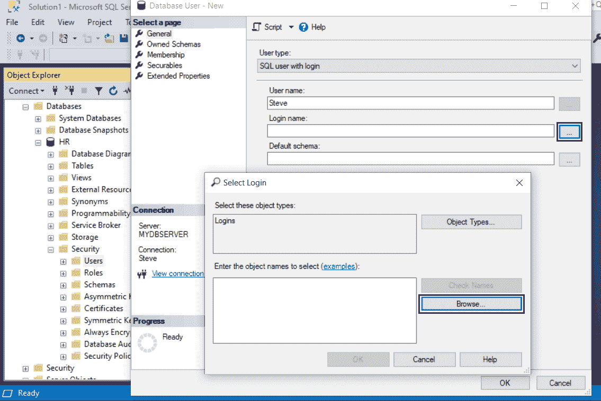
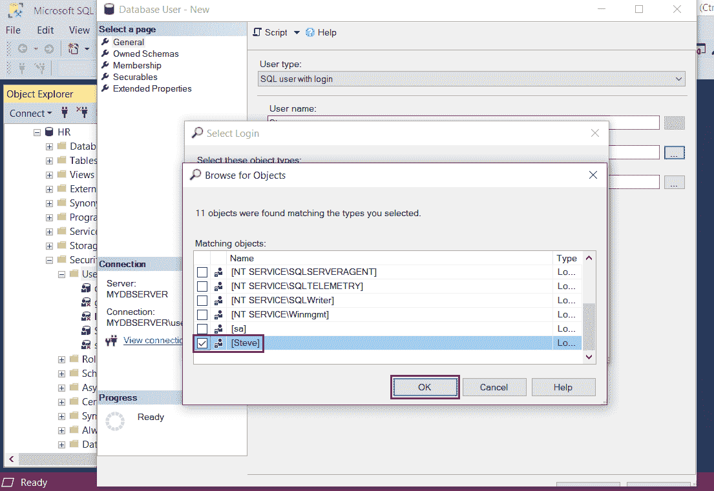
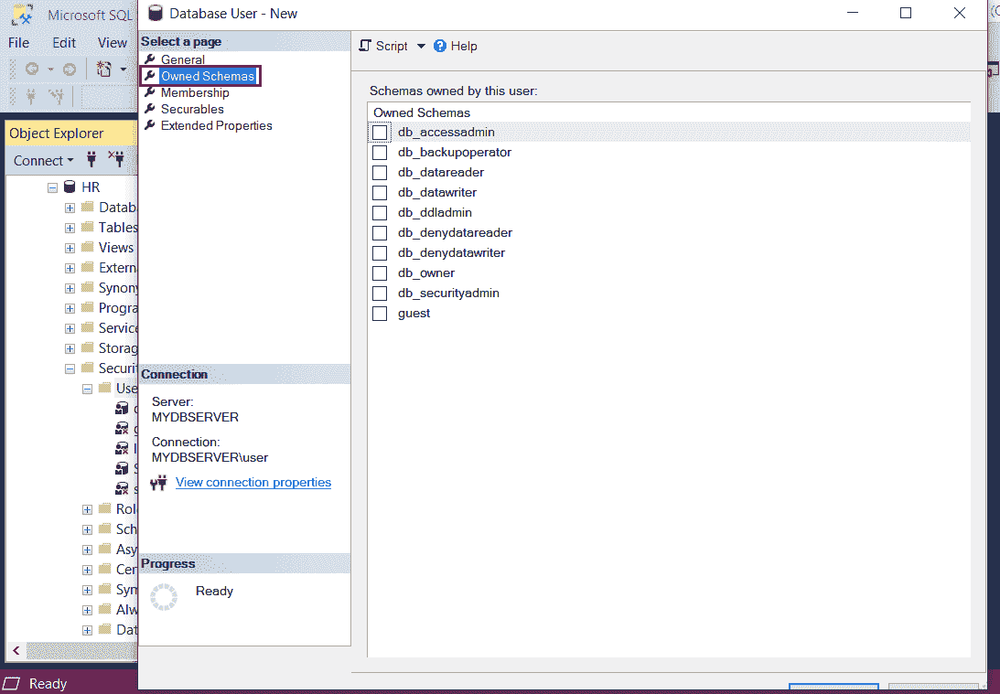
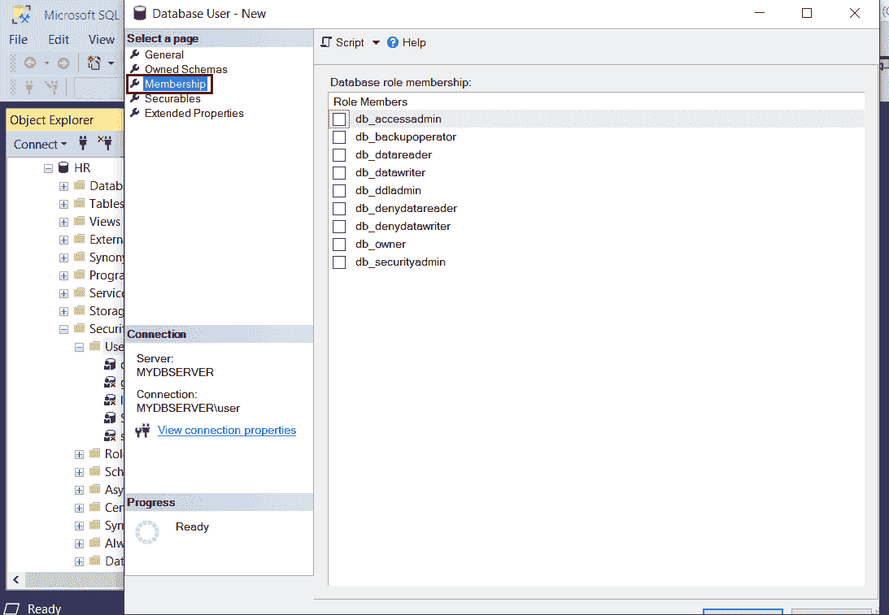
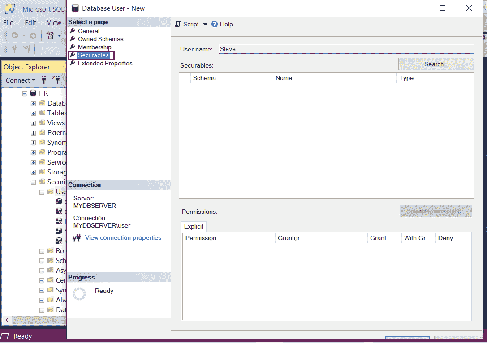
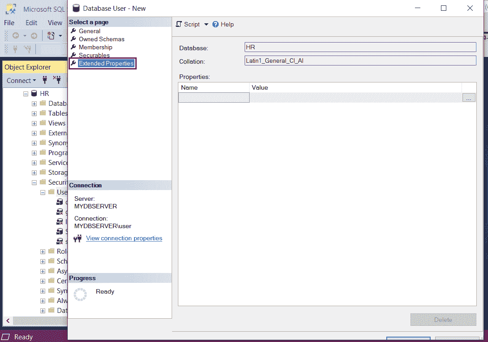

# 在 SQL Server 中创建新用户

> 原文:[https://www.tutorialsteacher.com/sqlserver/create-new-user](https://www.tutorialsteacher.com/sqlserver/create-new-user)

管理 SQL Server 安全性是维护您的 SQL Server 环境的关键部分。在本文中，让我们采取一步一步的方法来创建一个新的数据库用户，并向该用户授予权限。

在 SQL Server 中，登录是为服务器实例创建的，而用户是为数据库创建的。登录必须映射到用户才能连接到数据库。对于任何数据库，一个登录名只能映射到一个用户。用户的范围是数据库

有两种方法可以创建新用户或授予用户权限:

*   使用微软服务器管理工作室
*   使用 T-SQL

## 使用 SSMS 创建新用户

打开 SQL Server 管理工作室。在对象资源管理器中，展开“数据库”节点。

在这里，我们将为人力资源数据库创建一个新用户。所以，扩展人力资源数据库。

展开数据库的安全文件夹，右键单击用户并选择新用户，如下所示。

<figure>[](../../Content/images/sqlserver/create-user1.png) 

<figcaption>Create a New User and Grant Permissions in SQL Server 2019</figcaption>

</figure>

在“数据库用户-新建”对话框的“常规”选项卡页上，用户类型下拉列表列出了以下类型:

*   具有登录名的 SQL 用户
*   带密码的 SQL 用户
*   没有登录的 SQL 用户
*   映射到证书的用户
*   映射到非对称密钥的用户
*   Windows 用户

从下拉列表中选择用户类型为“登录的 SQL 用户”。

在用户名下，输入新的用户名。在这里，我们将输入“史蒂夫”作为用户名。

<figure>[](../../Content/images/sqlserver/create-user2.png) 

<figcaption>Create a New User and Grant Permissions in SQL Server 2019</figcaption>

</figure>

在登录名下，键入以前创建的登录名，即史蒂夫。或者点击省略号`...`按钮，打开选择-登录对话框。

<figure>[](../../Content/images/sqlserver/create-user3.png) 

<figcaption>Create a New User and Grant Permissions in SQL Server 2019</figcaption>

</figure>

单击“浏览”按钮，选择一个现有的登录名与该用户进行映射，如下所示。选择登录“史蒂夫”。单击“确定”按钮继续。

<figure>[](../../Content/images/sqlserver/create-user4.png) 

<figcaption>Create a New User and Grant Permissions in SQL Server 2019</figcaption>

</figure>

“自有模式”页列出了数据库中所有可用的模式。要向用户添加架构，请选中架构名称旁边的复选框。

<figure>[](../../Content/images/sqlserver/create-user5.png) 

<figcaption>Create a New User and Grant Permissions in SQL Server 2019</figcaption>

</figure>

“成员资格”页列出了正在创建的数据库用户可能拥有的所有成员资格角色。要添加成员角色，请选中角色旁边的复选框。

<figure>[](../../Content/images/sqlserver/create-user6.png) 

<figcaption>Create a New User and Grant Permissions in SQL Server 2019</figcaption>

</figure>

“安全对象”页面列出了可以授予用户的所有安全对象和权限。我们将在稍后的文章“用户权限”中研究如何向用户授予权限。

<figure>[](../../Content/images/sqlserver/create-user7.png) 

<figcaption>Create a New User and Grant Permissions in SQL Server 2019</figcaption>

</figure>

“扩展属性”页允许向数据库用户添加自定义属性。

此页面显示所选数据库的名称和所用的排序规则，这些都是只读字段。该页面还可以查看或指定对象的扩展属性。

<figure>[](../../Content/images/sqlserver/create-user8.png) 

<figcaption>Create a New User</figcaption>

</figure>

单击“确定”创建此用户。

## 使用 T-SQL 创建新用户

Syntax:<button class="copy-btn pull-right" title="Copy example code">*Copy*</button> 

```
USE <database-name>
CREATE USER <user-name> FOR LOGIN <login-name> 
```

下面在`HR`数据库中创建新用户`Steve`:

SQL Script: Create New DB User<button class="copy-btn pull-right" title="Copy example code">*Copy*</button> 

```
USE HR 
GO 
    CREATE USER 'Steve' FOR LOGIN 'Steve' 
GO 
```

