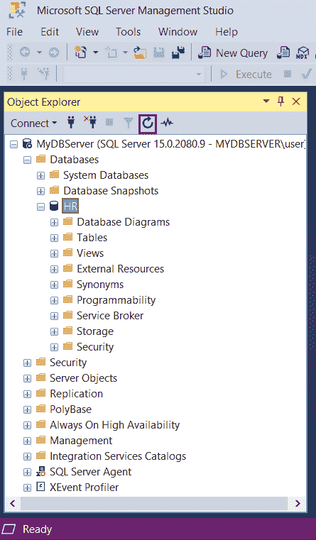
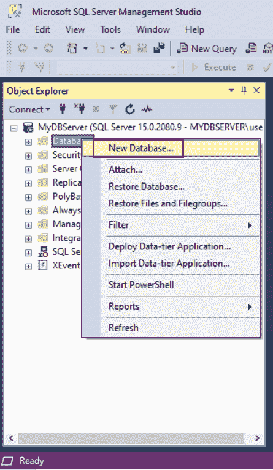
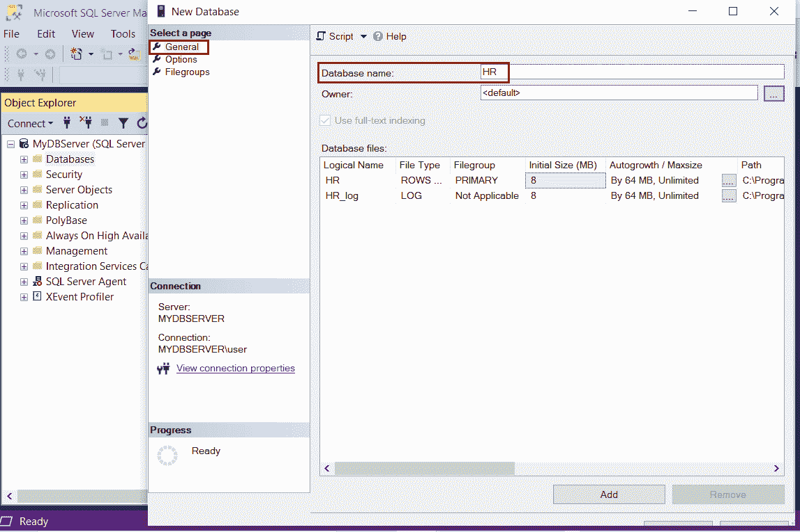
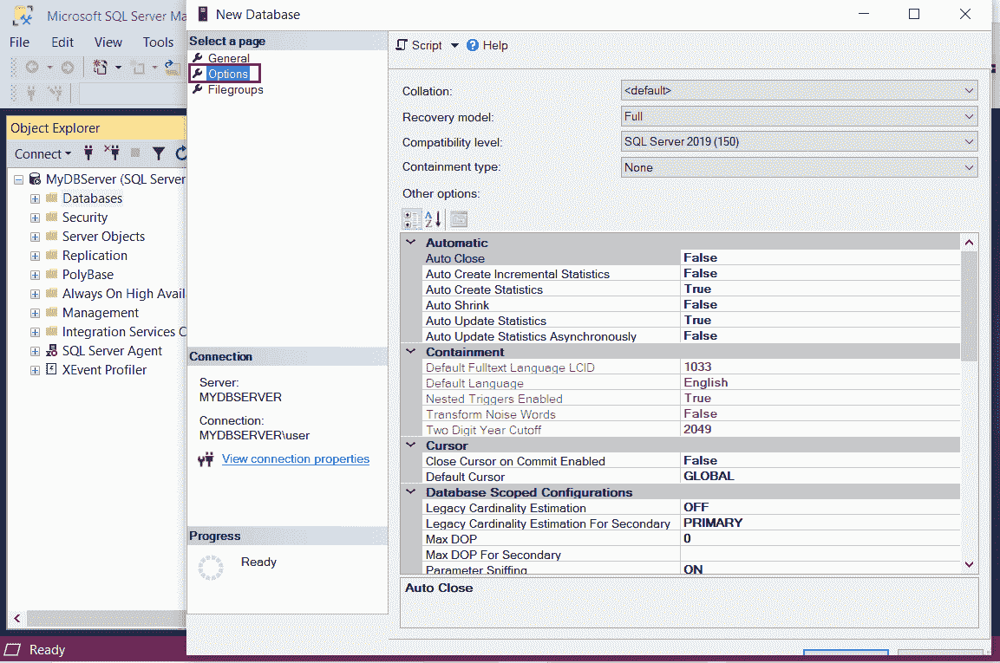
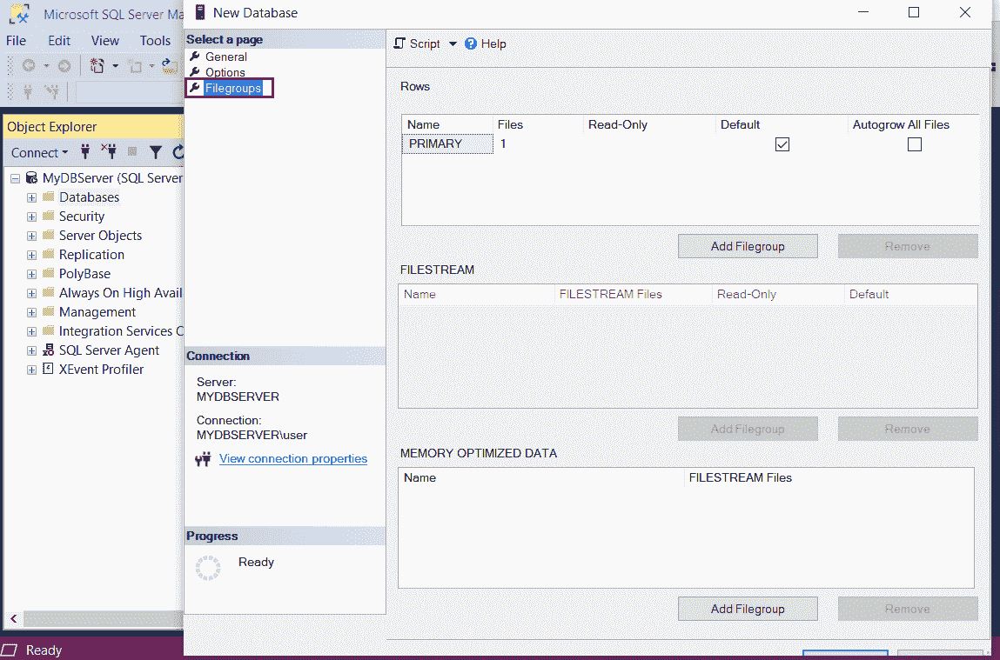
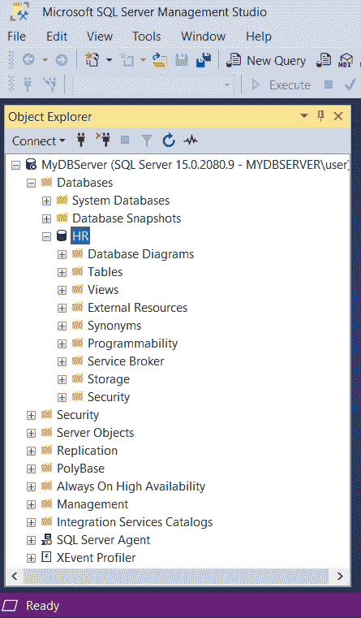

# 在 SQL Server 2019 中创建数据库

> 原文：<https://www.tutorialsteacher.com/sqlserver/create-database>

在 SQL Server 中，数据库由一组对象组成，如表、函数、存储过程、视图等。SQL Server 的每个实例可以有一个或多个数据库。SQL Server 数据库作为文件存储在文件系统中。登录用于访问 SQL Server 实例，数据库用户用于访问数据库。SQL Server 管理工作室广泛用于处理 SQL Server 数据库。

## SQL Server 中的数据库类型

SQL Server 中有两种类型的数据库:系统数据库和用户数据库。

**系统数据库**在安装 SQL Server 时自动创建。它们由 SSMS 和其他 SQL Server API 和工具使用，因此不建议手动修改系统数据库。 以下是系统数据库:

*   master: master 数据库存储 SQL Server 实例的所有系统级信息。它包括实例范围的元数据，如登录帐户、端点、链接服务器和系统配置设置。
*   模型:模型数据库用作在 SQL Server 实例上创建的所有数据库的模板
*   msdb: msdb 数据库由 SQL Server 代理用于调度警报和作业，并由其他功能(如 SQL Server Management Studio、服务代理和数据库邮件)使用。
*   tempdb: tempdb 数据库用于保存数据库引擎创建的临时对象、中间结果集和内部对象。

**用户定义的数据库**由数据库用户使用 T-SQL 或 SSMS 为您的应用数据创建。 一个 SQL Server 实例中最多可以创建 32767 个数据库。

有两种方法可以在 SQL Server 中创建新的用户数据库:

1.  [使用 T-SQL 创建数据库](#create-database-using-tsql)
2.  [使用 SQL Server 管理工作室](#create-database-using-ssms) 创建数据库

## 使用脚本创建数据库

可以使用`Master`数据库在查询编辑器中执行 SQL 脚本。

Syntax:

```sql
USE master;
CREATE <database-name> 
```

下面创建“人力资源”数据库。

```sql
USE master;
CREATE DATABASE 'HR'; 
```

下面用数据和日志文件创建“人力资源”数据库。

```sql
USE master;
CREATE DATABASE [HR] 
    ON (NAME = N'HR', FILENAME = N'C:\Program Files\Microsoft SQL Server\MSSQL15.SQLEXPRESS\MSSQL\DATA\HR.mdf', SIZE = 1024MB, FILEGROWTH = 256MB)
LOG ON (NAME = N'HR_log', FILENAME = N'C:\Program Files\Microsoft SQL Server\MSSQL15.SQLEXPRESS\MSSQL\DATA\HR_log.ldf', SIZE = 512MB, FILEGROWTH = 125MB) 
```

在执行上述 SQL 脚本之前，请确保数据和日志文件路径存在。

现在，打开 SSMS，刷新数据库文件夹，你会看到“人力资源”数据库被列出。

 

Create Database in SQL Server


了解更多关于[创建数据库 SQL 脚本语法](https://docs.microsoft.com/en-us/sql/t-sql/statements/create-database-transact-sql)的信息。

## 使用 SQL Server 管理工作室创建数据库

打开 SSMS，在对象资源管理器中，连接到 SQL Server 实例。展开要创建数据库的数据库服务器实例。

右键单击数据库文件夹，然后单击新建数据库..菜单选项。

 

Create Database


在“新建数据库”窗口中，输入新数据库的名称，如下所示。让我们输入数据库名称“人力资源”。

 

Create Database


数据库的所有者可以保留为默认值，或者要更改所有者，请单击[…]按钮。

在数据库文件网格下，您可以更改数据库和日志文件的默认值。每个数据库至少有两个操作系统文件:数据文件和日志文件。

*   数据文件包含数据和对象，如表、视图、存储过程、索引等。
*   日志文件包含恢复数据库中所有事务所需的信息。每个数据库至少必须有一个日志文件。了解更多关于[数据库文件和文件组](https://docs.microsoft.com/en-us/sql/relational-databases/databases/database-files-and-filegroups?view=sql-server-ver15)

根据您期望的最大数据量，使其尽可能大。

要更改数据库选项，请选择“选项”页面。您可以在此选项卡下更改排序规则、恢复模式，如下所示。

 

Database Options


**排序规则**指定代表数据集中每个字符的位模式。SQL Server 支持在单个数据库中存储具有不同排序规则的对象。

**恢复模型**是一个数据库属性，用于控制事务的记录方式。恢复模式下有三个选项:简单、完整&大容量日志。通常，数据库使用完整恢复模式。

**兼容级别**列出了 SQL Server 2008、2012、2014、2016、2017 & 2019。默认选择安装的最新版本，即 SQL Server 2019。

**包容类型**有两个选项:无和部分。默认情况下不选择任何选项。

现在，选择文件组选项卡。文件组是磁盘上存储 SQL server 数据的物理文件。默认情况下，创建新数据库时会创建主数据文件。了解更多关于[文件和文件组](https://docs.microsoft.com/en-us/sql/relational-databases/databases/database-files-and-filegroups)的信息。

 

Filegroups


单击“确定”创建新的“人力资源”数据库。这将在数据库文件夹中列出，如下所示。

 

Create Database in SQL Server


在上图中，使用以下文件夹创建了新的“人力资源”数据库:

**数据库图表:**它以图形方式显示数据库的结构。您可以通过右键单击文件夹并选择创建新图表 来创建新的数据库图表

**表:**与数据库相关的所有系统和用户定义的表都在该文件夹下。表包含数据库中的所有数据。

**视图:**该文件夹下提供所有系统和已使用的已定义视图。系统视图是包含数据库内部信息的视图。

**外部资源:**不属于 SQL Server 安装的任何服务、计算机、文件共享等都存储在这里。包含 2 个文件夹 1)外部数据源 2)外部文件格式

**可编程性:**可编程性文件夹列出了数据库的所有存储过程、函数、数据库触发器、程序集、规则、类型、默认值和序列

**服务代理:**所有数据库服务都存储在这个文件夹

**存储:**存储关于分区方案、分区函数、全文目录、 的信息

**安全性:**数据库用户、角色、模式、非对称密钥、证书、对称密钥、安全策略被创建&在每个数据库的安全文件夹中可用。

因此，您可以使用 T-SQL 脚本或 [SSMS](/sqlserver/sql-server-management-studio) 在 SQL Server 中创建新的数据库。