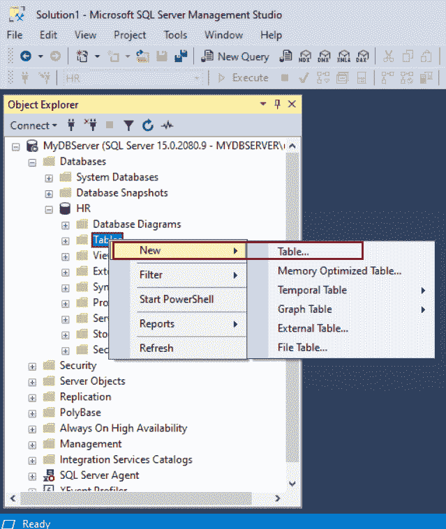
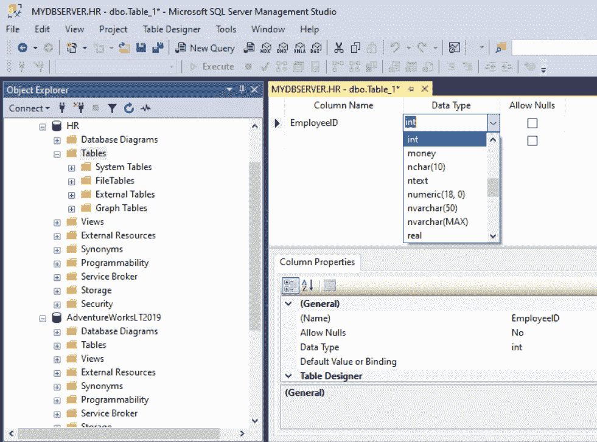
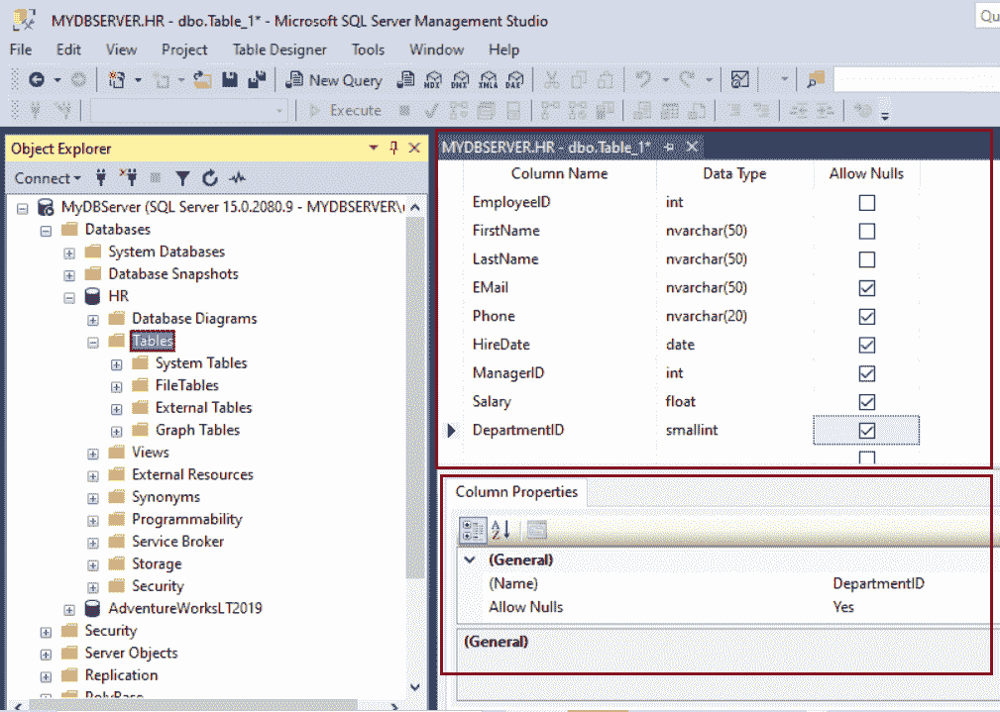
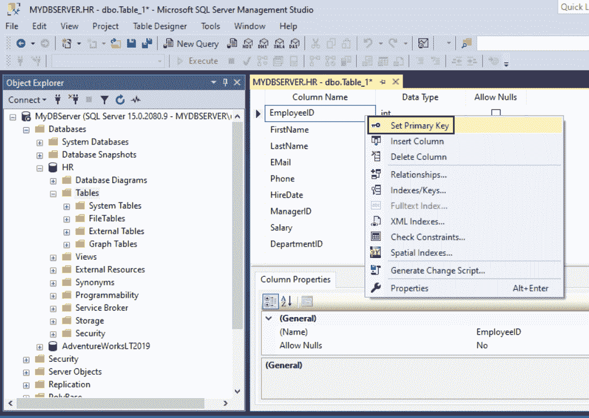
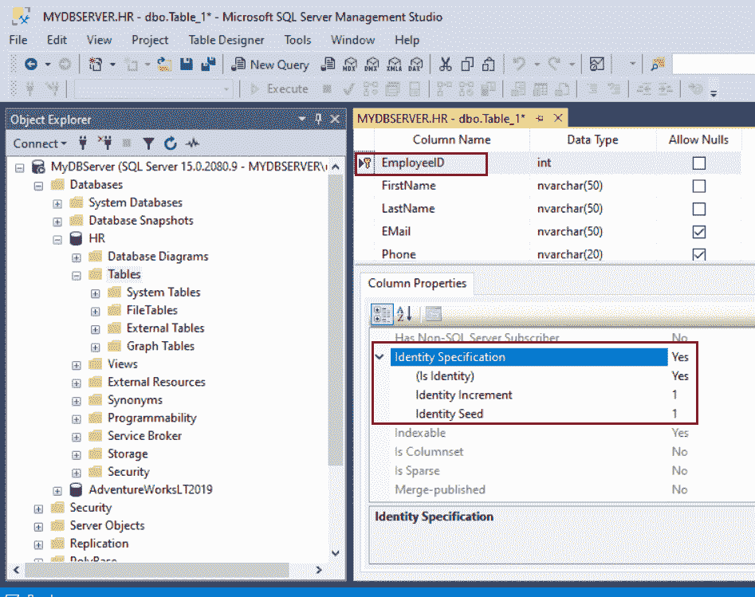
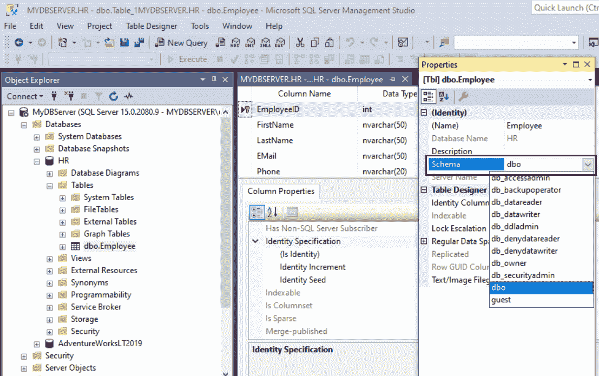
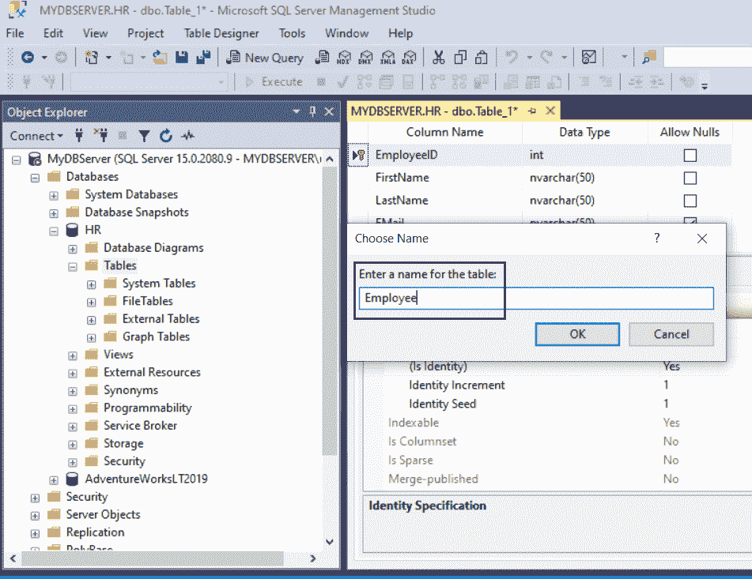
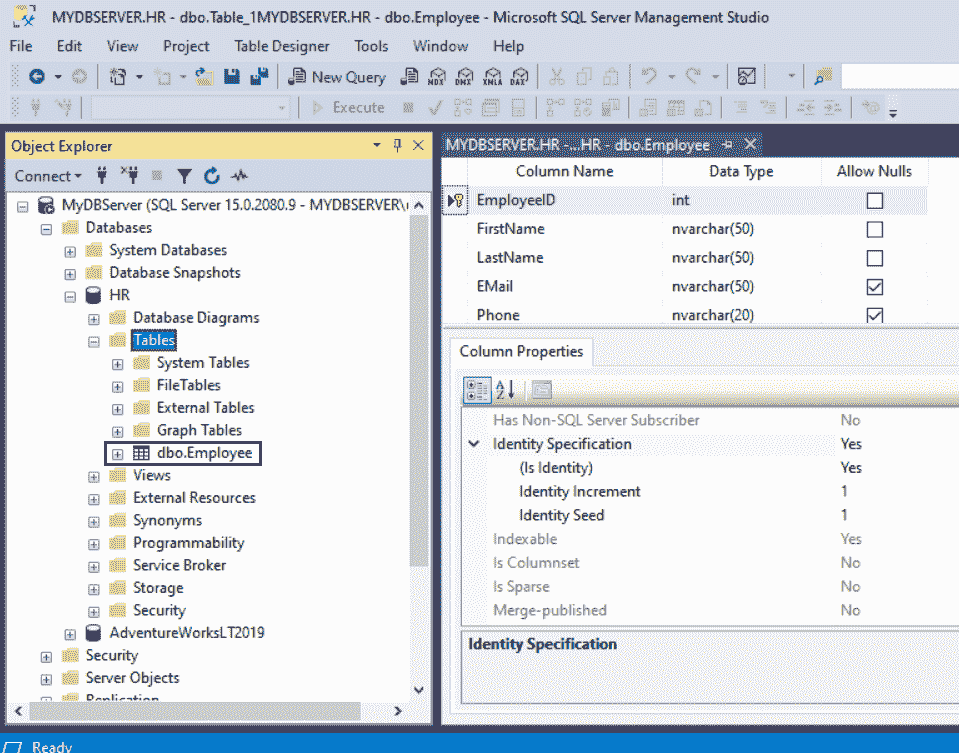

# 在 SQL Server 中创建新表

> 原文:[https://www.tutorialsteacher.com/sqlserver/create-table](https://www.tutorialsteacher.com/sqlserver/create-table)

表是包含数据库中所有数据的数据库对象。在表中，数据按行和列进行逻辑组织。每一列代表一个字段，每一行代表一条唯一的记录。每一列都有与之关联的数据类型。它表示该列中的数据类型。每个表在数据库中都是唯一命名的。

数据库中的表数量仅受数据库中允许的对象数量(2，147，483，647)的限制。用户定义的表最多可以有 1024 列。

在 SQL Server 中创建新表有两种方法:

*   [使用 T-SQL 脚本](create-table-sql-script)
*   [在 SQL Server 管理工作室中使用表设计器](#create-table-in-ssms)

## 使用测试脚本创建表

您可以在 SSMS 的查询编辑器中执行 CREATE TABLE 语句，在 SQL Server 中创建新表。

Syntax:

```
CREATE TABLE [database_name.][schema_name.]table_name (
    pk_column_name data_type PRIMARY KEY,
    column_name2 data_type [NULL | NOT NULL],
    column_name3 data_type [NULL | NOT NULL],
    ...,
    [table_constraints]
); 
```

下面的 CREATE TABLE 语句创建了`Employee`表。

T-SQL: Create a New Table 

```
CREATE TABLE Employee
(  
    EmployeeID int,
    FirstName nvarchar(50) NOT NULL,  
    LastName nvarchar(50) NOT NULL, 
    EMail nvarchar(50),
    Phone varchar(15),
    HireDate date,
    Salary Money
); 
```

上面的 SQL 脚本将在默认模式`dbo`中创建新的`Employee`表，并将其放入 SSMS 查询编辑器指向的数据库中。

您可以以`DatabaseName.SchemaName.TableName`格式指定完整的表名。 下面在默认的`dbo`模式和`HR`数据库中创建`Employee`表。

T-SQL: Create a New Table 

```
CREATE TABLE HR.dbo.Employee
(  
    EmployeeID int IDENTITY(1,1) PRIMARY KEY,
    FirstName nvarchar(50) NOT NULL,  
    LastName nvarchar(50) NOT NULL, 
    EMail nvarchar(50),
    Phone varchar(15),
    HireDate date,
    Salary Money
); 
```

在上面的 T-SQL 中:

*   `HR`是数据库名称，`dbo`是表将属于的模式名称，`Employee`是表名。 如果未指定数据库名称，则默认为查询编辑器所针对的当前数据库。 如果未指定模式名，则该表将属于默认模式。
*   表名最多可以有 128 个字符。
*   列名以`ColumnName DataType NOT NULL`格式指定，用逗号分隔。 它创建`EmployeeId, FirstName, LastName, Email, Phone, HireDate, Salary`列。
*   在列名后指定[数据类型](/sqlserver/data-types)，表示一列将要存储的数据类型。
*   `NOT NULL`指定该列不允许空值。默认情况下，如果不指定`NOT NULL`，列将允许空值。
*   `IDENTITY(1,1)`将一个整数列作为自动生成的缩进列，其中`(1,1)`指定该值将从 1 开始，并在每次[插入](/sqlserver/insert-data)操作时增加 1。 主要是主键列是标识列。
*   通过在列名和数据类型后指定`PRIMARY KEY`关键字，使列成为[主键](/sqlserver/create-primary-keys)。如果一个表只有一个如上的主键，那么指定`PRIMARY KEY`。

下面删除已经存在的`Employee`表，然后创建`Employee`表。

```
USE HR

GO
DROP TABLE IF EXISTS HR.dbo.Employee; --drop table if already exists

CREATE TABLE Employee
(  
    EmployeeID int IDENTITY(1,1) PRIMARY KEY,
    FirstName nvarchar(50) NOT NULL,  
    LastName nvarchar(50) NOT NULL, 
    EMail nvarchar(50),
    Phone varchar(15),
    HireDate date,
    Salary Money
); 
```

下面指定最后的`Primary Key`约束。

```
USE HR

GO
DROP TABLE IF EXISTS HR.dbo.Employee; --drop table if already exists

CREATE TABLE Employee
(  
    EmployeeID int IDENTITY(1,1),
    FirstName nvarchar(50) NOT NULL,  
    LastName nvarchar(50) NOT NULL, 
    EMail nvarchar(50),
    Phone varchar(15),
    HireDate date,
    ManagerID int,
    Salary float,
    DepartmentID int,
    CONSTRAINT pk_Employee_EmployeeID PRIMARY KEY(EmployeeID)
); 
```

学习[创建表格](https://docs.microsoft.com/en-us/sql/t-sql/statements/create-table-transact-sql)的完整语法。

## 使用 SSMS 创建表格

您可以使用 SQL Server Management Studio 中的表设计器设计新表。

要设计新表，请打开 SSMS 并连接到 sql server 实例。

在对象资源管理器中，展开`HR`数据库或要创建新表的数据库。

现在，右键点击表格文件夹，选择`New Table`，如下图。

<figure>[](../../Content/images/sqlserver/create-table1.png) 

<figcaption>Create Table</figcaption>

</figure>

这将打开一个表设计器，您可以在其中输入列的名称、数据类型，并在列允许 null 时选中复选框，如下所示。

<figure>[](../../Content/images/sqlserver/create-table2.png)

<figcaption>Create Table in SQL Server</figcaption>

</figure>

**列名:**键入唯一的列名。

**数据类型:**从下拉列表中选择列的数据类型。为字符串数据类型选择适当的长度。

**允许空值:**通过选中复选框，选择是否允许每列为空值。

在单独的一行中为您要在表格中采用的所有列输入列信息。以下是`Employee`表的各列。

<figure>[](../../Content/images/sqlserver/create-table3.png)

<figcaption>Create Table in SQL Server</figcaption>

</figure>

设置列的属性，如标识规范、计算列规范等。，选择一列并在底部窗格的`Column Properties`选项卡中设置属性值。

要指定一列作为主键列，右键单击列行并选择`Set Primary Key`，如下图所示。

<figure>[](../../Content/images/sqlserver/create-table4.png)

<figcaption>Create Table in SQL Server</figcaption>

</figure>

您可以通过将主键设置为标识列来配置将自动生成唯一整数的主键，如下所示。

<figure>[](../../Content/images/sqlserver/create-table5.png)

<figcaption>Create Table in SQL Server</figcaption>

</figure>

默认情况下，该表是在 dbo 模式中创建的。若要为表指定不同的架构，请在“表设计器”窗格中单击鼠标右键，然后选择“属性”。从模式下拉列表中，选择适当的模式。

<figure>[](../../Content/images/sqlserver/create-table6.png)

<figcaption>Create Table in SQL Server</figcaption>

</figure>

现在，从“文件”菜单中选择“保存”来创建此表。输入`Employee`作为表名，点击确定。

<figure>[](../../Content/images/sqlserver/create-table7.png)

<figcaption>Create Table in SQL Server</figcaption>

</figure>

要查看新表，请刷新对象资源管理器中的“表”文件夹。“雇员”表现在在“表”节点下可用。

<figure>[](../../Content/images/sqlserver/create-table8.png)

<figcaption>Create Table in SQL Server</figcaption>

</figure>

因此，您可以使用 SSMS 的表设计器( [SQL Server 管理工作室](/sqlserver/sql-server-management-studio))设计一个新表。**