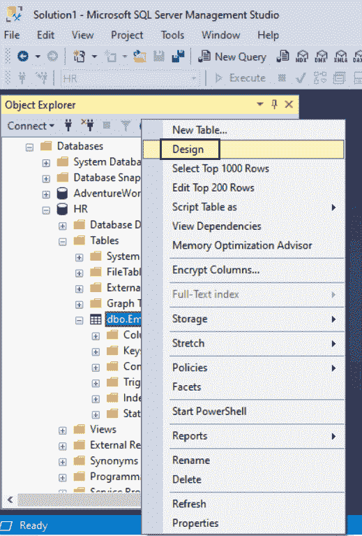
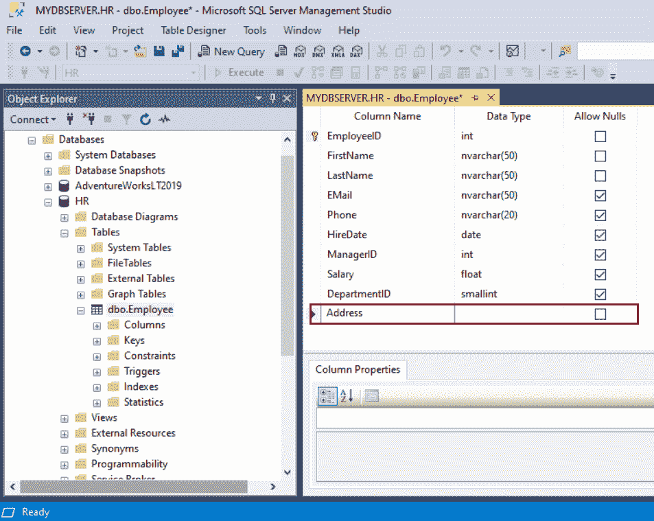

# SQL Server:更改表在表中添加列

> 原文:[https://www . tutorial stearn . com/SQL server/alter-table-add-columns](https://www.tutorialsteacher.com/sqlserver/alter-table-add-columns)

您可以使用 ALTER TABLE 语句向现有表中添加列。

ALTER TABLE 语句也可用于重命名或删除现有表中的列

使用`ALTER TABLE ADD`语句向现有表中添加一列或多列。

Syntax:

```
ALTER TABLE [schema_name.]table_name 
ADD column_name1 data_type constraint,
    column_name2 data_type constraint
    ...
    column_nameN data_type constraint; 
```

下面在`Employee`表格中添加一个类型为`varchar`尺寸为 500 的新栏`Address`。

```
ALTER TABLE dbo.Employee
Add Address varchar(500) NOT NULL; 
```

下面给`Employee`表增加三列。

```
ALTER TABLE dbo.Employee
Add Address varchar(500) NOT NULL,
    Designation varchar(50) NOT NULL,
    Qualification varchar(100); 
```

### 使用 SSMS 添加列:

在对象资源管理器中，右键单击要添加新列的表，然后选择“设计”。

<figure>[](../../Content/images/sqlserver/alter-table1.png)

<figcaption>Add Columns to a Table in SQL Server</figcaption>

</figure>

单击最后一个列名列下的第一个空白单元格，输入列名，如下所示。

<figure>[](../../Content/images/sqlserver/alter-table2.png)

<figcaption>Add Columns to a Table in SQL Server</figcaption>

</figure>

在下一列中，从下拉列表中选择数据类型和长度(如果适用)。

在行的最后一列，如果允许空值，则选中允许空值复选框。现在，从文件->保存菜单保存表格，保存修改后的表格。