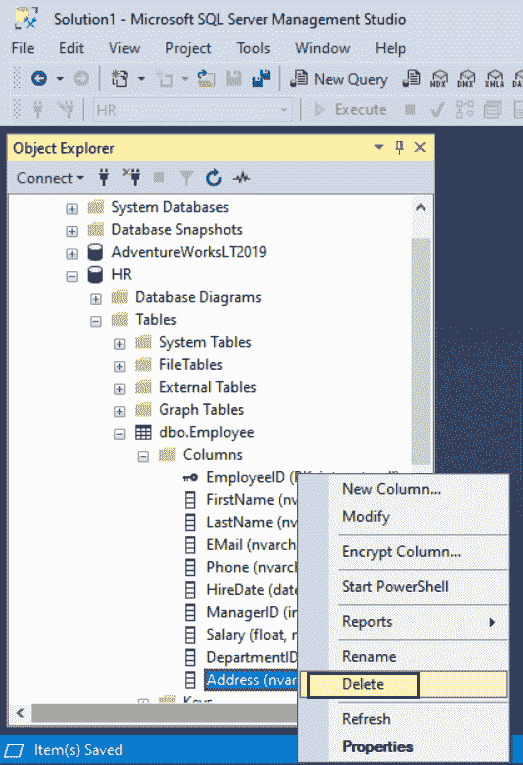
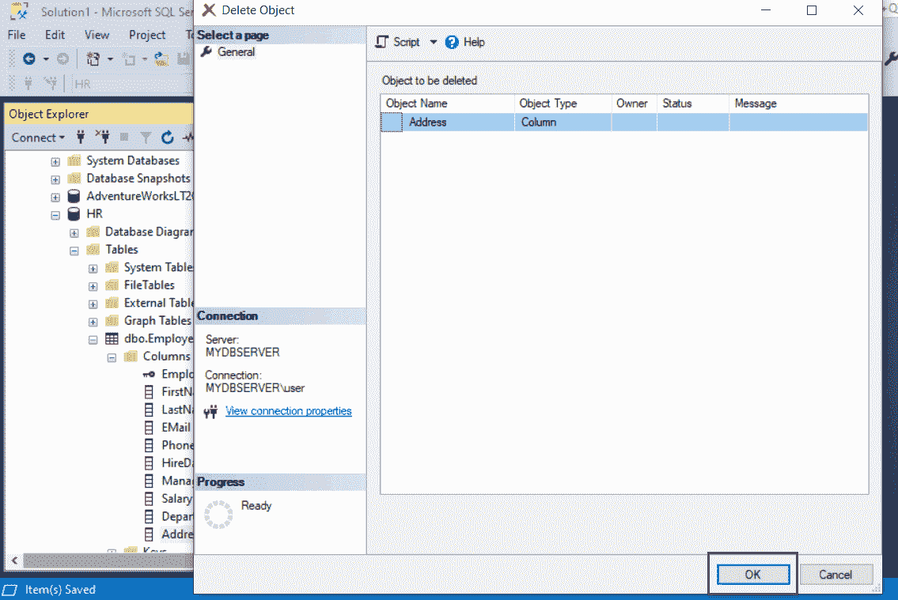

# SQL Server:删除表的列

> 原文:[https://www . tutorial stearn . com/SQL server/alter-table-drop-columns](https://www.tutorialsteacher.com/sqlserver/alter-table-drop-columns)

使用`ALTER TABLE DROP COLUMN`语句使用 T-SQL 删除一个表的一列或多列。

Syntax:

```
ALTER TABLE [schema_name.]table_name 
DROP column column_name1, column_name2,... column_nameN; 
```

下面删除`Employee`表的`Address`列。

```
ALTER TABLE dbo.Employee
DROP COLUMN Address; 
```

下面删除`Employee`表的多列。

```
ALTER TABLE dbo.Employee
DROP COLUMN Address, PhoneNo, Email; 
```

## 使用 SSMS 删除列

打开 SSMS 并连接到 SQL Server 实例。在对象资源管理器中，展开数据库和“表”文件夹。找到该表并展开“列”文件夹以显示列名。

右键单击要删除的列名，然后单击删除。

[](../../Content/images/sqlserver/alter-table3.png)

Delete Column in SQL Server


这将打开“删除对象”页面，如下所示。

[](../../Content/images/sqlserver/alter-table4.png)

Delete Column in SQL Server


单击确定删除列。

最后，从文件菜单->保存保存更改。