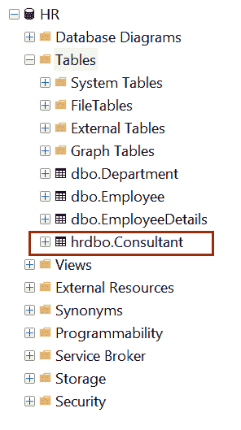
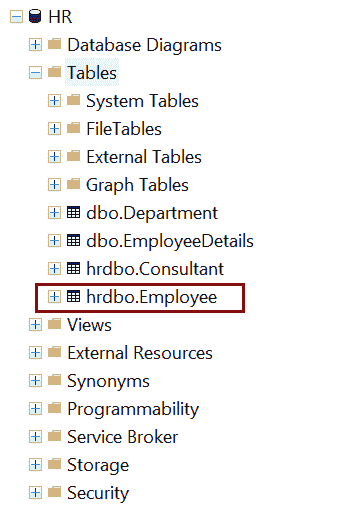
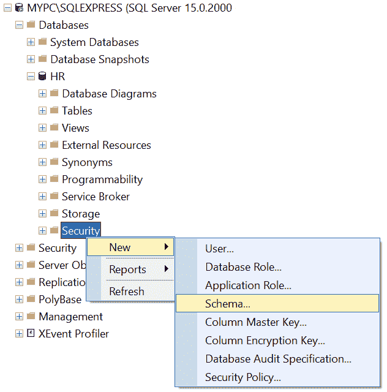
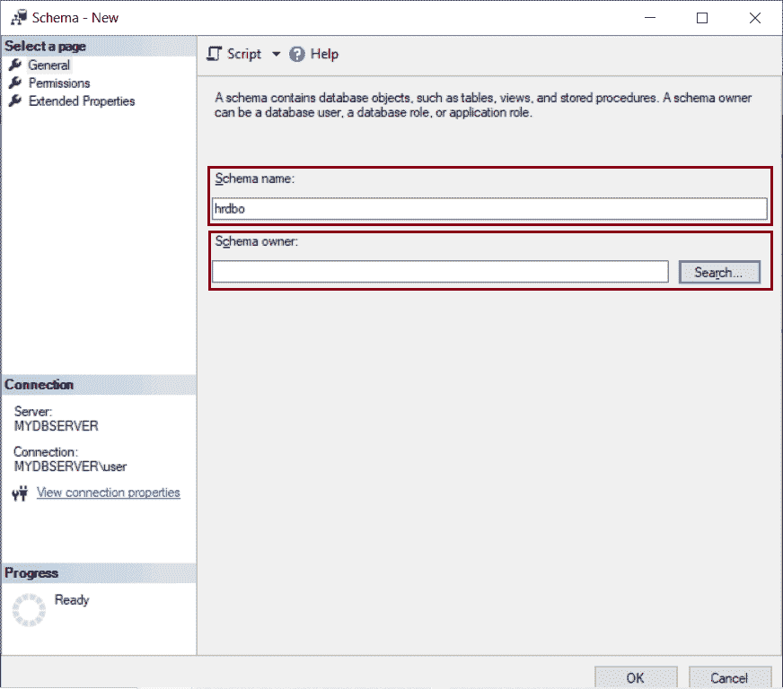
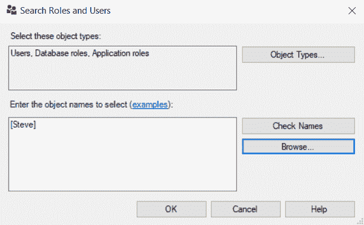
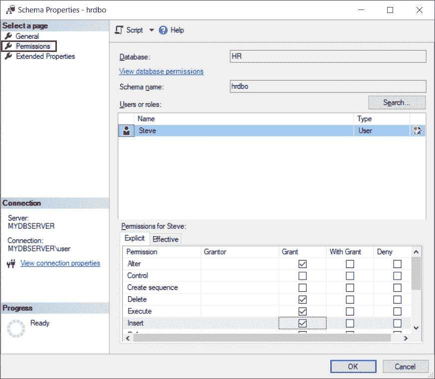
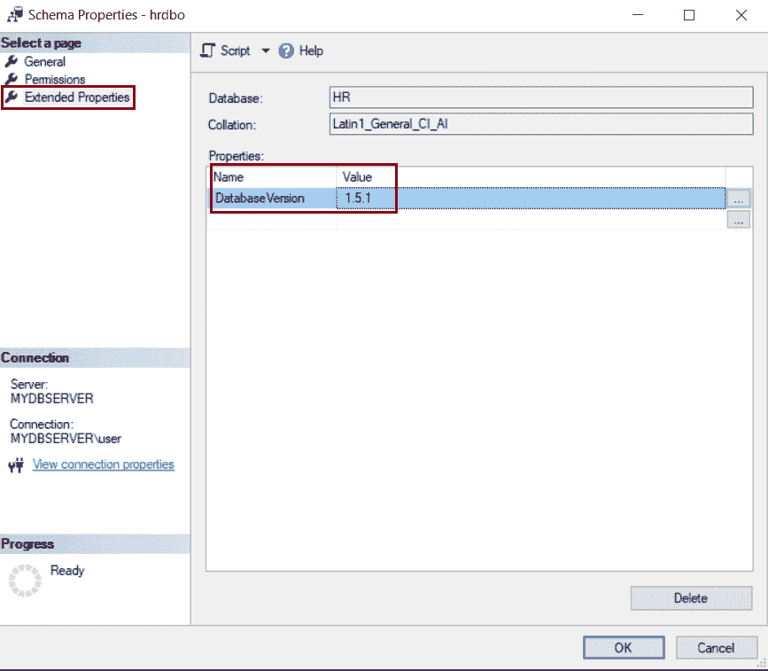

# SQL Server 中的数据库模式

> 原文:[https://www.tutorialsteacher.com/sqlserver/database-schema](https://www.tutorialsteacher.com/sqlserver/database-schema)

在 SQL Server 中，架构是数据库对象的逻辑集合，如表、视图、存储过程、索引、触发器和函数。它可以被认为是一个容器，由数据库用户创建。创建模式的数据库用户是模式所有者。

*   一个模式只能属于一个数据库，而一个数据库可以有一个或多个模式。
*   模式中的对象数量没有限制。
*   SQL Server 为我们提供了一些内置模式，如 dbo、guest、sys 等。
*   数据库模式可以由数据库角色或应用程序角色以及数据库用户拥有。他们被称为模式所有者。
*   dbo 是新创建的数据库的默认模式。
*   模式所有权可以在同一个数据库中从一个用户转移到另一个用户。
*   可以删除数据库用户，而不删除用户拥有的数据库对象。但是如果模式拥有数据库对象，则不能删除它。

## 使用测试 SQL 创建模式

可以使用 T-SQL 创建一个模式。

Syntax 

```
CREATE SCHEMA <schema_name> 
[AUTHORIZATION owner_name] 
```

在上面的语法中，`schema_name`是您想要创建的模式的名称。 您可以选择将模式所有者指定为`AUTHORIZATION owner_name`。

下面将创建一个名为`hrdbo`的新模式，默认用户`dbo`将是模式所有者。

Example: Create a New Schema 

```
CREATE SCHEMA hrdbo 
```

下面将创建一个名为`hrdbo`的新模式，用户`Steve`作为模式所有者。

Example: Create a New Schema 

```
CREATE SCHEMA hrdbo AUTHORIZATION Steve 
```

以上将创建一个新的模式`hrdbo`。您可以在 SSMS 的安全- >模式文件夹下看到这一点，如下所示。

<figure>[](../../Content/images/sqlserver/schema7.png)

<figcaption>Database Schema in SQL Server</figcaption>

</figure>

创建架构后，您可以在此架构下创建对象，并向其他用户授予权限。

例如，下面在`hrdbo`模式下创建一个新表。

T-SQL: Create a New Table in a Schema 

```
CREATE TABLE hrdbo.Consultant
(  
    ConsultantID int,
    FirstName nvarchar(50) NOT NULL,  
    LastName nvarchar(50) NOT NULL
); 
```

上面将在`hrdbo`模式中创建新表`Consultant`，如下所示。

<figure>[](../../Content/images/sqlserver/schema8.png)

<figcaption>Tables in Database Schema</figcaption>

</figure>

## 修改架构

使用 ALTER SCHEMA 语句将数据库对象从一个模式传输到同一数据库中的另一个模式。

Syntax

```
ALTER SCHEMA <schema_name>
TRANSFER [entity_type::]securable_name; 
```

在上面的 ALTER SCHEMA 语法中:

1.  `schema_name`是当前数据库中某个模式的名称，安全对象(表、视图、存储过程等)将被移入该模式。
2.  `entity_type`可以是对象、类型或 XML 模式集合。
3.  `securable_name`是 db 对象(表、视图、存储过程等)的名称。)移动到指定的`schema_name`模式。

下面将`Employee`表从默认的`dbo`模式转移到`hrdbo`模式。

Example: Transfer Table to Schema 

```
ALTER SCHEMA hrdbo
TRANSFER OBJECT::dbo.Employee; 
```

以下为`hrdbo.Employee`表。

<figure>[](../../Content/images/sqlserver/schema9.png)</figure>

注意:您可以使用 ALTER AUTHORIZATION 语句来更改模式的所有者，如下所示:

Example: Modify Schema Owner 

```
ALTER AUTHORIZATION ON SCHEMA :: hrdbo TO dbo 
```

## 删除架构

DROP SCHEMA 从数据库中删除一个模式。正在删除的架构不得包含任何数据库对象。如果模式包含对象，DROP 语句将失败。

Syntax 

```
DROP SCHEMA [IF EXISTS] schema_name 
```

以下语句删除了`hrdbo`模式，前提是该模式中没有对象。

Example: 

```
DROP SCHEMA IF EXISTS hrdbo 
```

## 使用 SSMS 创建模式

也可以在 SSMS 工具中创建模式。

步骤 1:打开 SSMS 并连接到数据库。

第二步:在对象资源管理器中，展开`Databases`文件夹，并展开要创建新模式的数据库实例。

第三步:右键点击`Security`文件夹，选择新建- >模式，如下图。

<figure>[](../../Content/images/sqlserver/schema1.png)

<figcaption>Database Schema in SQL Server</figcaption>

</figure>

这将打开如下所示的`Schema New`对话框。在常规选项卡上，输入新的方案名称和方案所有者，如下所示。

架构所有者可以是拥有架构的数据库用户或角色的名称。或者要选择用户/角色，请单击搜索按钮。

<figure>[](../../Content/images/sqlserver/schema2.png)

<figcaption>Database Schema in SQL Server</figcaption>

</figure>

在“搜索角色或用户”对话框中，单击“浏览”按钮，并选择一个用户作为方案的所有者。单击确定。

<figure>[](../../Content/images/sqlserver/schema3.png)

<figcaption>Database Schema in SQL Server</figcaption>

</figure>

步骤 4:单击“权限”页面，查看所有安全对象的列表以及可以授予的这些安全对象的权限，如下所示。

<figure>[](../../Content/images/sqlserver/schema4.png)

<figcaption>Database Schema Permissions</figcaption>

</figure>

第五步:在`Extended Properties`选项卡中，可以添加自定义属性来存储附加信息。每个扩展属性都有一个用户定义的名称和值。它用于为数据库对象添加注释，如下所示。

<figure>[](../../Content/images/sqlserver/schema5.png)

<figcaption>Database Schema Extended Properties</figcaption>

</figure>

扩展属性可用于存储版本信息、用户界面工具提示、数据沿袭信息、列描述等。

第 6 步:单击确定创建模式并保存。

步骤 7:刷新数据库实例选项卡。新模式创建在安全->模式文件夹下，如下所示。

<figure>[](../../Content/images/sqlserver/schema7.png)

<figcaption>New Schema</figcaption>

</figure>

因此，您可以使用 T-SQL 和 SSMS 创建、编辑和删除数据库模式。********