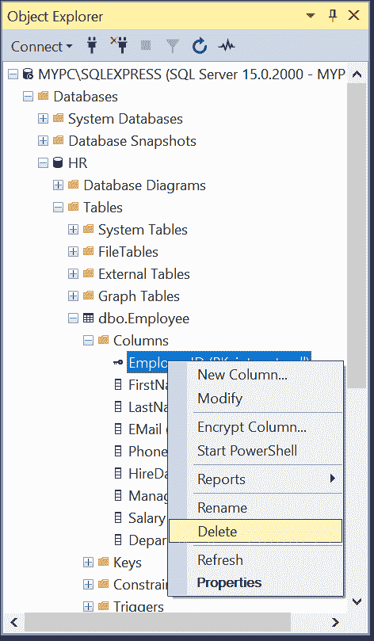
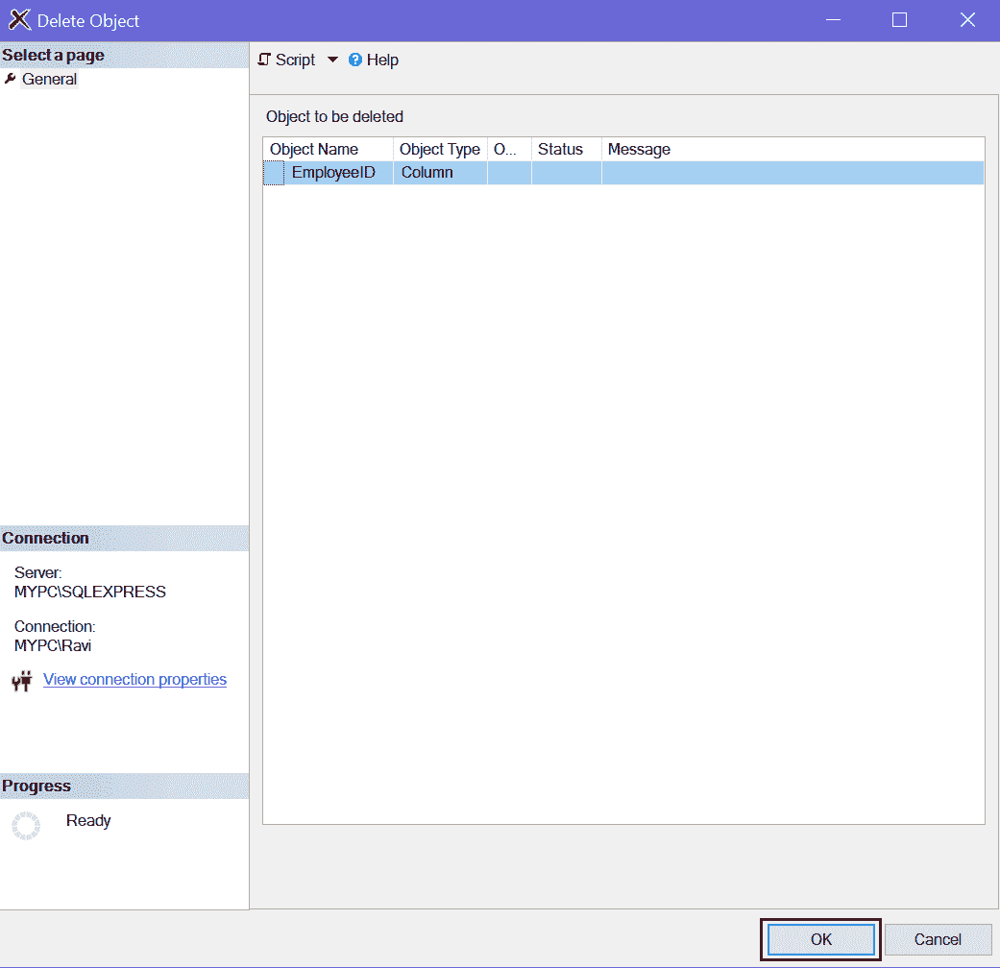
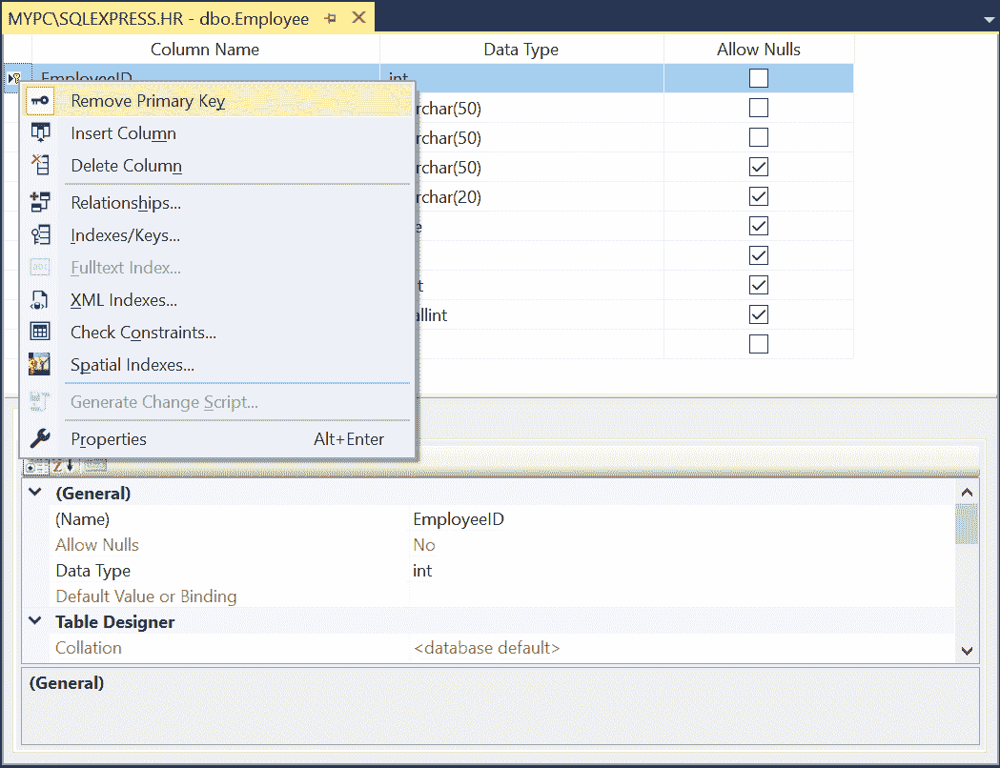
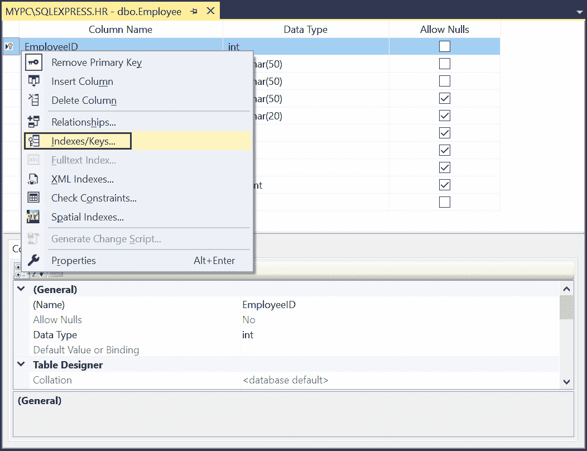
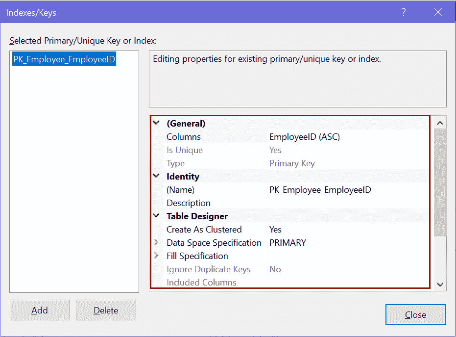
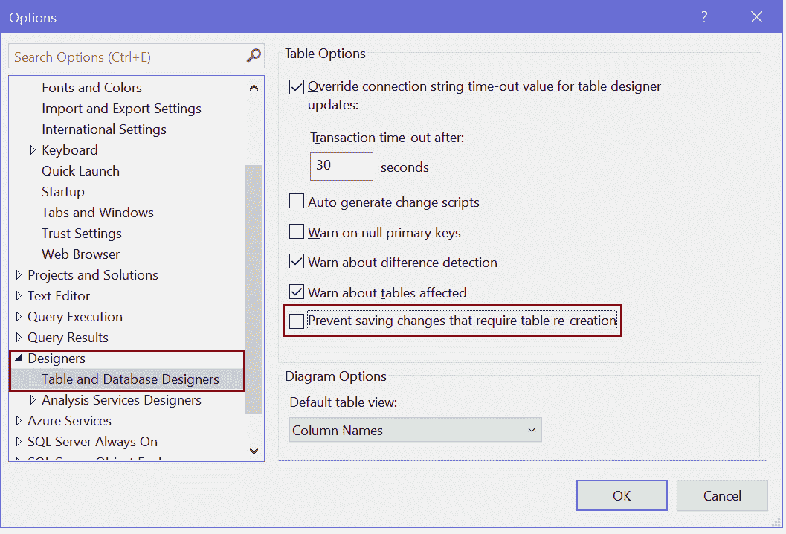

# 修改、删除 SQL Server 中的主键

> 原文:[https://www . tutorial stearner . com/SQL server/modify-delete-primary-keys](https://www.tutorialsteacher.com/sqlserver/modify-delete-primary-keys)

在这里，您将学习如何修改或删除表中现有的主键。

## 使用 T-SQL 删除主键

使用 ALTER TABLE DROP CONSTRAINT 命令从表中删除主键。

下面的 T-SQL 脚本从`Employee`表中删除了一个主键`PK_Employee_EmployeeID`。

Example: Delete a Primary Key 

```
ALTER TABLE Employee 
DROP CONSTRAINT PK_Employee_EmployeeID; 
```

## 使用 SSMS 删除主键

在对象资源管理器中，展开包含要删除的主键的表。

展开密钥节点，右键单击密钥，然后选择删除。

<figure>[](../../Content/images/sqlserver/primarykey5.png) 

<figcaption>Delete Primary Key in SQL Server</figcaption>

</figure>

在“删除对象”对话框中，验证是否指定了正确的键，并选择“确定”。

<figure>[](../../Content/images/sqlserver/primarykey6.png) 

<figcaption>Delete Primary Key in SQL Server</figcaption>

</figure>

## 使用表设计器删除主键

在对象资源管理器中，右键单击主键必须删除的表。选择设计。

在表设计器中，右键单击包含主键的行，然后选择“删除主键”。

<figure>[](../../Content/images/sqlserver/primarykey7.png) 

<figcaption>Remove Primary Key in SQL Server</figcaption>

</figure>

保存表格以反映更改。

## 使用 SSMS 修改主键

您可以通过更改键名称、列顺序、聚集选项或填充因子来修改表的主键。

要使用 T-SQL 修改主键，必须首先删除现有的主键约束，然后使用新定义重新创建它。

要使用 SSMS 修改或删除主键，请右键单击要修改主键的表，然后单击设计选项以设计模式打开表。

现在，在表设计器中右键单击并从菜单中选择索引/键，如下所示。

<figure>[](../../Content/images/sqlserver/primarykey3.png) 

<figcaption>Open Indexes/Keys Configurations</figcaption>

</figure>

在“索引/键”对话框中，选择主键索引，如下所示。

<figure>[](../../Content/images/sqlserver/primarykey4.png) 

<figcaption>Modify Primary Key in SQL Server</figcaption>

</figure>

在“索引/键”对话框中，您可以重命名主键、设置聚集选项、设置填充因子、更改主键列或更改复合主键的列顺序。

单击添加按钮添加新的索引或主键。

单击删除按钮删除选定的索引或主键。

按`Ctrl + s`保存更改。如果它阻止保存和显示重新创建表的消息，请转到“工具”菜单，单击“选项”，展开“设计器”，然后单击“表和数据库设计器”。 清除阻止保存需要重新创建表的更改复选框，如下所示。

<figure>[](../../Content/images/sqlserver/prevent-save.png) </figure>*