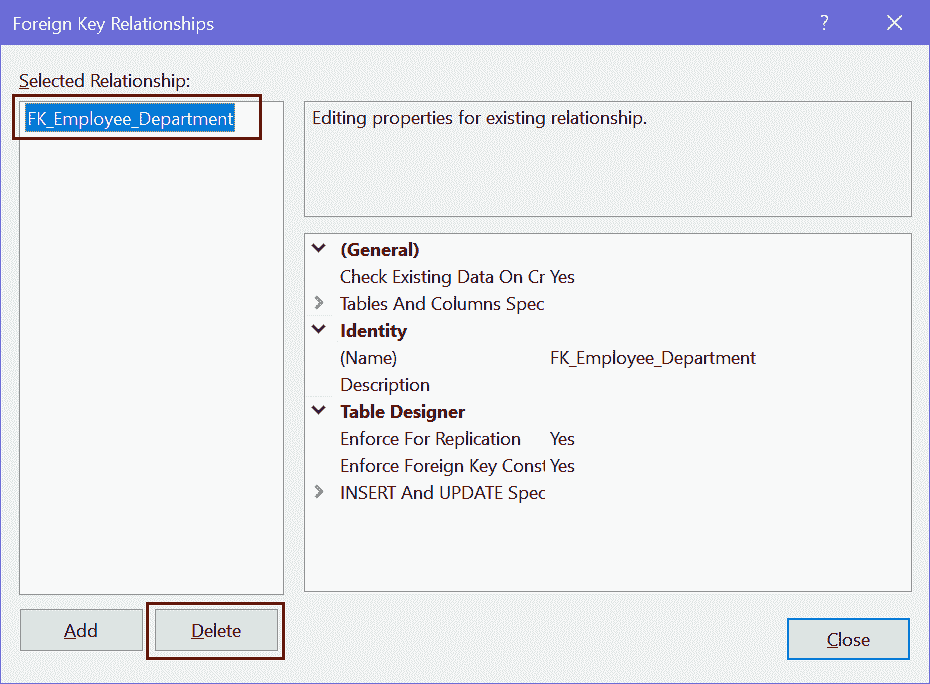
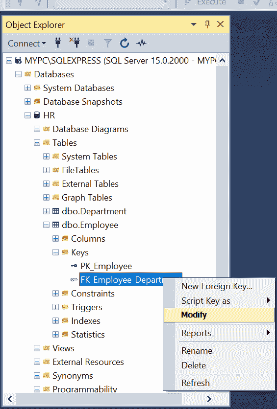
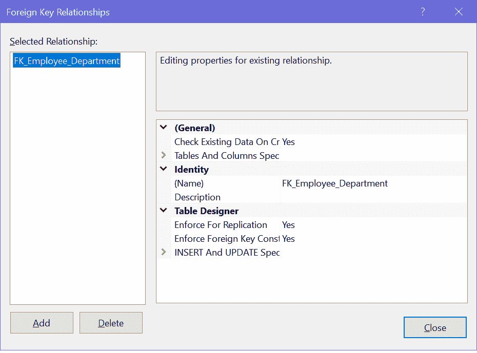

# 修改、删除 SQL Server 中的外键

> 原文:[https://www . tutorial stearner . com/SQL server/modify-delete-外键](https://www.tutorialsteacher.com/sqlserver/modify-delete-foreign-keys)

在这里，您将学习如何修改或删除表中的外键。

外键约束在 SQL Server 数据库中强制引用完整性。它用于通过将一个表的行与另一个表的行相关联来创建两个表之间的关系。

## 使用 T-SQL 删除外键

使用 ALTER TABLE DROP CONSTRAINT 命令删除现有表中的外键约束。

Syntax: Delete Foreign Key<button class="copy-btn pull-right" title="Copy example code">*Copy*</button> *```
ALTER TABLE <table_name>
DROP CONSTRAINT <foreignkey_name>; 
```

下面删除`Employee`表上的外键。

Example: Delete a Foreign Key<button class="copy-btn pull-right" title="Copy example code">*Copy*</button> *```
ALTER TABLE Employee   
DROP CONSTRAINT FK_Employee_Department 
```

## 使用 SSMS 删除外键

要使用 SQL Server Management Studio 删除外键，请在设计模式下打开一个表，方法是右键单击该表并选择“设计”选项。

<figure>[](../../Content/images/sqlserver/foreignkey1.png) 

<figcaption>Delete a Foreign Key in SQL Server</figcaption>

</figure>

这将在设计模式下打开`Employee`表。

现在，右键单击表设计器上的任意位置，然后选择“关系”...这将打开外键关系对话框，如下所示。

<figure>[](../../Content/images/sqlserver/foreignkey12.png) </figure>

选择一个外键，然后单击删除按钮将其删除。关闭对话框并保存表格。

## 使用 T-SQL 修改外键

要使用 T-SQL 修改外键约束，必须首先删除现有的外键约束，然后用新定义重新创建它。

## 使用 SSMS 修改外键

打开 SSMS，连接到人力资源数据库。展开“表格”文件夹。展开密钥。

右键单击要修改的外键约束，然后选择修改。

<figure>[](../../Content/images/sqlserver/foreignkey6.png) 

<figcaption>Foreign Keys in SQL Server</figcaption>

</figure>

将打开外键关系对话框。您可以在以下类别中进行更改:名称、说明、添加、删除、表和列规范类别、外键基表、外键列、主/唯一基表、主/唯一键列、删除规则、更新规则。

<figure>[](../../Content/images/sqlserver/foreignkey7.png) 

<figcaption>Foreign Keys in SQL Server</figcaption>

</figure>

按 Ctrl + s 保存更改。

因此，您可以在 SQL Server 中删除或修改外键。**