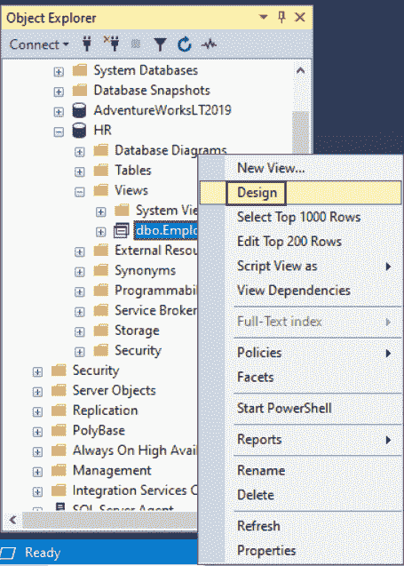
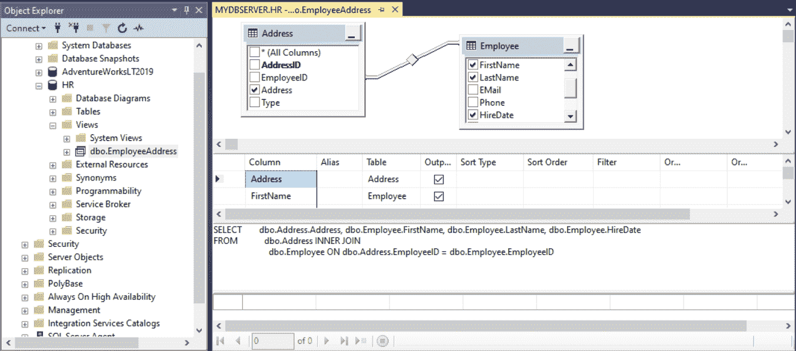
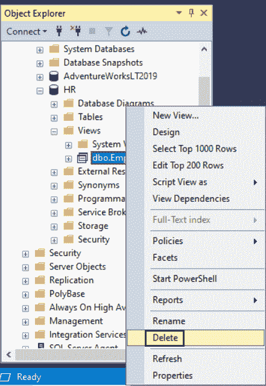

# SQL Server:更改或删除视图

> 原文：<https://www.tutorialsteacher.com/sqlserver/alter-delete-views>

在 SQL Server 中，可以通过使用 SQL Server 管理工作室或使用 TSQL 来修改视图

使用 ALTER VIEW 语句修改视图的查询。

Example: Modify View 

```
ALTER VIEW dbo.EmployeeAddress  
AS 
    SELECT emp.FirstName, emp.LastName, emp.HireDate, addr.Address 
    FROM Employee emp JOIN Address addr 
    on emp.EmployeeID = addr.EmployeeID
    WHERE emp.HireDate > '01/01/2010' 
```

## 使用 SQL Server 管理服务器修改视图

步骤 1:打开 SSMS 并连接到要修改视图的数据库

步骤 2:在对象资源管理器中，展开数据库。展开视图文件夹。

步骤 3:右键单击要修改的视图，然后单击设计。

[](../../Content/images/sqlserver/view8.png)

Views in SQL Server 2019


步骤 4:在查询设计器的图表窗格中，通过在视图中添加或删除列/元素来修改视图；从另一个表中选择其他列。

[](../../Content/images/sqlserver/view9.png)

Views in SQL Server 2019


步骤 5:单击保存保存更改。

## 删除 SQL Server 中的视图

可以使用 SQL Server 管理工作室或 T SQL 删除(删除)SQL Server 中的视图。

使用 DROP VIEW 语句删除视图，如下所示:

Example: Delete Views 

```
DROP VIEW dbo.EmployeeAddress; 
```

如果您不确定视图是否存在，请使用`IF`条件检查视图是否存在。

Example: Delete Views 

```
IF OBJECT_ID('dbo.EmployeeAddress', 'V') IS NOT NULL  
    DROP VIEW dbo.EmployeeAddress; 
```

注意:删除视图时，视图的定义和有关视图的其他信息将从系统目录中删除。

## 使用 SQL Server 管理工作室删除视图

步骤 1:打开 SSMS，连接到要修改视图的数据库。

步骤 2:在对象资源管理器中，展开数据库。展开“视图”文件夹。

第三步:右键点击要删除的视图名称，选择删除。

[](../../Content/images/sqlserver/view10.png)

Views in SQL Server 2019


步骤 4:在“删除对象”对话框中，单击“确定”。***