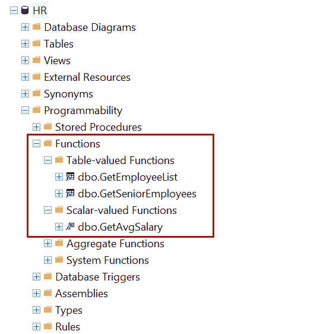

# SQL 服务器-函数

> 原文:[https://www . tutorial stearn . com/SQL server/用户自定义函数](https://www.tutorialsteacher.com/sqlserver/user-defined-functions)

SQL Server 中的函数类似于其他编程语言中的函数。SQL Server 中的函数包含执行某些特定任务的 SQL 语句。函数可以有输入参数，并且必须返回单个值或多个记录。

如果您的脚本重复使用同一组 SQL 语句，那么这可以转换成数据库中的一个函数。

## 函数的类型

SQL Server 函数有两种类型:

**系统功能:**这些是每个数据库都有的内置功能。一些常见的类型是聚合函数、分析函数、排序函数、行集函数、标量函数。

**用户定义函数(UDFs):** 数据库用户创建的函数称为用户定义函数。 UDF 有两种类型:

1.  标量函数:返回单个数据值的函数称为标量函数。
2.  表值函数:以表数据类型返回多条记录的函数称为表值函数。它可以是单个 select 语句的结果集。

以下是 SQL Server 中用户定义函数的简化语法。

Syntax: User-defined Function

```
CREATE OR ALTER FUNCTION [schema_name.]function_name(@parameter_name parameter_data_type,...)
RETURNS <data_type>
    [WITH <function_options>]
    AS 
        BEGIN

            <function_body>

            RETURN <value or select_statement>
        END 
```

更多信息请访问[用户定义函数语法](https://docs.microsoft.com/en-us/sql/t-sql/statements/create-function-transact-sql?view=sql-server-ver15)。

## 标量函数

标量函数总是返回一个值。以下标量函数`GetAvgSalary`返回指定部门的平均工资。

Example: Scalar Function 

```
CREATE or ALTER FUNCTION GetAvgSalary(@DeptID int)  
RETURNS float   --returns float type value
    AS 
    BEGIN

        DECLARE @avgSal float = 0; --declares float variable 

        -- retrieves average salary and assign it to a variable 
        SELECT @avgSal =  AVG(Salary) FROM Employee 
        WHERE DepartmentID = @DeptID   

        RETURN @avgSal; --returns a value
    END 
```

在上面的例子中，`CREATE or ALTER FUNCTION`表示创建一个新的函数或者改变一个函数(如果存在的话)。 `GetAvgSalary`是函数名，`@DeptID`是 int 类型的输入参数， `RETURNS float`指定函数将返回的浮点类型值。 功能体以`BEIGN`开始，以`END`结束。`RETURN @avgSal;`返回存储在变量`avgSal`中的值。

注意:错误处理在 UDF 中受到限制。UDF 不支持 TRY-CATCH、@ERROR 和 RAISERROR。

可以在 [SELECT](/sqlserver/select-query) 子句中调用标量函数，如下所示:

```
SELECT dbo.GetAvgSalary(5); 
```

您也可以从存储过程调用函数，如下所示。

Example: Calling a Function in Stored Procedure 

```
CREATE PROCEDURE dbo.uspCallUserFunction(@DeptID int)  
    AS  
    BEGIN
        SELECT dbo.GetAvgSalary(@DeptID)
    END 
```

## 表值函数

表值函数返回一个或多个记录作为表数据类型。

下面的表值函数返回`Employee`表中`HireDate`大于传递的输入参数的所有行。

Example: Inline Table-Valued Function 

```
CREATE or ALTER FUNCTION dbo.GetEmployeeList(@hiredate date)
RETURNS TABLE
    AS
    RETURN
        SELECT * FROM Employee
        WHERE HireDate > @hiredate; 
```

上面的`GetEmployeeList()`函数是内联表值函数，因为它包含一条语句。

以下示例执行一个表值函数来返回 2010 年 1 月 1 日之后雇用的员工列表。

```
SELECT * FROM dbo.GetEmployeeList('01/01/2010') 
```

多语句表值函数可以包含多个语句，如下所示。

Example: Multi-Statement Table-Valued Function 

```
CREATE or ALTER FUNCTION dbo.GetSeniorEmployees()
RETURNS @SrEmp Table
(
    EmpID int, 
    FirstName varchar(50)
)
AS
BEGIN
 Insert into @SrEmp Select EmployeeID, FirstName from Employee;

 delete from @SrEmp where EmpID > 10; --delete other employees
return
end 
```

以上`GetSeniorEmployees()`功能包含`BEGIN`和`END`内的多条语句。 声明一个表`@SrEmp`，将所有员工插入其中，然后删除部分员工。因此，您可以在表值函数中包含多个语句。

您可以在对象资源管理器的“函数”文件夹下查看新创建的用户定义函数。

<figure>[](../../Content/images/sqlserver/functions1.png)</figure>

## 使用 SSMS 创建用户定义的函数

步骤 1:打开 SQL Server 管理工作室并连接到数据库。

步骤 2:在您想要创建函数的地方展开数据库。扩展可编程性。

步骤 3:右键单击函数并选择新建。你有 3 个选择–

*   内联表值函数
*   多语句表值函数
*   标量值函数

<figure>[](../../Content/images/sqlserver/create-functions.png)

<figcaption>Create Functions in SSMS</figcaption>

</figure>

第四步:根据返回值点击一个适合你的新函数的选项。这将打开一个模板，在查询窗口中创建一个函数，如下所示。

<figure>[](../../Content/images/sqlserver/functions2.png)

<figcaption>Create Functions in SSMS</figcaption>

</figure>

编写适当的语句并执行脚本来创建函数。在对象资源管理器中刷新数据库，查看在“函数”文件夹下创建的函数。

## 删除用户定义的函数

使用 DROP 语句删除一个函数，如下所示。

Example: Delete a Function 

```
DROP FUNCTION dbo.GetEmployeeList; 
```

## 用户定义函数的优势

*   更快的执行:与存储过程类似，UDF 通过缓存计划并在未来的执行中重用它们来降低 T-SQL 的编译成本。
*   减少网络流量:函数的 SQL 语句在数据库中执行，调用它的应用程序需要对数据库进行函数调用。
*   支持模块化编程:UDF 可以独立于应用程序源代码进行修改。您可以创建一次 UDF 并将它们存储在数据库中，并且它们可以被调用任意多次。

了解 SQL Server 中函数和存储过程的[区别是什么。](/articles/functions-vs-stored-procedures-in-sqlserver)*****