# SQL Server 中的触发器

> 原文：<https://www.tutorialsteacher.com/sqlserver/triggers>

触发器是一个数据库对象，类似于当数据库中发生事件时自动执行的存储过程。有不同类型的事件可以激活触发器，如在表中插入或删除行、用户登录数据库服务器实例、更新表列、创建、更改或删除表等。

例如，考虑一个场景，其中`Employee`表中员工的工资被更新。在更新为新值之前，您可能希望在单独的审核表中保留以前的薪资详细信息。每当`Employee`表的值更新时，您可以创建一个触发器来自动将更新的员工数据插入到新的审核表中。

在 SQL Server 中有三种类型的触发器

*   [当表发生插入、更新或删除事件时，DML 触发器](#dml-triggers)会自动触发。
*   [当数据库中发生 CREATE、ALTER 或 DROP 事件时，DDL 触发器](/sqlserver/ddl-triggers)会自动调用。它是响应服务器范围或数据库范围的事件而激发的。
*   [当建立用户会话时引发登录事件时，会调用登录触发器](/sqlserver/logon-triggers)。

## dml 触发器

当对表执行 INSERT、UPDATE 或 DELETE 语句时，会自动调用 DML(数据操作语言)触发器。

使用 CREATE TRIGGER 语句在 SQL Server 中创建触发器。

Syntax: Create Trigger 

```sql
CREATE TRIGGER [schema_name.]trigger_name
ON { table_name | view_name }
{ FOR | AFTER | INSTEAD OF } {[INSERT],[UPDATE],[DELETE]}
[NOT FOR REPLICATION]
AS
    {sql_statements} 
```

在上面的语法中:

*   `schema_name`(可选)是将在其中创建新触发器的模式的名称。
*   `trigger_name`是新触发器的名称。
*   `ON { table_name | view_name }`关键字指定将在其上创建触发器的表或视图名称。
*   `AFTER`子句指定将触发触发器的插入、更新或删除事件。AFTER 子句指定触发器仅在 SQL Server 成功完成触发它的操作的执行后才会触发。 在触发触发器之前，所有其他动作和约束都应该成功执行。 T3】
*   `INSTEAD OF`子句用于跳过对表的 INSERT、UPDATE 或 DELETE 语句，而是执行触发器中定义的其他语句。 因此，实际的 INSERT、UPDATE 或 DELETE 语句根本不会发生。不能在 DDL 触发器上使用代替子句。 T3】
*   `[NOT FOR REPLICATION]`子句用于指示当复制代理修改表时，SQL Server 不调用触发器。
*   `sql_statements`指定事件发生时要执行的动作。

DML 触发器使用两个特殊的临时表，称为插入表和删除表。SQL Server 会自动创建和管理这些表。SQL Server 使用这些表来查找数据修改前后的表状态，并根据该差异采取措施。

| 插入的表格 | 已删除的表格 |
| --- | --- |
| 保存要在插入或更新事件中插入的新行。 | 在删除或更新事件期间保存受影响行的副本。 |
| DELETE 语句没有记录。 | 没有`INSERT INTO`语句的记录。 |

让我们创建一个触发器，在`Employee`表上执行插入、更新和删除操作时触发。 为此，创建一个新表`EmployeeLog`来记录在`Employee`表上执行的所有操作。

Example: Create Log Table 

```sql
CREATE TABLE EmpLog (
	LogID int IDENTITY(1,1) NOT NULL,
	EmpID int NOT NULL,
	Operation nvarchar(10) NOT NULL,
	UpdatedDate Datetime NOT NULL	
) 
```

在上表中，`LogID`是自动递增的序列号，`UpdatedDate`是`Employee`表的更新日期。 `Operation`列存储对表进行的操作类型；“插入”、“更新”或“删除”。

## 用于触发器

可以在表或视图中定义 FOR 触发器。只有当触发 SQL 语句中指定的所有操作都已成功启动时，它才会触发。在此触发器触发之前，所有引用级联操作和约束检查也必须成功。

以下 FOR 触发器在`Employee`表上的插入操作时触发。

Example: FOR Trigger 

```sql
CREATE TRIGGER dbo.trgEmployeeInsert
ON dbo.Employee
FOR INSERT	
AS
    INSERT INTO dbo.EmpLog(EmpID, Operation, UpdatedDate)
    SELECT EmployeeID ,'INSERT',GETDATE() FROM INSERTED; --virtual table INSERTED 
```

以上操作将在<表 _ 名称> - >触发器文件夹中创建`trgEmployeeInsert`触发器，如下图所示。

[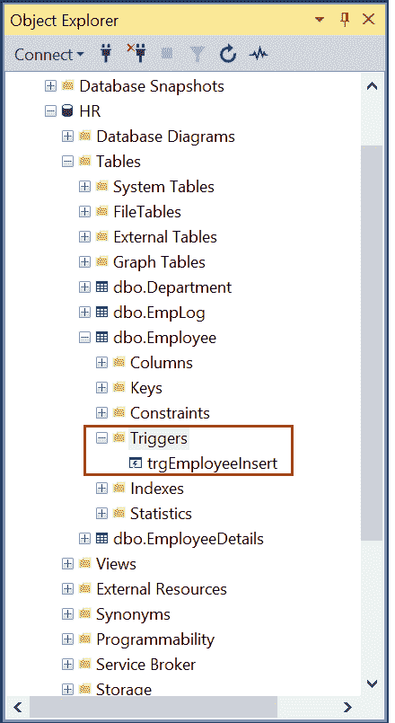](../../Content/images/sqlserver/triggers1.png)

Triggers in SQL Server


在`Employee`和`EmpLog`表上执行 select 语句，查看现有记录。

[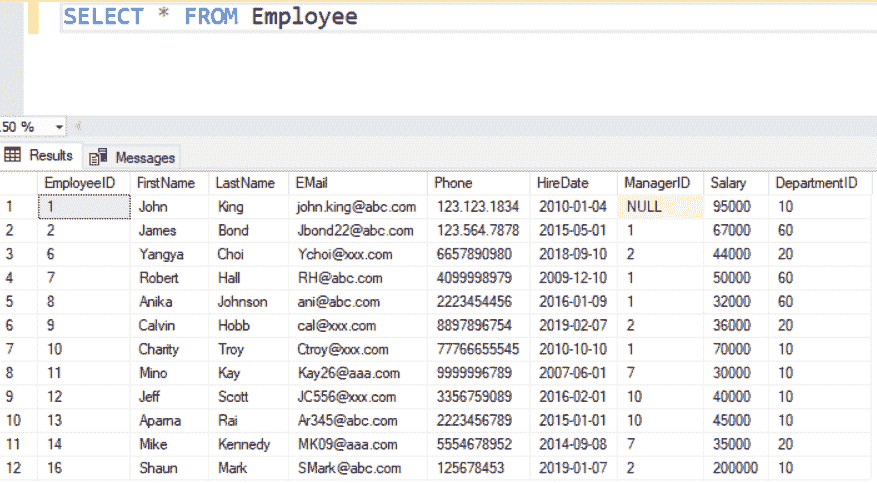](../../Content/images/sqlserver/trigger-select1.png)

以下是`EmpLog`表。

[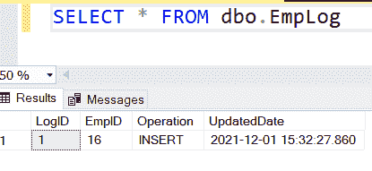](../../Content/images/sqlserver/trigger-select2.png)

现在，执行下面的 INSERT 语句，该语句将触发`trgEmployeeInsert`触发器。

Example: INSERT Data 

```sql
INSERT INTO Employee(FirstName
           ,LastName
           ,EMail
           ,Phone
           ,HireDate
           ,ManagerID
           ,Salary
           ,DepartmentID)
     VALUES('Manisha'
           ,'Dutt'
           ,'[[email protected]](/cdn-cgi/l/email-protection)'
           ,6799878453
           ,'11/07/2015'
           ,5
           ,50000
           ,20) 
```

以上将在`Employee`表中插入新的一行，如下所示。

[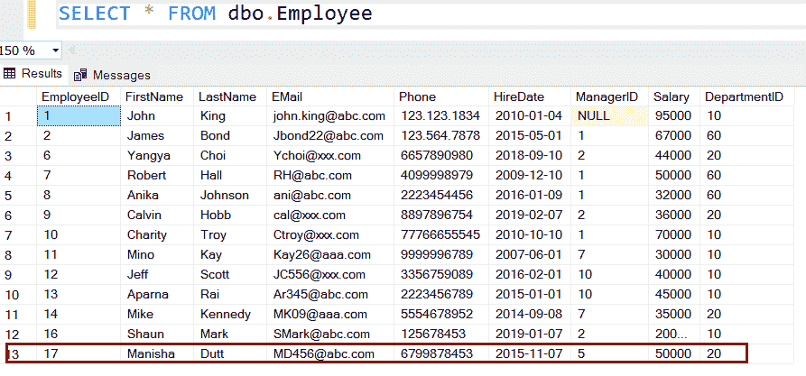](../../Content/images/sqlserver/trigger-select4.png)

将触发`trgEmployeeInsert`，并在`EmpLog`表中插入一行，如下所示。

[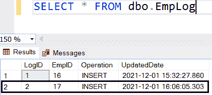](../../Content/images/sqlserver/trigger-select3.png)

您可以看到对于`Employee`表的每个 INSERT 语句，一个新的行被插入到`EmpLog`表中。

注意:由于任何原因，如果 For 触发器失败，那么 INSERT 也将失败，并且不会插入任何行。

## 触发后

只有在指定的触发 SQL 语句成功完成后，才会触发 AFTER 触发器。不能在视图上定义 AFTER 触发器。

例如，在`Employee`表上的每个 `UPDATE`语句之后，将触发以下触发器。

Example: AFTER Trigger 

```sql
CREATE TRIGGER dbo.trgEmployeeUpdate
ON dbo.Employee
AFTER UPDATE
AS
    INSERT INTO dbo.EmpLog(EmpID, Operation, UpdatedDate)
    SELECT EmployeeID,'UPDATE', GETDATE() FROM DELETED; 
```

要测试此触发器，请执行以下 `UPDATE`语句。

Example: INSERT Data 

```sql
UPDATE Employee
SET salary = 55000
WHERE EmployeeID = 2; 
```

现在，从`EmpLog`表中选择行。`trgEmployeeUpdate`触发器应该在`EmpLog`表中插入一个新行，如下所示。

[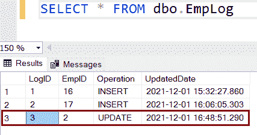](../../Content/images/sqlserver/trigger-select5.png)

## 而不是触发器

“替代”触发器允许您覆盖表或视图上的插入、更新或删除操作。实际的 DML 操作根本不会发生。

在表或视图上执行 INSTEAD OF DELETE 触发器，而不是实际的删除事件。在下面的“不删除”触发器示例中，当对雇员表发出删除命令时，会在`EmpLog`表中创建新行，将操作存储为“删除”，但该行不会被删除。

Example: INSTEAD OF Trigger 

```sql
CREATE TRIGGER dbo.trgInsteadOfDelete 
ON dbo.Employee
INSTEAD OF DELETE
AS
    INSERT INTO dbo.EmpLog(EmpID, Operation, UpdatedDate)
    SELECT EmployeeID,'DELETE', GETDATE() FROM DELETED; 
```

现在，执行下面的 `DELETE`语句来测试上面的触发器。

Example: INSTEAD OF Trigger 

```sql
DELETE FROM Employee
WHERE EmployeeID = 16; 
```

上面的语句将触发`trgInsteadOfDelete`触发器，该触发器将在`EmpLog`表中插入一个新行，而不是在`Employee`表中删除一行。

[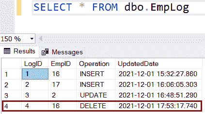](../../Content/images/sqlserver/trigger-select8.png)

INSTEAD OF DELETE 触发器也以同样的方式用于批量删除。当您运行删除多行的 SQL 语句时，这些行不会被删除，但会在`EmpLog`表中插入相等数量的行。

## 多个触发器

在 SQL Server 中，可以为同一事件在一个表上创建多个触发器。这些触发器没有定义的执行顺序。

可以使用存储过程 sp_settriggerorder 将触发器的顺序设置为“第一个”或“最后一个”。一个表只能有一个第一个或最后一个触发器。在第一个定义的触发器和最后一个定义的触发器之间触发的所有触发器不会以任何保证的顺序触发。考虑有四个或更多触发器的场景。触发第一个定义的触发器后，其他触发器没有定义的触发顺序，直到最后触发最后一个定义的触发器。

Syntax 

```sql
sp_settriggerorder [ @triggername = ] 'triggername',
[ @order = ] 'value',  
[ @stmttype = ] 'statement_type',  
[ @namespace = { 'DATABASE' | 'SERVER' | NULL } ] 
```

参数:

*   触发器名称是要排序的触发器的名称
*   @order =触发器的顺序。第一个、最后一个或无
*   @stmttype =语句类型。插入更新、删除、登录或 DDL 事件中列出的任何 TSQL 语句事件。
*   @namespace 指定 DDL 触发器是在数据库还是服务器上创建的。

假设您有多个触发器触发`Employee`表上的`UPDATE`语句。 以下示例指定触发器`trgEmployeeUpdate`是在`Employee`表上发生更新操作后触发的第一个触发器。

Example: Set Trigger Order 

```sql
sp_settriggerorder @triggername= 'dbo.trgEmployeeUpdate', 
    @order='First', 
    @stmttype = 'UPDATE'; 
```

## 使用 SSMS 创建一个 DML 触发器

步骤 1:打开 SSMS 并登录到数据库服务器。在对象资源管理器中，展开数据库实例，并选择要在其中创建触发器的数据库。

步骤 2:展开要创建触发器的表。右键单击触发器文件夹，然后选择新建触发器。新触发器的 CREATE TRIGGER 语法将在查询编辑器中打开。

[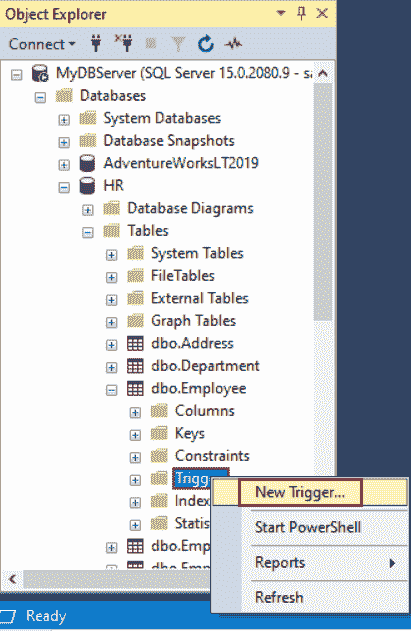](../../Content/images/sqlserver/triggers7.png)

步骤 3:在“查询”菜单中，单击“指定模板参数值”。

[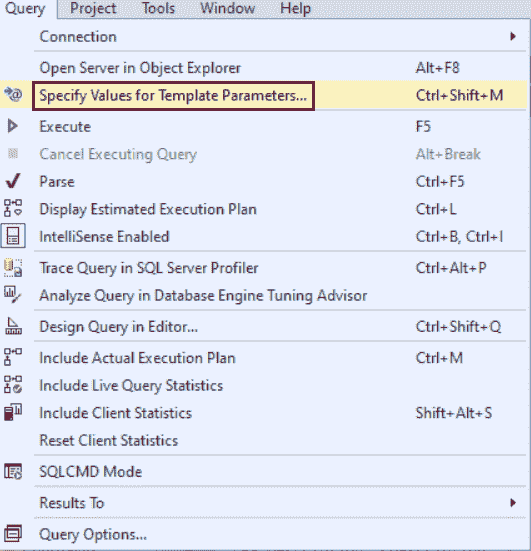](../../Content/images/sqlserver/triggers8.png)

在对话框中，指定触发器名称、创建日期、模式名称、触发器作者，并填充其他参数。单击确定。

[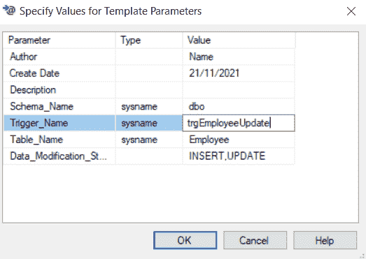](../../Content/images/sqlserver/triggers9.png)

步骤 4:在查询编辑器中，在注释部分输入触发器的 SQL 语句–在此插入触发器语句。

[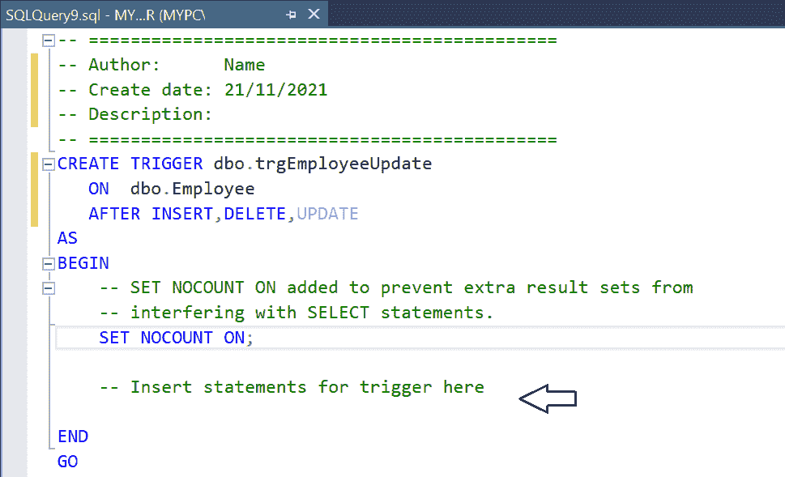](../../Content/images/sqlserver/triggers11.png)

步骤 5:您可以通过单击查询菜单下的解析来验证语法。

步骤 6:单击执行创建触发器。

第七步:刷新表格。新触发器将在表的触发器文件夹下创建。

[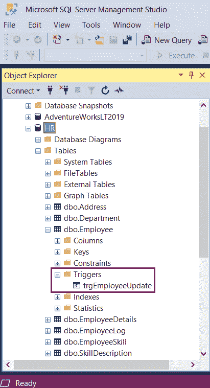](../../Content/images/sqlserver/triggers10.png)

因此，您可以在 SSMS 创建触发器。**********