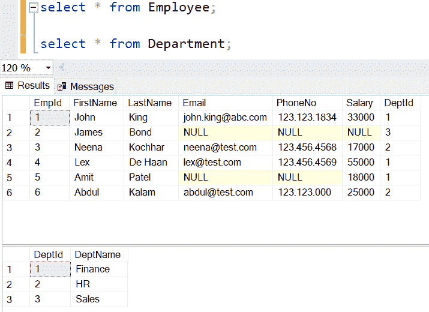
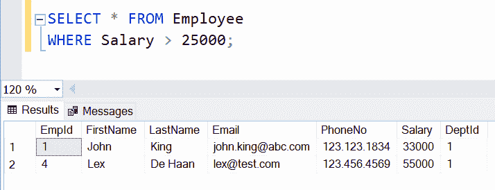
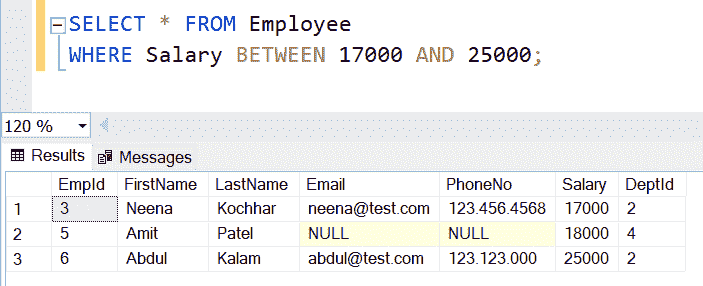
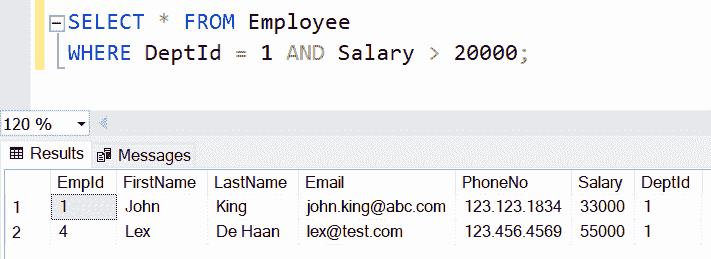

# SQL Server - WHERE 子句

> 原文：<https://www.tutorialsteacher.com/sqlserver/where-clause>

在 SQL Server 中，SELECT 语句可以有一个可选的 WHERE 子句来筛选数据。WHERE 子句可以包含一个或多个布尔条件来过滤表中的数据。

WHERE 子句总是在 FROM 子句之后，在 GROUP BY、HAVING 和 ORDER BY 子句之前。

#### 语法:

```
SELECT column1, column2,...columnN 
FROM table_name
WHERE boolean_expression; 
```

出于演示目的，我们将在所有示例中使用以下`Employee`和`Department`表。

[](../../Content/images/sqlserver/demo-tables.png)

WHERE 子句可以包含一个或多个条件，这些条件可以使用[条件运算符](#where-conditional-operators)来筛选出结果数据。 考虑以下查询。

SQL Server: SELECT Query with WHERE Clause 

```
SELECT * FROM Employee 
WHERE Salary > 25000; 
```

在上面的查询中，条件`Salary > 25000`返回`Salary`列中的值大于 25000 的行。上述查询将返回以下结果。

[](../../Content/images/sqlserver/where2.png)

以下查询在 WHERE 子句中使用了 BETWEEN 运算符。

SQL Server: BETWEEN Operator in WHERE Clause 

```
SELECT * FROM Employee 
WHERE Salary BETWEEN 17000 AND 25000; 
```

在上面的查询中，条件`Salary BETWEEN 17000 AND 25000`返回的行中`Salary`列的值在 17000 到 25000 之间(包括这两个值)。 以上查询会得到以下记录。

[](../../Content/images/sqlserver/where3.png)

## WHERE 子句中的多个条件

WHERE 子句可以使用 AND 和 OR 运算符包含多个条件。以下查询使用逻辑运算符“与”指定两个条件来过滤数据。

SQL Server: Multiple Conditions in WHERE Clause 

```
SELECT * FROM Employee 
WHERE DeptId = 1 AND Salary > 20000; 
```

在上面的查询中，WHERE 条件`DeptId = 1 AND Salary > 20000`指定了由 AND 运算符分隔的两个条件。这将返回`Employee`表中的行，其中`DeptId`的值为 1，`Salary`大于 20000。

[](../../Content/images/sqlserver/where4.png)

## WHERE 子句中的子查询

WHERE 条件也可以使用子查询的结果值，如下所示。

SQL Server: Subquery in WHERE Clause 

```
SELECT * FROM Employee 
WHERE DeptId = (SELECT DeptId FROM Department WHERE DeptName = 'HR'); 
```

在上面的查询中，WHERE 条件为`WHERE DeptId = (SELECT DeptId FROM Department WHERE DeptName = 'HR')`。因此，首先，将执行子查询`SELECT DeptId FROM Department WHERE DeptName = 'HR'`，得到的`DeptId`值将用于过滤掉行。

[](../../Content/images/sqlserver/where5.png)

## 条件运算符

下列运算符可用于 WHERE 条件。

| 操作员 | 描述 |
| --- | --- |
| = | 平等的 |
| > | 大于 |
| < | 不到 |
| >= | 大于或等于 |
| <= | 小于或等于 |
| <>还是！= | 不平等。在一些数据库中，`!=`用于比较不相等的值。 |
| 在...之间 | 在一定范围内 |
| 喜欢 | 搜索模式 |
| 在…里 | 为一列指定多个可能的值 |****