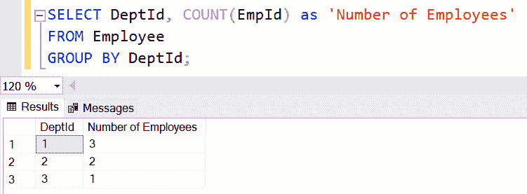
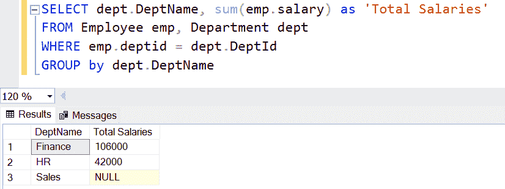

# SQL Server `GROUP BY`子句

> 原文：<https://www.tutorialsteacher.com/sqlserver/groupby>

在 SQL Server 中，`GROUP BY`子句用于获取基于一个或多个组的汇总数据。这些组可以形成在一个或多个柱上。例如，GROUP BY 查询将用于统计每个部门的员工人数，或者获取部门的总工资。

必须使用`COUNT()`、`MAX()`、`MIN()`、`SUM()`、`AVG()`等聚合函数。，在 `SELECT`查询中。 `GROUP BY`子句的结果为 GROUP BY 列的每个值返回一行。

#### 语法:

```
SELECT column1, column2,...columnN FROM table_name
[WHERE]
[GROUP BY column1, column2...columnN]
[HAVING]
[ORDER BY] 
```

SELECT 子句可以包含与 `GROUP BY`子句一起使用的列。因此，要在 SELECT 子句中包含其他列，请对这些列使用类似`COUNT()`、`MAX()`、`MIN()`、`SUM()`、`AVG()`的聚合函数。

  GROUP BY Characteristics:

*   `GROUP BY`子句用于形成记录组。
*   `GROUP BY`子句必须在 `WHERE`子句之后(如果存在)，并且在 `HAVING`子句之前。
*   `GROUP BY`子句可以包含一个或多个列，以基于这些列形成一个或多个组。
*   SELECT 子句中只能包含 GROUP BY 列。若要在 SELECT 子句中使用其他列，请使用聚合函数。

出于演示目的，我们将在所有示例中使用以下`Employee`和`Department`表。

[](../../Content/images/sqlserver/demo-tables.png)

考虑以下分组依据查询。

SQL Script: GROUP BY 

```
SELECT DeptId, COUNT(EmpId) as 'Number of Employees' 
FROM Employee
GROUP BY DeptId;

--following query will return same data as above
SELECT DeptId, COUNT(*) as 'No of Employees' 
FROM Employee
GROUP BY DeptId; 
```

上面的查询包含 GROUP BY `DeptId`子句，所以您只能在 SELECT 子句中包含`DeptId`。您需要使用聚合函数在 SELECT 子句中包含其他列，所以`COUNT(EmpId)`被包含在内，因为我们想要计算同一个`DeptId`中的员工数量。 `'No of Employees'`是`COUNT(EmpId)`列的别名。查询将显示以下结果。

[](../../Content/images/sqlserver/groupby2.png)

下面的查询得到的是部门名称，而不是结果中的`DeptId`。

SQL Script: GROUP BY 

```
SELECT dept.DeptName as 'Department', count(emp.empid) as 'No of Employees'
FROM Employee emp, Department dept
WHERE emp.deptid = dept.DeptId
GROUP by dept.DeptName 
```

[](../../Content/images/sqlserver/groupby3.png)

以同样的方式，下面的查询得到部门的工资总额。

SQL Script: GROUP BY 

```
SELECT dept.DeptName, sum(emp.salary) as 'Total Salaries'
FROM Employee emp, Department dept
WHERE emp.deptid = dept.DeptId
GROUP by dept.DeptName 
```

[](../../Content/images/sqlserver/groupby4.png)

下面的查询会抛出一个错误，因为`dept.DeptName`没有包含在 `GROUP BY`子句中，或者没有使用聚合函数。

SQL Script: GROUP BY 

```
SELECT dept.DeptName, sum(emp.salary) as 'Total Salaries'
FROM Employee emp, Department dept
WHERE emp.deptid = dept.DeptId
GROUP by dept.DeptId 
```

[](../../Content/images/sqlserver/groupby5.png)****