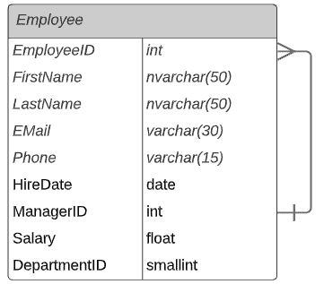
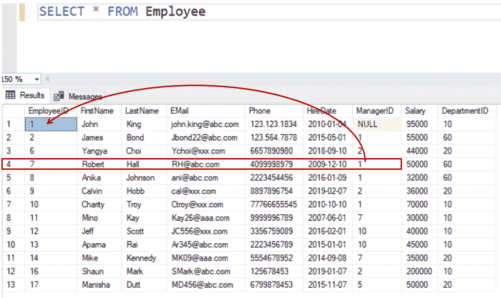
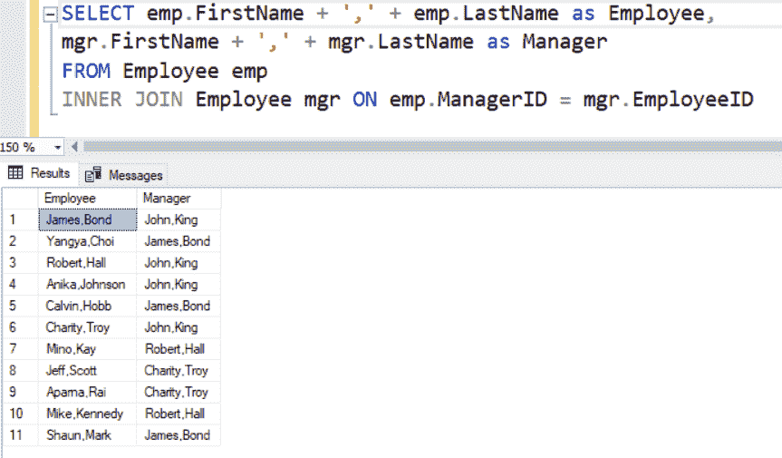
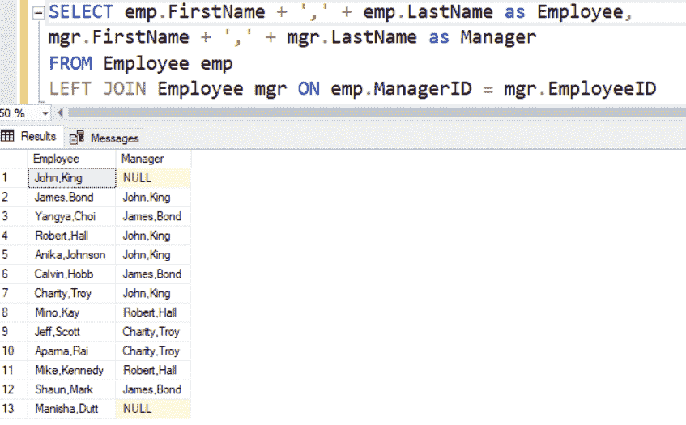

# SQL Server 中的自加入

> 原文:[https://www.tutorialsteacher.com/sqlserver/self-join](https://www.tutorialsteacher.com/sqlserver/self-join)

在 SQL Server 中，自联接类似于常规联接，但它将表联接到自身。与任何其他联接类似，自联接至少需要两个表。但是，不是向联接中添加不同的表，而是添加同一表的另一个实例。它是同一表的两个副本之间的连接。自联接主要用于查询单个表中存储的层次数据。

没有自我加入关键字。您编写了一个普通的连接，其中连接中涉及的两个表是相同的。

以下是自联接查询的语法。

Syntax: Self-join<button class="copy-btn pull-right" title="Copy example code">*Copy*</button> *```
SELECT a.column1, b.column2
FROM table1 a, table1 b
WHERE condition; 
```

在自联接中，您必须为表的两个实例指定表别名；否则你会得到一个错误。

考虑以下包含`EmployeeID`和`ManagerID`列的`Employee`表。`ManagerID`列值将是任何一个`EmployeeID`。 这样，我们可以在同一个表中找到经理的信息。

<figure>[](../../Content/images/sqlserver/employee-table-design.png) </figure>

`Employee`表包含以下数据。

<figure>[](../../Content/images/sqlserver/employee-table-data.png) </figure>

在上表中，`EmployeeID` 7 包含`ManagerID` 1 作为他的经理。`EmployeeID` 1 在`ManagerID`列中包含空值，因为他没有经理。

以下自联接查询获取所有员工的经理。

Example: Self-join<button class="copy-btn pull-right" title="Copy example code">*Copy*</button> *```
SELECT emp.FirstName + ',' + emp.LastName as Employee, 
mgr.FirstName + ',' + mgr.LastName as Manager
FROM Employee emp
INNER JOIN Employee mgr ON emp.ManagerID = mgr.EmployeeID; 
```

上述查询将在 SQL Server 中显示以下结果。

<figure>[](../../Content/images/sqlserver/self-join.png) </figure>

以上结果显示了所有有经理的员工及其经理姓名。没有经理的员工(经理列为空)不会显示。

您可以使用 [LEFT JOIN](/sqlserver/left-join) 查询来调整上述查询，以列出所有员工，即使他们没有经理。

Example: Left-join<button class="copy-btn pull-right" title="Copy example code">*Copy*</button> *```
SELECT emp.FirstName + ',' + emp.LastName as Employee,
mgr.FirstName + ',' + mgr.LastName as Manager
FROM Employee emp
LEFT JOIN Employee mgr ON emp.ManagerID = mgr.EmployeeID 
```

上面的查询将显示以下结果。

<figure>[](../../Content/images/sqlserver/self-join2.png)</figure>***