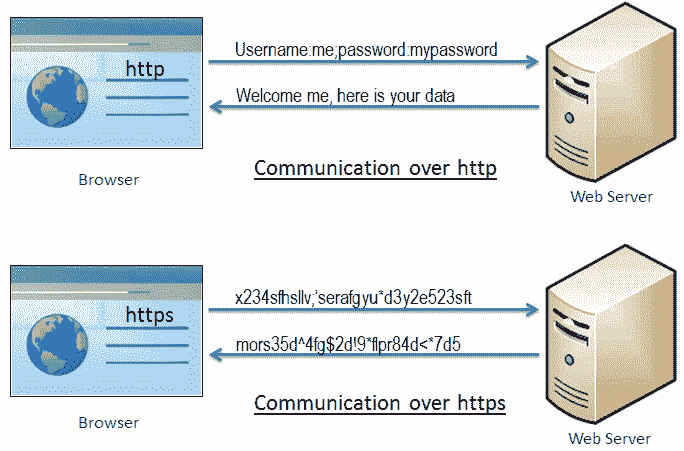

# 什么是 https？

> 原文:[https://www.tutorialsteacher.com/https/what-is-https](https://www.tutorialsteacher.com/https/what-is-https)

HTTPS 代表超文本传输协议安全。它是一种保护两个系统(例如浏览器和网络服务器)之间通信的协议。

下图说明了通过 http 和 https 进行通信的区别:

 

Communication over https and http

从上图可以看到， [http](https://en.wikipedia.org/wiki/Hypertext_Transfer_Protocol) 以超文本格式在浏览器和 web 服务器之间传输数据，而 https 以加密格式传输数据。 因此，https 可以防止黑客在浏览器和网络服务器之间的传输过程中读取和修改数据。 即使黑客设法拦截了通信，他们也无法使用它，因为消息是加密的。

HTTPS 使用安全套接字层(SSL)或传输层安全(TLS)协议在浏览器和网络服务器之间建立了加密链接。TLS 是 SSL 的新版本。

## 安全套接字层

SSL 是在两个系统之间建立加密链接的标准安全技术。这些可以是浏览器到服务器、服务器到服务器或客户端到服务器。基本上，SSL 确保两个系统之间的数据传输保持加密和私密。

https 本质上是基于 SSL 的 http。SSL 使用 SSL 证书(也称为数字证书)建立加密链接。

SSL

## http vs https

| 超文本传送协议（Hyper Text Transport Protocol 的缩写） | 安全超文本传输协议 |
| --- | --- |
| 以超文本(结构化文本)格式传输数据 | 以加密格式传输数据 |
| 默认情况下使用端口 80 | 默认情况下使用端口 443 |
| 不安全 | 使用 SSL 技术保护 |
| 以`http://` 开始 | 以`https://` 开始 |

## https 的优势

*   **安全通信:** https 通过在浏览器和服务器或任意两个系统之间建立加密链接来进行安全连接。
*   **数据完整性:** https 通过加密数据来提供数据完整性，因此，即使黑客设法捕获数据，他们也无法读取或修改数据。
*   **隐私与安全:** https 通过防止黑客被动监听浏览器与服务器之间的通信，保护网站用户的隐私与安全。
*   **更快的性能:**与 http 相比，https 通过加密和减小数据大小来提高数据传输速度。
*   **SEO:** 使用 https 增加 SEO 排名。在谷歌浏览器中，如果用户的数据是通过 http 收集的，谷歌会在浏览器中显示**不安全**标签。
*   **未来:** https 通过让用户和网站所有者的互联网变得安全，代表了网络的未来。

在下一章中了解 SSL 证书。