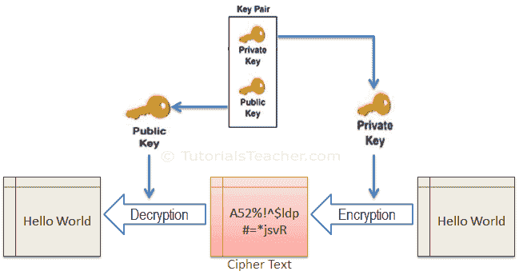
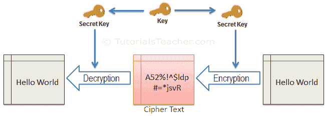

# SSL 是如何工作的？

> 原文：<https://www.tutorialsteacher.com/https/how-ssl-works>

正如您在上一章中所学习的，https 使用 SSL 协议通过传输加密数据来保护通信。在深入之前，先了解一下 SSL 是如何工作的。

SSL 基本上使用以下概念:

1.  不对称密码学
2.  对称密码学

## 不对称密码学

非对称加密(也称为非对称加密或公钥加密)使用与数学相关的密钥对来加密和解密数据。在密钥对中，一个密钥与任何对通信感兴趣的人共享。这叫做**公钥**。密钥对中的另一个密钥是保密的，被称为**私钥**。

这里，密钥指的是一个数学值，是使用加密或解密数据的数学算法创建的。

在非对称加密中，数据可以用私钥签名，私钥只能用一对中的相关公钥解密。

 

Asymmetric Cryptography

SSL 使用非对称加密来发起通信，这就是所谓的 SSL 握手。最常用的非对称密钥加密算法包括 EIGamal、RSA、DSA、椭圆曲线技术和 PKCS。

## 对称密码学

在对称加密中，只有一个密钥来加密和解密数据。发送方和接收方都应该有这个密钥，只有他们自己知道。

Symmetric Cryptography

SSL 使用对称加密，在初始握手完成后使用会话密钥。最广泛使用的对称算法是 AES-128、AES-192 和 AES-256。

## 通过 SSL 传输数据

SSL 协议使用非对称和对称加密技术来安全地传输数据。下图说明了 SSL 通信的步骤:

SSL Communication

从上图中可以看到，浏览器和 web 服务器(或任何其他两个系统)之间的 SSL 通信主要分为两个步骤:SSL 握手和实际数据传输。

### SSL 握手

通过 SSL 的通信总是从 SSL 握手开始。SSL 握手是一种非对称加密技术，允许浏览器在实际数据传输开始之前验证网络服务器，获取公钥并建立安全连接。

下图说明了 SSL 握手中涉及的步骤:

SSL Handshake

让我们理解上面的步骤:

1.  客户端发送“客户端您好”消息。这包括客户端的 SSL 版本号、密码设置、特定于会话的数据以及服务器使用 SSL 与客户端通信所需的其他信息。
2.  服务器以“服务器你好”消息作为响应。这包括服务器的 SSL 版本号、密码设置、特定于会话的数据、带有公钥的 SSL 证书以及客户端通过 SSL 与服务器通信所需的其他信息。
3.  客户端从证书颁发机构验证服务器的 SSL 证书，并对服务器进行身份验证。如果身份验证失败，客户端将拒绝 SSL 连接并引发异常。如果身份验证成功，则继续步骤 4。
4.  客户端创建一个会话密钥，用服务器的公钥加密，然后发送给服务器。如果服务器请求了客户端身份验证(主要是在服务器到服务器的通信中)，那么客户端会向服务器发送自己的证书。
5.  服务器用其私钥解密会话密钥，并将确认发送给用会话密钥加密的客户端。

因此，在 SSL 握手结束时，客户端和服务器都有一个有效的会话密钥，它们将使用该密钥来加密或解密实际数据。此后将不再使用公钥和私钥。

## 实际数据传输

客户端和服务器现在使用共享会话密钥来加密和解密实际数据并传输它。这是在两端使用相同的会话密钥完成的，因此，它是一种对称加密技术。实际的 SSL 数据传输使用对称加密，因为与非对称加密相比，它简单且占用较少的 CUP 资源。

SSL Data Transfer

因此，SSL 基本上使用非对称加密和对称加密来工作。在现实生活中，实现 SSL 通信涉及到某些基础设施，称为公钥基础设施。

## 公钥基础设施

[公钥基础设施(PKI)](https://en.wikipedia.org/wiki/Public_key_infrastructure) 是创建、管理、分发、使用、存储和撤销数字证书以及管理公钥加密所需的一组角色、策略和过程。

公钥基础设施包括以下要素:

*   认证机构:认证个人、计算机和其他实体身份的机构。
*   注册机构:代表根证书颁发机构为特定用途颁发证书的下属证书颁发机构。
*   SSL 证书:包含公钥和其他信息的数据文件。
*   证书管理系统:存储、验证和撤销证书的系统。

在下一章中了解 SSL 证书。